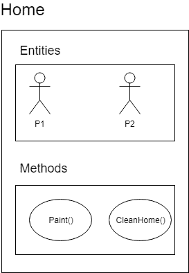

# 面向对象编程的目标是什么

> 原文：<https://dev.to/jai00271/what-is-the-objective-of-object-oriented-programming-4a58>

当有人问我们什么是 OOPS 时，我们从 OOPS 的支柱开始解释，比如抽象、多态、封装和继承。在这篇文章中，我们将先后退一步理解面向对象，然后再讨论它的支柱。

按照 Wiki 的说法,(一种编程语言的)面向对象，使用一种方法使一个系统能够被建模为一组能够以模块化方式控制和操作的对象。

[](https://res.cloudinary.com/practicaldev/image/fetch/s--Ip5xwqKv--/c_limit%2Cf_auto%2Cfl_progressive%2Cq_auto%2Cw_880/https://thepracticaldev.s3.amazonaws.com/i/xv9gqlpvaudbeioi3g7l.jpg)

还在分析？好吧，让我们用更简单的话来理解这一点。面向对象是一种软件设计，在这种设计中，我们可以简单地将数据、数据类型和方法组合在一个包中。这里我们将讨论两个主要术语:

**类**:类是数据和函数或方法的蓝图。
**对象**:对象是一个类的实例。

[](https://res.cloudinary.com/practicaldev/image/fetch/s--TFI1ggZY--/c_limit%2Cf_auto%2Cfl_progressive%2Cq_auto%2Cw_880/https://thepracticaldev.s3.amazonaws.com/i/fj0vte5a3h0pu663lxb0.png)

在这里，我们可以把家看作一个类，它包含了作为居住在其中的人的属性和作为方法的他们的行为。c#语言中类似的描述可以表示为:

```
public class Home

{
        public string P1 { get; set; }
        public string P2 { get; set; }

        public void Paint()
        {

        }
} 
```

现在 home 是一个通用类，可以用来表示家庭。例如，如果有人想创建 C. V. Raman 先生或 Kalam 先生的房子，他们只需要创建一个此类的对象，然后就可以设置属性并调用方法。

```
class Program
{
   static void Main(string[] args)
   {
      Home ramanHome = new Home();
      ramanHome.P1 = "Mr. C. V. Raman";
      ramanHome.P2 = "Mrs. Lokasundari Ammal";
      ramanHome.Paint(ramanHome.P1, ramanHome.P2);

      Home kalamHome = new Home();
      KalamHome.P1 = "Mr. A. P. J. Abdul Kalam";
      KalamHome.P2 = "None";
      KalamHome.Paint(ramanHome.P1, ramanHome.P2);
   }
} 
```

现在，如果你注意到我们使用了相同的 Home 类来描述两个实体。类似地，要定义其他 home，我们只需要创建 home 类的一个实例并设置属性。

[](https://res.cloudinary.com/practicaldev/image/fetch/s--_i4dONxb--/c_limit%2Cf_auto%2Cfl_progressive%2Cq_auto%2Cw_880/https://thepracticaldev.s3.amazonaws.com/i/3b7tjd34x02o7oj1di3k.png)

希望类和对象这样的概念清晰。现在，让我们来看看 OOPS 的支柱，我将只提供基本的定义，因为互联网上有足够多的文章描述这些支柱。

**抽象**:抽象是隐藏实现细节，只向用户显示功能的过程。

**封装**:将数据和功能包装在一个单元中称为封装。我们对外界隐藏数据，不允许外界直接访问它们。这就是所谓的数据隐藏。

**多态性**:多态性是指采取一种以上形式的能力。

**继承**:继承是一个类的对象获得另一个类的对象的属性的过程。

请分享您的宝贵反馈。