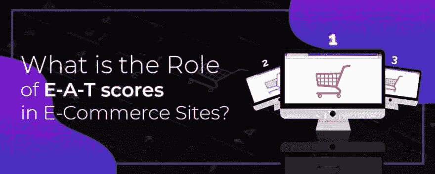

# E-A-T 分数在电子商务网站中有什么作用？

> 原文：<https://dev.to/edword12/what-is-the-role-of-e-a-t-scores-in-e-commerce-sites-5913>

今天，网上交易主宰了整个世界。但是以你现有的内容和评估者的分数，要想在这场激烈的竞争中保持一席之地。在整个排名游戏已经发展到一个新水平的地方，内容很重要。对于电子商务网站来说，内容对其他任何网站都同样重要。当谷歌使用因素来衡量网站的品牌价值时——三个重要因素是专业知识、权威和信任，或通常称为 E-A-T。

## E-A-T 是什么意思？

如上所述，E-A-T 代表专业知识、权威和信任。这个概念在很多网站中是一个巨大的排名因素。让我们讨论一下这三个术语的实际含义:

### 专业知识:

这个术语代表专业知识和技能。在这里你需要在主要内容中展示你的技能。比如，如果你提供一项你深有造诣的服务，你会被推荐为该领域的专家。你的网站也需要你的专业知识来保持领先于其他市场竞争对手。

### 权威人士:

在这里，你必须明确谷歌的指导方针，以表明你有权创建主要内容。同样，专长是对知识或技能水平的衡量，权威是对你做得有多好的衡量。随着时间的推移，随着权威的到来，小企业和新企业真的会感到更加困难。

### 信任:

让你的潜在客户觉得他们可以信任你是电子商务的一个重要组成部分。如果你的品牌在你的顾客中不值得信任，那么你的销售将几乎不存在。确保你站在 E-A-T 分数中的可信度分数框上。

### 为什么 E-A-T 分数在电子商务中很重要:

去年 7 月，在更新了搜索质量评分员的指导方针后不久，主要的焦点转移到了 E-A-T(专业知识、权威和信任)分数上。如果你想让你的购物页面在搜索中排名靠前，你需要确定如何最大化你的 E-A-T 分数。

E-A-T 在电子商务行业很重要，因为网站页面或购物页面被认为是 YMYL(你的钱，你的生活)页面。这些网页被认为是最高的质量标准，因此，预期的 E-A-T 也被要求最高。

***现在，谷歌考虑什么内容？…*T3】**

最重要的是要认识到，内容不仅限于文本，评分者不只是被要求评估文本。他们必须评估你的网站的功能。它包括您的 **[电子商务网站的设计](https://www.clapcreative.com/services/los-angeles-ecommerce-development/?utm_source=dev&utm_medium=article)****界面、可用性、交互性等重要功能。**

 **这些质量评分者还被提醒，高质量的购物内容可以让用户轻松找到产品并购买。要确定购物页面的 E-A-T，需要找到一些能给你积极分数的东西。如果内容的数量不足以满足网站页面的目的，高 E-A-T 不会让你走得足够远，所以从这里开始。

当搜索评级机构评估网站页面时，指南要求他们对信息进行一些特殊检查，如联系方式、支付政策、退换货政策等。请记住，所有这些信息都可以在客户服务中找到。

谷歌的评级专家负责彻底调查每个网站的 E-A-T。因此，在电子商务网站中，网站的每个页面都需要提供最高质量的信息和内容，并由所有者仔细检查。

### 结论:

拥有良好的 E-A-T 成绩对你的电子商店或在线业务大有裨益。你得分越高，你的品牌或电子商务网站就越成功。只要仔细考虑 E-A-T 分数的个别部分，就能打动搜索引擎，被谷歌排名靠前。搜索质量评估人员指出，专业知识、权威和信任是谷歌工程师的主要考虑因素。**