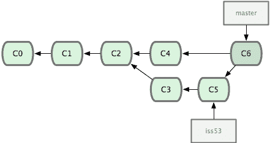
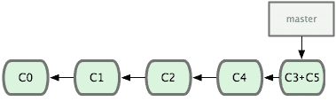

# 你的 git 合并策略是什么？

> 原文：<https://dev.to/meanin/what-is-your-git-merge-strategy-2a1k>

# 分支

当你着手一项新任务时，拓展是常见的第一步。对你们大多数人来说应该很熟悉。这个例程保持根分支(主/开发无论什么)干净，直到有人完成她/他的工作。然后，您必须以某种方式将您的更改放入根分支。

# 合并

将变更集成到根分支的默认策略是合并操作。当然，如果你遇到任何冲突，你必须解决它们，但最后，代码库将被整合。
[T3】](https://res.cloudinary.com/practicaldev/image/fetch/s--CPr3Z3lT--/c_limit%2Cf_auto%2Cfl_progressive%2Cq_auto%2Cw_880/https://git-scm.com/figures/18333fig0317-tn.png)

# 南瓜

合并变更时有一个选项，使用`--squash`。您将得到一个合并提交，放在根分支历史之上。在我看来，这种方法确实有风险。当一个团队不遵守拉取请求/分支命名约定时，可能会产生严重的后果。想象一下，通过名为`update`、`align with newer version`、`test`、`more tests`等的提交回到存储库历史中。这个选项将简化历史视图，但是它只适用于成熟的团队。
[T8】](https://res.cloudinary.com/practicaldev/image/fetch/s--GyFASwMu--/c_limit%2Cf_auto%2Cfl_progressive%2Cq_auto%2Cw_880/https://raw.githubusercontent.com/meanin/dev-to-articles/master/img/2019-01-07-git-merge-strategy/squash.png)

# 混合

当我为这篇文章做研究时，我发现了这个。在一种方法中很好地混合了合并和挤压。同样，这里你需要一个成熟的团队，遵循命名惯例，但这是一个很好的共识。

# 问题？

就我个人而言，我更喜欢使用标准合并。我见过一些团队，他们使用一个`--squash`选项来合并所有的特性分支，我可以看到这种方法的优点。毕竟，我在那个场景中错过了详细的 git 历史。你的默认合并策略是什么？

图片来源:[git-分支-合并](https://git-scm.com/book/en/v1/Git-Branching-Basic-Branching-and-Merging)