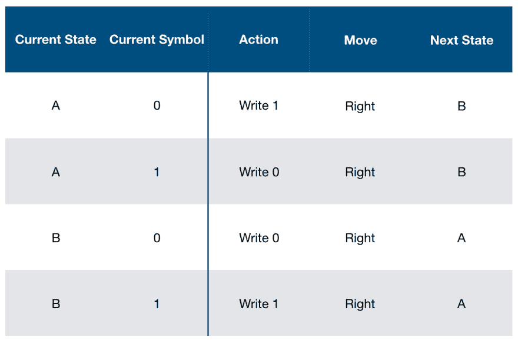
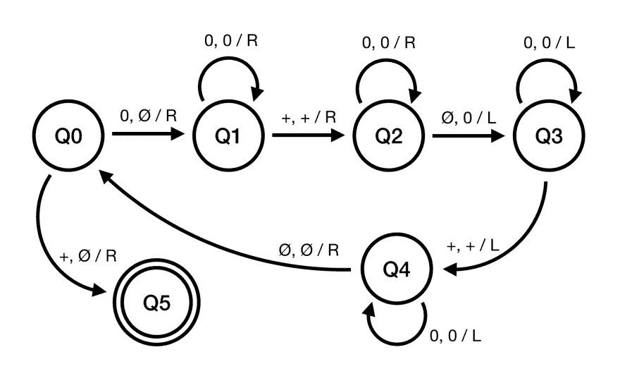
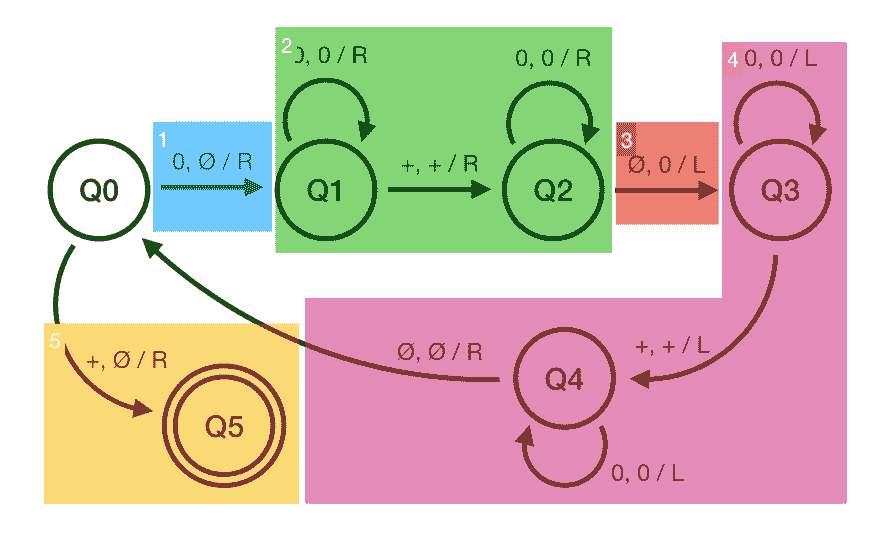

# 什么是图灵机？(又有什么关系呢？)

> 原文：<https://dev.to/marinbenc/what-s-a-turing-machine-and-why-does-it-matter-1m79>

你不会总想着数学家会像工程师一样创造东西，但事实是数学家一直在创造东西。只是他们构建的东西大多存在于他们的脑海中(以及发表的论文中)。它们不是你能看到和感觉到的具体事物。他们这样做是为了证明定理或性质。图灵在“建造”图灵机时就是这么做的。

为了设定场景，想象一下 1928 年左右，还没有可编程计算机被发明出来。但是数学家确实研究算法和可计算的东西。由于计算机是如此有限，找出所有程序的通用属性的唯一方法就是认真思考。

他们无法理解的算法特性之一是我以前写过的:[停机问题](https://programmingwords.com/home/halting-problem)。停机问题是问你是否能写一个程序来判断另一个程序是否会冻结。(剧透提醒:不可以！)

停顿问题很难解决，因为程序的数量是无限的。要回答这个问题，我们需要一台可以执行无限量程序的计算机，图灵就是这么做的。

图灵的机器不是*真正的*机器。它是一个数学模型，一个概念，就像状态机、自动机或者组合逻辑一样。它纯粹存在于抽象中。(尽管图灵机的“真实”实现确实存在，比如在[这篇计算机科学基础论文中。](https://www.youtube.com/watch?v=uNjxe8ShM-8))

## 图灵机如何工作

图灵机有三个主要部分:

1.  该节目的明星是一卷无限长的**胶带**。这种带子可以被书写，书写的符号可以被擦除或者用不同的符号重写。
2.  写东西的是头。磁头可以在磁带上上下移动，并在磁带上写入、擦除或重写符号。就像硬盘里的磁头。
3.  还有一个**状态寄存器**，是机器的内存。它保存机器的当前状态。

图灵机所做的只是从一片磁带上读写。在任何一步，它都可以写一个符号并向左或向右移动。但是即使是有限的动作，它也能做各种事情。事实上，它可以做任何编程语言做的所有事情。

[](https://res.cloudinary.com/practicaldev/image/fetch/s--JTI-9vOm--/c_limit%2Cf_auto%2Cfl_progressive%2Cq_auto%2Cw_880/https://thepracticaldev.s3.amazonaws.com/i/utkf48b75mcd7ko2dcde.png)

有一张指示表，告诉机器什么时候做什么。这个表格有五列。第一列检查机器的当前状态。第二列检查哪个符号当前位于机器头部下方。这两列决定了机器可以有不同的输入组合。

接下来的三列是要写的下一个符号，头应该移动到哪里，下一个状态是什么。这三列决定了机器对给定的前两列执行的操作。

例如，如果机器当前处于状态" A ",并且磁头在符号" 0 "之上，那么机器应该在那个位置写" 1 "并且向右移动，转换到状态 b。

如果你按照顶部的说明表，你会看到，对于状态 A，所有的 0 都被替换为 1，反之亦然。对于 B，0 和 1 保持不变。a 总是转换到 B，B 转换到 a。这导致一台机器将每隔一个字符串符号进行反转。所以对于“1111”你会得到“0101”。

让我们看一个更复杂的例子，看看这到底是如何工作的。

[](https://res.cloudinary.com/practicaldev/image/fetch/s--li76y3xV--/c_limit%2Cf_auto%2Cfl_progressive%2Cq_auto%2Cw_880/https://thepracticaldev.s3.amazonaws.com/i/7uron3vnbzi9c74bken6.png)

这看起来不像你的标准 C 程序，是吗？指令表并不能很好地扩展。编写图灵机的一个更好的方法是使用如上图。如果你曾经和自动机打过交道，这看起来会很熟悉。

上图是一个做加法的图灵机，给定一个类似“00+000”(2+3)的字符串，它会输出“000000”(5)。

图中的圆圈是状态，命名为 Q0 到 Q4。状态用箭头连接，表示从一种状态到另一种状态的转换。在箭头上你可以看到三个符号，比如“0，X / R”。您可以将第一个符号(在我们的例子中为“0”)视为检查磁带上当前符号的`if`条件。如果磁带上的符号是“0”，将执行转换。如果机器读取一个符号，并且在当前状态下没有从该符号的转换，则机器停止。

第一种状态用箭头标记。机器的目标是移动到最终状态，这个状态非常好，我们可以绕它两圈。如果机器停止在最终状态之外的任何地方，这意味着要么我们的机器出错了，要么我们的输入语法出错了。这类似于编译器验证代码的方式。如果它在编译之前就卡住了，这意味着您有一个语法错误。

我们定义图灵机使用的符号。对于这个例子，我们将使用四个符号:“0”、“1”、“加号”和“∅”来表示一个空格。

后两个符号告诉机器该做什么。逗号后的第一个符号是将被写在磁带上的内容。“0，X / R”的意思是“如果我正在读取一个 0，用 X 替换它”。斜线后的符号告诉头部去哪里。r 代表右，自然，L 代表左。所以总的来说,“0，X / R”的意思是“如果你读到一个 0，用 X 替换它并右移”。一旦转换完成，机器就进入下一个状态，即转换箭头所指的状态。每当机器读取一个符号，它要么进入另一个状态，要么停止。

现在我们已经有了基本原理，让我们一步一步地把 000 和 00 相加。以下是该机器功能的高级概述:

[](https://res.cloudinary.com/practicaldev/image/fetch/s--H-em5WuA--/c_limit%2Cf_auto%2Cfl_progressive%2Cq_auto%2Cw_880/https://thepracticaldev.s3.amazonaws.com/i/uqukpbi51lp43fuvsdyp.png)

1.  用空格替换第一个 0。
2.  移动到字符串的末尾。
3.  将“0”添加到字符串的末尾。
4.  回到字符串的开头，并回到步骤 1。
5.  如果第一个符号是“+”，删除“+”并完成。

让我们一步一步地做加法。我们拿一块(假想的)胶带，在上面(用抽象的记号笔)写下“00+000”。我们给机器磁带，把磁头定位在第一个 0。

```
"00+000"
 ^(Q0) 
```

机器最初处于状态 Q0。状态 Q0 有两个转变，一个是“0”，另一个是“+”。机器读取“0”，用一个空格替换，然后向右移动。

```
" 0+000"
  ^(Q1) 
```

这台机器现在在 Q1。同样，我们有两个转换，其中一个是循环。就像编程语言一样，图灵机也有循环。循环将所有 0 替换为 0，并向右移动。换句话说，它只是跳过所有的 0。“X，X / R”是图灵机器对“跳过”的说法。

```
" 0+000"
   ^(Q1) 
```

机器跳过了所有的 0，现在是“+”，但仍在 Q1。过渡到 Q2 只是跳过了“+”。

```
" 0+000"
    ^(Q2) 
```

现在我们有了与 Q1 相似的转换:机器将首先跳过循环中的所有 0。

```
" 0+000 "
       ^(Q2) 
```

一旦到达空白处，它会用 0 替换空白处，并将**向左移动**，转换到 Q3。

```
" 0+0000"
      ^(Q3) 
```

Q3 将再次跳过所有 0，直到到达“+”，但这次向左移动。一旦到达“+”，机器将向左移动一格并转换到 Q4。

```
" 0+0000"
  ^(Q4) 
```

Q4 将跳过所有 0，转换回 Q0，如果到达一个空格(即字符串开头后的一个空格)，则向右移动。

```
" 0+0000"
  ^(Q0) 
```

我们刚刚描述的相同循环再次发生。你能看到机器在做什么吗？本质上，该机器用空格替换“+”前面的 0，将头移动到字符串的末尾并添加“0”。然后，它返回到左起的第一个 0，做同样的事情。它一直这样做，直到用空格替换“+”左边的所有 0。

```
Loop 1: 00+000
Loop 2:  0+0000
Loop 3:   +00000
          ^(Q1) 
```

三圈后，机器发现自己回到了 Q1，但这次它显示的是“+”。机器的最后一步用空白状态替换“+”，并移动到最终状态 Q5。

```
 00000
   ^(Q5) 
```

我们走吧！我们给机器“00+000”，得到的是“00000”。诚然，它不是最有用的计算器，但它表明，用这样一套简单的工具和规则，我们可以建造一台可以计算的机器！它适用于任意长的数字或 0！

## 这个为什么重要？

图灵没有想出*一个*机器。图灵为所有的*机器提出了一个抽象模型。换句话说，*任何*算法都可以建立在图灵机上。从“2 + 2”一直到最新的《刺客信条》，一台图灵机就能运行。(但后者需要*大量*胶带。喜欢，很多很多。)*

这是对计算机的理论描述。毕竟，这正是图灵使用图灵机的目的。他想到了它们，这样他就可以证明一般可计算事物的性质。在此之前，我们对算法的极限一无所知。我们不知道到底能计算出什么。

最酷的是，这项惊人的发明只是图灵试图回答一些基本数学问题的副产品，但在这个过程中，他创造了我们今天使用的所有计算机的基础。

对于坐在这里用我们的通用电脑阅读这些内容的我们来说，这一切听起来很好。但是请记住，图灵是在 1936 年写的这个**。这是在任何可编程计算机出现之前。事实上，在当时，“计算机”指的是人，而不是机器。当时的想法是，计算机只能为一项任务而专门制造。但是图灵不这么认为。他相信你可以建造一台可以编程完成任何任务的机器。事实证明这是真的，因为你目前正在使用一个。**

> 具有这种特性的机器的存在有一个重要的结果，即除了考虑速度之外，没有必要设计各种新的机器来完成各种计算过程。它们都可以用一台数字计算机来完成，并根据每种情况进行适当的编程。-图灵，1950 年。

哦，我有没有提到当他还是一个 23 岁的学生时就想到了这些？回答数学和计算机科学的一个基本问题，并通过这样做发明一种抽象的方法来描述所有的计算机，甚至在它们成为一个东西之前，这对于一个夏季项目来说是一个非常酷的想法。

> 注:这是来自[programmingwords.com](https://programmingwords.com)的转贴。这是一个关于不同计算机科学主题的博客，以简单易懂的方式进行了解释。如果你对 compsci、编译器或编程语言感兴趣的话，就去看看吧！:)

## 参考文献

图灵论文:

[https://londmathsoc . online library . Wiley . com/doi/ABS/10.1112/plms/S2-42 . 1 . 230](https://londmathsoc.onlinelibrary.wiley.com/doi/abs/10.1112/plms/s2-42.1.230)

《图灵注释》(一本比我更好地解释了图灵所有工作并有历史背景的伟大著作)
[http://theannotatedturing.com](http://theannotatedturing.com)

图灵机解说- Computerphile(视频)

【https://www.youtube.com/watch?v=dNRDvLACg5Q】T2

库尔奇-图灵论文

【https://plato.stanford.edu/entries/church-turing/ T2】

《计算机器与智能》，图灵关于机器智能的论文

【https://www.csee.umbc.edu/courses/471/papers/turing.pdf】T2