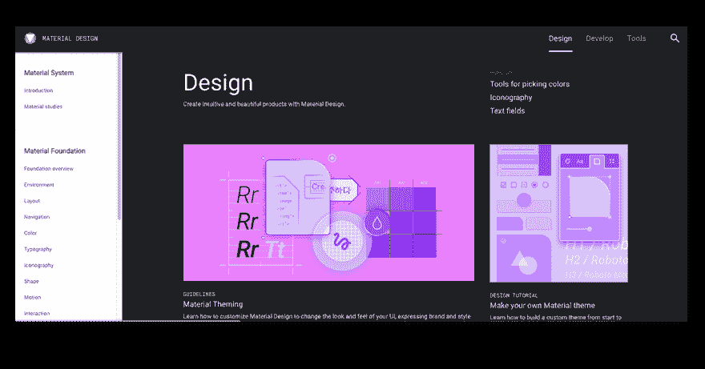
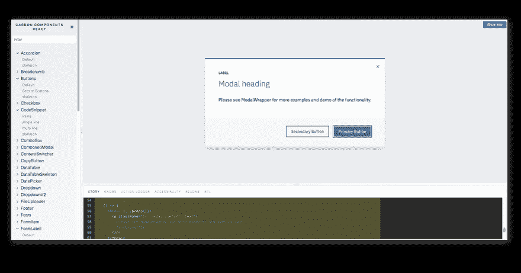
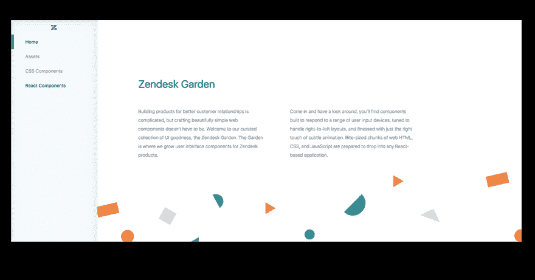
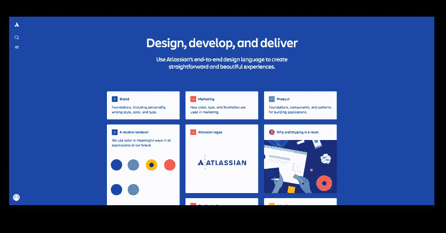
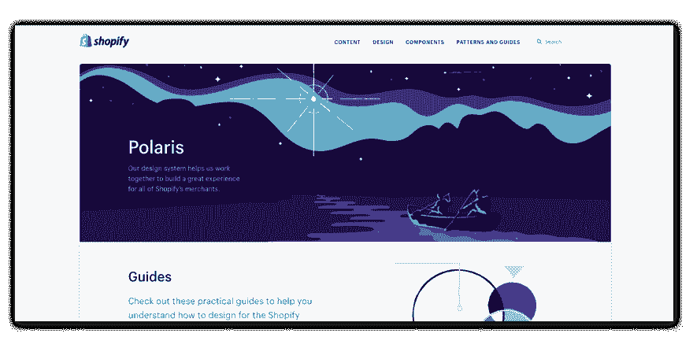

# 什么是设计系统，为什么你需要一个

> 原文：<https://dev.to/graphqleditor/what-s-design-system-and-why-you-need-one-31fh>

正在寻找改进设计开发工作流程的方法吗？你需要一个设计系统！为什么？因为它将帮助你更好、更快地工作&将你的团队协作提升到一个新的水平！

设计系统是一个非常流行的概念，最近引起了很多情绪和兴趣...甚至美国政府也有一个他们称之为[美国网页设计系统](https://designsystem.digital.gov/):)

### 什么是设计系统

设计系统是可重用的图形组件、设计标准、风格指南的集合，它们为产品团队定义了通用的视觉语言。它加速了设计过程，并通过清晰的图形标准弥合了参与构建最终产品的团队之间的差距，这使得从组件组装网站变得超级容易。所以基本上，设计系统是图形和开发团队的规则手册，我们可以这样分解:

*   **设计系统**–一整套设计标准以及实现这些标准的原则、模式&代码组件。
*   **模式库**–设计系统的子类，定义了允许的设计模式。
*   风格指南(Style guide)-展示产品外观的子类，包含 UI 模式、排版等用例。

来源:[扎克·卢瑟福为 UXPin 工作室制作](https://www.uxpin.com/studio/blog/design-systems-vs-pattern-libraries-vs-style-guides-whats-difference/)

### 好处

设计系统在设计公司或产品视觉识别的新元素时提供一致性。设计系统为最终用户和产品团队创造了简单而美好的体验，使协作变得更加容易:

*   设计师们可以将设计过程分解成更小的部分，比整个网页更容易处理、管理和改变。

*   **开发人员**因此他们清楚如何构建所需的组件以保持统一的风格，

*   **产品负责人/经理**基于组件的方法使得向开发团队请求额外的页面元素变得非常简单

### 例子

你们可能都听说过谷歌著名的 **[材料设计](https://material.io/)** :

但这不是唯一一个你可以从中获得灵感的，因为像 IBM、奥迪或 Atlassian 这样的大公司都公开了他们的设计系统。你可以看看其中的几个:

**[碳反应元件由 IBM](http://react.carbondesignsystem.com/)**

**[Zendesk 花园](https://garden.zendesk.com/)**

**[亚特兰蒂斯设计系统](https://atlassian.design/)**

**[北极星 by Shopify](https://polaris.shopify.com/)**

### 寻找更多？

一定要去参观[https://designsystemsrepo.com/design-systems/](https://designsystemsrepo.com/design-systems/)获得更多样品&灵感！