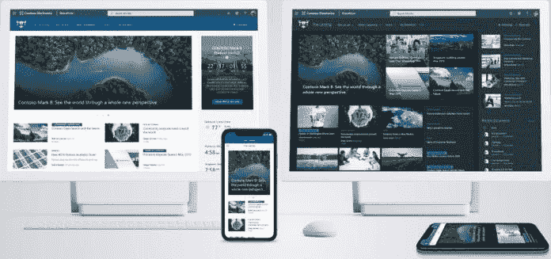
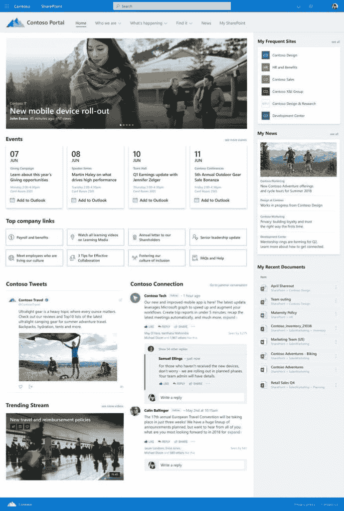
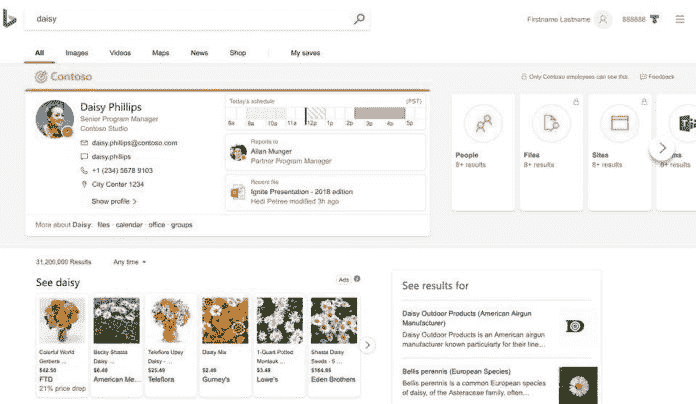
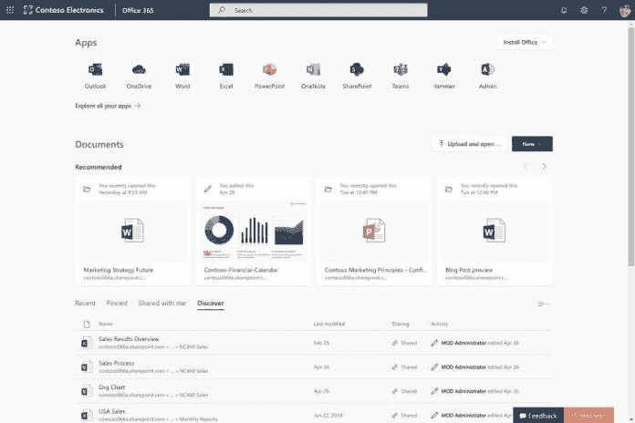
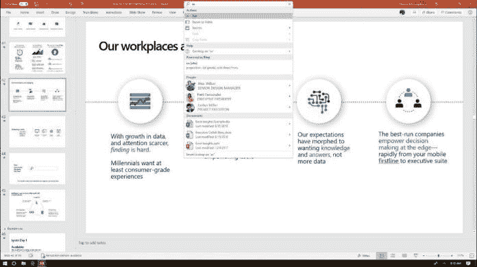
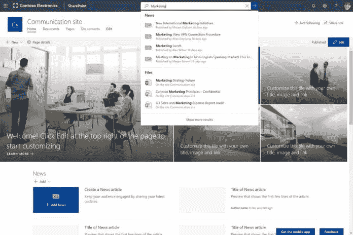
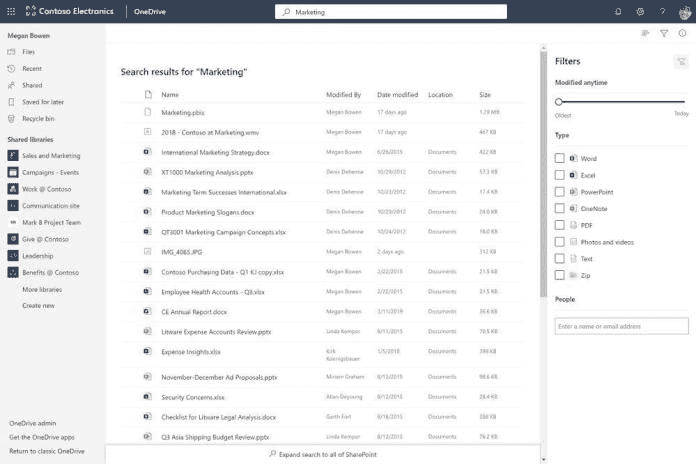
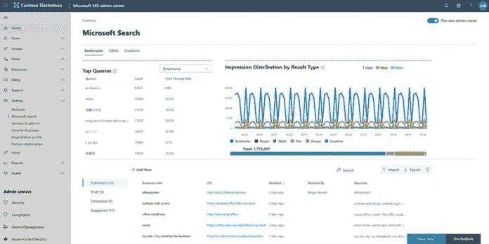

# SharePoint Conference 2019 的 SharePoint 和 Office 365 新功能(第 1 部分)

> 原文：<https://dev.to/mlisidoro/what-s-new-for-sharepoint-and-office-365-from-sharepoint-conference-2019-part-1-1k8a>

来自 SharePoint Conference 2019 (Part 1)的帖子[SharePoint 和 Office 365 的新功能](https://blogit.create.pt/miguelisidoro/2019/06/05/whats-new-for-sharepoint-and-office-365-from-sharepoint-conference-2019-part-1/)首先出现在[博客 IT](https://blogit.create.pt) 上。

SharePoint 和 Office 365 已经走过了漫长的道路，看到微软这些年来一直在向该平台引入的不断创新，真是令人惊叹！

5 月 21 日至 23 日，微软再次举办了 [SharePoint 大会](https://www.sharepointconference.com)，这是其最大的科技活动之一，展示了微软世界中许多令人兴奋的新功能，包括 SharePoint 和 Office 365。

## 简介

有很多新的公告正在以非常快的速度发布，要跟上所有正在发布的东西是一个挑战！

这篇文章将尝试恢复 SharePoint 和 Office 365 世界的最新公告，以及它对最终用户、it 专业人员和开发人员的意义。

希望你已经准备好乘车，系好安全带，因为有许多新功能即将推出(其中一些可能在撰写本文时已经推出)。虽然不可能谈论所有已经宣布的事情，但我将尝试在两部分系列中恢复一些最大的宣布。这些是我将在这个两部分系列的第一部分中讨论的主要话题:

*   SharePoint 主网站
*   微软搜索
*   OneDrive 的新增功能
*   对开发人员来说有什么新功能

要阅读这个帖子系列的第二部分，请点击[这里](https://blogit.create.pt/miguelisidoro/2019/06/05/whats-new-for-sharepoint-and-office-365-from-sharepoint-conference-2019-part-2/)。

## SharePoint 主网站

毫无疑问，今年 SharePoint 大会最大的宣布之一是新的 SharePoint 主页。这是一个 SharePoint 交流网站，旨在成为贵组织的主页。

SharePoint 主网站基本上是一个预建的门户，它基于一个具有许多附加功能的通信网站。主网站有一些新的 web 部件(也可用于任何通讯网站),并自动配置为整个组织的新闻网站。

主要目标是通过将相关新闻、事件、内容、对话和视频集中到一个地方，提供一种能反映每个组织与整个公司最相关的信息的吸引人的体验，从而促进员工在组织内的参与。

这是 SharePoint 主网站的外观:

与传统的通讯网站相比，SharePoint 主网站具有以下优势:

*   一个伟大而现代的设计
*   SharePoint 主网站被配置为默认组织的新闻网站
*   页面中显示的信息的范围是整个租户(使用 Microsoft Search)

新的 SharePoint 主页将分为两大类信息:

*   与整个组织相关的内容
*   显示相关个性化内容(针对登录用户的内容)的智能 web 部件，使每个用户都可以轻松快速地访问最相关的信息，这是一种很好的体验(再次由基于搜索的功能提供支持)。示例:我经常访问的网站、我的新闻、我最近的文档

从现在开始，创建新的引人入胜的 SharePoint 门户将是几分钟的事情，而不是几天或几周，因为 SharePoint 主页将是现成的，不需要任何自定义开发。

在不久的将来，所有新的 Office 365 租户都将自动创建一个 SharePoint 主站点作为他们的主页。对于现有的租户，管理员将能够使用 PowerShell(并最终使用管理中心)配置一个主站点。

要了解更多关于 SharePoint 主页的信息，请点击[此处](https://techcommunity.microsoft.com/t5/Microsoft-SharePoint-Blog/SharePoint-home-sites-a-landing-for-your-organization-on-the/ba-p/621933)。

## 微软搜索

微软搜索是在上一个微软 Ignite 版本中宣布的(如果你想了解关于微软 Ignite 2018 公告的一切，请单击[此处](https://dev.to/mlisidoro/whats-new-for-sharepoint-and-office-365-after-microsoft-ignite-2018-7ga))从那以后，这个部门发生了很多事情。

### 微软必应搜索(现已推出)

如果您正在使用 Bing，并且使用您的 Office 365 帐户登录，搜索结果将汇集来自您的 Office 365 租户的 web 结果和组织结果，包括 People、SharePoint、Microsoft Teams 和 Yammer。

### 微软 Office.com 搜索(现已推出)

现在已经可以从 Office.com 门户进行搜索，并快速找到与您最相关的信息，包括您最近处理的文档(所有这些都由 Graph API 提供)。

### 微软 Office 桌面应用中的搜索(现已推出)

从办公应用程序(包括桌面、网络和移动应用程序)中获得一致的搜索体验已经成为可能。例如，搜索体验允许您从 Word 文档中搜索 PowerPoint 演示文稿，并在不打开 PowerPoint 的情况下将特定幻灯片直接插入到 Word 文档中！

搜索结果也是上下文相关的，建议将根据用户正在编辑的文档部分出现。

### SharePoint 中的微软搜索(现已推出)

最近，微软搜索被纳入现代 SharePoint 网站，将允许用户快速找到新闻，文件和人。与其他 Office 365 应用程序一样，搜索框显示在页面顶部。

第一次单击搜索框时，搜索结果将显示建议以及您最近处理或打开的文档。

### one drive 中的微软搜索(现已提供)

OneDrive 中还提供了 Microsoft Search，让您可以从 OneDrive 文件中快速找到您想要的信息，并快速筛选搜索结果。

### 微软视窗搜索(即将推出)

尚不可用，但很快就可以直接从 Windows 10 搜索 Office 365 租户中的信息(文档、人员)。

### 微软搜索管理中心(现已推出)

新的微软搜索管理中心已经可用，并允许管理员查看贵组织内部信息的有价值的见解，如热门查询、按结果类型的印象分布等。

### 其他微软搜索公告(今年晚些时候)

对于 IT 专业人员和开发人员来说，今年晚些时候还将发布一些令人兴奋的主要新功能:

*   定制精炼机
*   自定义垂直搜索
*   自定义结果类型的自定义显示模板

要了解更多关于微软搜索的最新公告，请点击[此处](https://techcommunity.microsoft.com/t5/Microsoft-SharePoint-Blog/Search-that-works-wherever-you-re-working/ba-p/576431)。

要阅读所有关于 SharePoint 和 Office 365 的最新公告，请点击[此处](https://blogit.create.pt/miguelisidoro/2019/06/05/whats-new-for-sharepoint-and-office-365-from-sharepoint-conference-2019-part-1/)。

分享快乐！

来自 SharePoint Conference 2019 (Part 1)的帖子[SharePoint 和 Office 365 的新功能](https://blogit.create.pt/miguelisidoro/2019/06/05/whats-new-for-sharepoint-and-office-365-from-sharepoint-conference-2019-part-1/)首先出现在[博客 IT](https://blogit.create.pt) 上。