# Chrome DevTools 2019 的新功能

> 原文：<https://dev.to/tomoyukikashiro/what-s-new-in-chrome-devtools-2019-1emi>

我喜欢 Google I/O 中的 Chrome DevTools 会话中的[新功能，以便了解最新更新！可惜 Google I/O 2019 没有那个环节…所以我自己做的！](https://www.youtube.com/watch?v=mfuE53x4b3k&list=PLNYkxOF6rcIC4NQeXpdAy0RbOACI66Hvf&index=8&t=0s)

我们开始吧！

## JavaScript

### 热切评价(v68) [ [在 youtube 上观看](https://chromedevtools.fun/versions/v68#eager-evaluation)

控制台面板的设置中有`Eager evaluation`选项。如果打开它，您可以在执行前看到结果。

[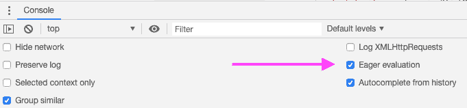](https://res.cloudinary.com/practicaldev/image/fetch/s--MtcwP_RA--/c_limit%2Cf_auto%2Cfl_progressive%2Cq_auto%2Cw_880/https://i.gyazo.com/0cd520a0d8cb1dbaca760b18ec5afb1b.png)

当你写正则表达式时，它可能是有用的。这个功能以前可以在金丝雀版本中使用，但现在每个人都可以在标准版本的 Chrome 中使用。

[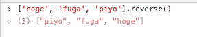](https://res.cloudinary.com/practicaldev/image/fetch/s--JDbgpNrw--/c_limit%2Cf_auto%2Cfl_progressive%2Cq_auto%2Cw_880/https://i.gyazo.com/1542791f418040fca340a53395104a1f.png)

### 论据提示(v68) [ [在 youtube 上观看](https://chromedevtools.fun/versions/v68#argument-hints)

当您键入时，Funcnton 参数提示显示在控制台面板中。

[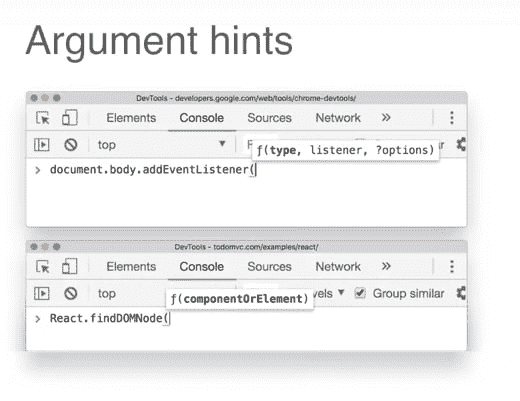](https://res.cloudinary.com/practicaldev/image/fetch/s--LJeYECrn--/c_limit%2Cf_auto%2Cfl_progressive%2Cq_auto%2Cw_880/https://i.gyazo.com/080a0ad0fd3d3d1be5e1561d5d8879cf.png)

### 调用函数后自动完成(v68) [ [在 youtube 上观看](https://chromedevtools.fun/versions/v68#autocomplete-after-invoking-functions)

对于函数返回值，显示自动完成。

[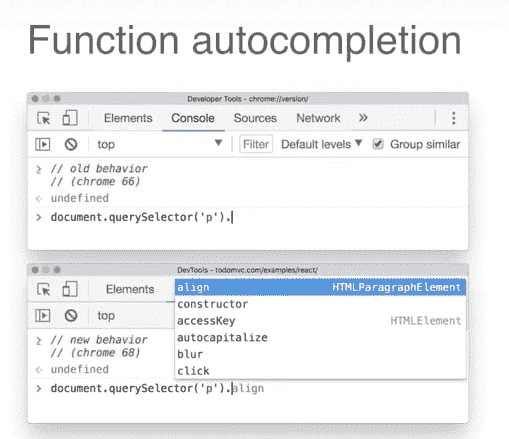](https://res.cloudinary.com/practicaldev/image/fetch/s--FG19L0Jj--/c_limit%2Cf_auto%2Cfl_progressive%2Cq_auto%2Cw_880/https://i.gyazo.com/19d412c972d98e8168e299a2f60f6e9b.png)

### 控制台中的现场表情(v 70)【[在 youtube 上观看](https://chromedevtools.fun/versions/v70#live-expressions-in-the-console)

您可以在控制台面板中设置`Live Expression`语句。在这种情况下，每次改变焦点元素时,`activeElement`都会改变。

[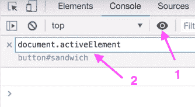](https://res.cloudinary.com/practicaldev/image/fetch/s--lvOkbpPy--/c_limit%2Cf_auto%2Cfl_progressive%2Cq_auto%2Cw_880/https://i.gyazo.com/8208b85dac508579ce4d9a6e02df7031.png)

### 将 DOM 节点存储为全局变量(v71)【[在 youtube 上观看](https://chromedevtools.fun/versions/v71#store-dom-nodes-as-global-variables)

您可以通过选择上下文菜单中的`Store as global variable`将元素设置为 javascript 全局变量。

[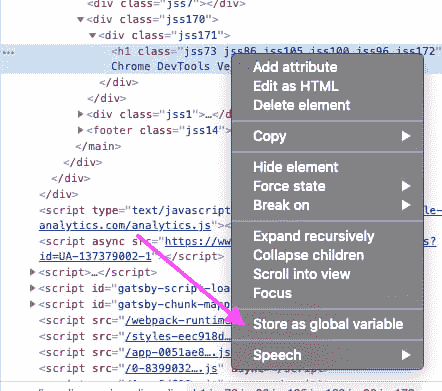](https://res.cloudinary.com/practicaldev/image/fetch/s--kSpTBlMt--/c_limit%2Cf_auto%2Cfl_progressive%2Cq_auto%2Cw_880/https://i.gyazo.com/9f5cc7b7868703cb425f5b8b65ae2503.png)

该元素将被设置为`temp${N}`。

[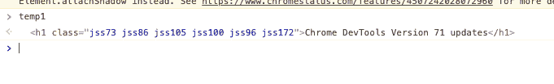](https://res.cloudinary.com/practicaldev/image/fetch/s--T1FGhIhZ--/c_limit%2Cf_auto%2Cfl_progressive%2Cq_auto%2Cw_880/https://i.gyazo.com/568c269f755884cc2daaf5f1f2e35d4c.png)

### Logpoint (v73) [ [在 youtube 上观看](https://chromedevtools.fun/versions/v73#logpoints)

前端开发人员常用的调试模式是`write console.log`->-`execute javascript`->-`remove console.log`。现在你不需要为它编辑代码了！！

您可以将 logpoint 放入源代码面板中的语句。

[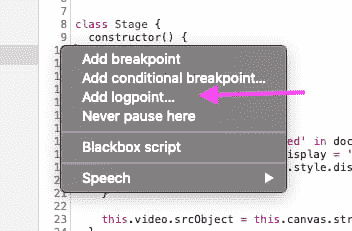](https://res.cloudinary.com/practicaldev/image/fetch/s--1RbF2ud6--/c_limit%2Cf_auto%2Cfl_progressive%2Cq_auto%2Cw_880/https://i.gyazo.com/05d100536ddb0b024052edd27694ef0e.png)

## 元素

### 检查节点时的详细提示(v73) [ [在 youtube 上观看](https://chromedevtools.fun/versions/v73#detailed-tooltips-when-inspecting-nodes)

当您在元素面板中选择元素时，会显示元素的详细信息。

[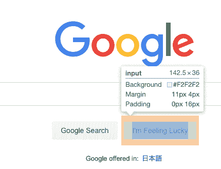](https://res.cloudinary.com/practicaldev/image/fetch/s--MzlYRlaS--/c_limit%2Cf_auto%2Cfl_progressive%2Cq_auto%2Cw_880/https://i.gyazo.com/75bb084bdc77608d641915961a1980f6.png)

### 拾色器中的 AAA 对比度线(v 73)[在 youtube 上观看](https://chromedevtools.fun/versions/v73#aaa-contrast-ratio-line-in-the-color-picker)

您可以查看当前的`Contrast ratio`和对它的推荐。

[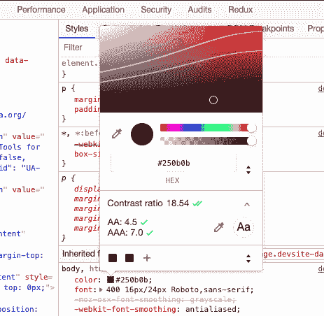](https://res.cloudinary.com/practicaldev/image/fetch/s--3MaukE4F--/c_limit%2Cf_auto%2Cfl_progressive%2Cq_auto%2Cw_880/https://i.gyazo.com/b8599016891b21e7994beb180fa928f1.png)

你可以查看更多关于对比度的细节。

[无障碍风格](https://developers.google.com/web/fundamentals/accessibility/accessible-styles#color_and_contrast)

### 高亮显示所有受 CSS 属性影响的节点(v74) [ [在 youtube 上观看](https://chromedevtools.fun/versions/v74#highlight-all-nodes-affected-by-css-property)

当你编辑 css 属性时，同样的 css 属性所应用的元素将会被高亮显示。在这种情况下，在编辑 css 属性时，`p`元素中边距被突出显示。

[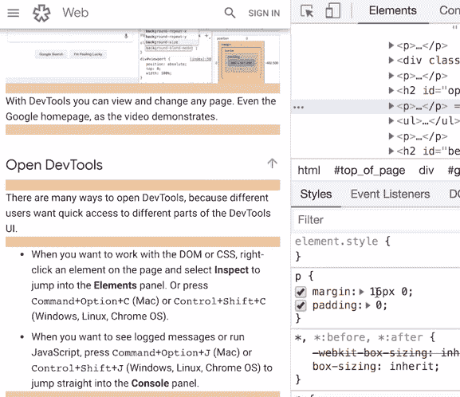](https://res.cloudinary.com/practicaldev/image/fetch/s--PwpZjtli--/c_limit%2Cf_auto%2Cfl_progressive%2Cq_auto%2Cw_880/https://i.gyazo.com/68558d4e64b838dd89fec55e2796dde6.png)

## 表现

### 计时部分的性能指标(v72) [ [在 youtube 上观看](https://chromedevtools.fun/versions/v72/#performance-metrics-in-the-timings-section)

您可以在网络面板中查看`First Pain`、`First Contentful Paint`等性能指标。

[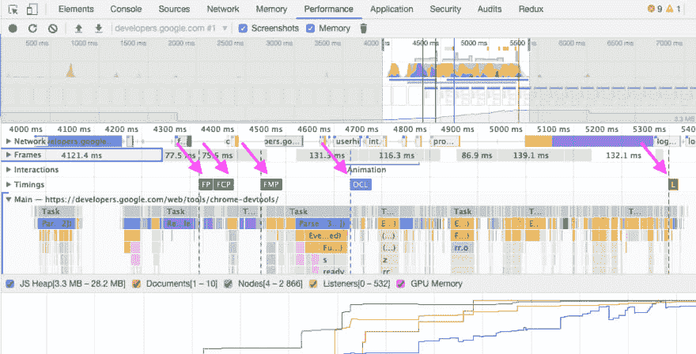](https://res.cloudinary.com/practicaldev/image/fetch/s--zsERsXfa--/c_limit%2Cf_auto%2Cfl_progressive%2Cq_auto%2Cw_880/https://i.gyazo.com/56ac198e4d12f74b7b6dcdf99898a646.png)

### 表演录像中的长任务(v74) [ [在 youtube 上观看](https://chromedevtools.fun/versions/v74#long-tasks-and-first-paint-in-performance-recordings)

你可以在网络面板看到`Long Task`。这些任务在右上角有红色三角形标签。

[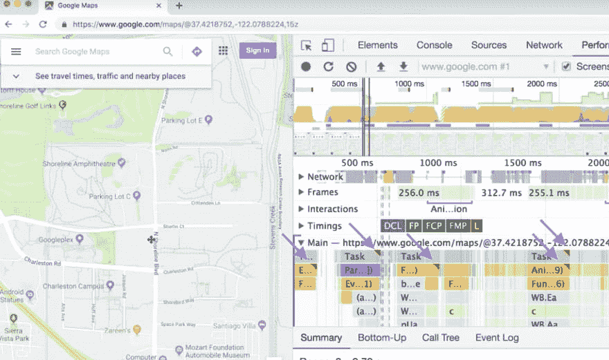](https://res.cloudinary.com/practicaldev/image/fetch/s--fzwyIAN9--/c_limit%2Cf_auto%2Cfl_progressive%2Cq_auto%2Cw_880/https://i.gyazo.com/16bea4cbd6b45d3ab35373a45bc96401.png)

## 最后

有一堆更新！感谢 ChromeDevtools 团队的最大努力！！！！

我做了一个网站，你可以根据版本或功能检查所有更新。

看看吧！！

[https://chromedevtools.fun/](https://chromedevtools.fun/)

[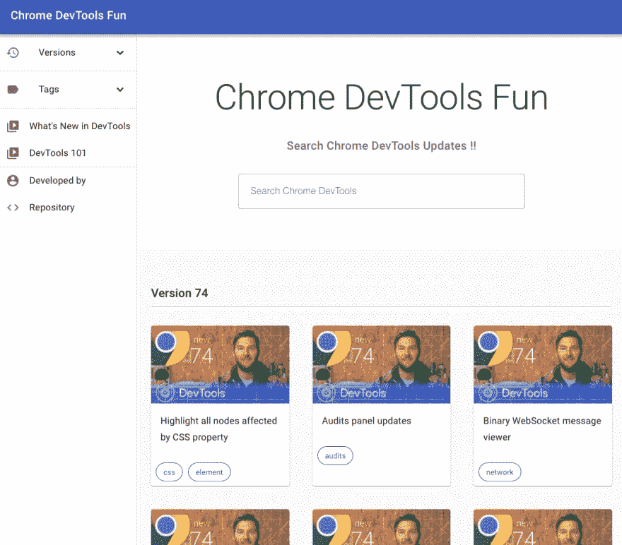](https://res.cloudinary.com/practicaldev/image/fetch/s--6qmKe-mS--/c_limit%2Cf_auto%2Cfl_progressive%2Cq_auto%2Cw_880/https://i.gyazo.com/959038c904555b7ce98e54a7716a1437.png)