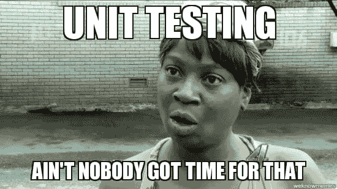

# 我们应该测试什么(反应堆组件)

> 原文：<https://dev.to/mihailgaberov/what-should-we-test-reactjs-components-9hp>

###### 照片由 [Artem Sapegin](https://unsplash.com/photos/ZMraoOybTLQ?utm_source=unsplash&utm_medium=referral&utm_content=creditCopyText) 在 [Unsplash](https://unsplash.com/search/photos/unit-testing-reactjs?utm_source=unsplash&utm_medium=referral&utm_content=creditCopyText) 上拍摄

当我们谈论测试时，网络上有很多讨论。甚至更多关于单元测试的知识。在[反应](https://reactjs.org/)。

**TL；博士**

这将是一个简短的总结，当我们测试一个 [ReactJS](https://github.com/facebook/react/) 应用程序时，我们应该考虑什么以及如何考虑。更具体地说，在为我们的应用程序创建 React 组件时，我们应该为什么编写测试。如果你想跳过阅读，[这里](http://mihailgaberov.github.io/testing-reactjs-presentation/)你可以在几张幻灯片中找到更短的版本。

> 以下所有观点都是比我聪明的人推荐的。我只是把它们收集起来作为最佳实践的总结，试图帮助我的团队在这个问题上做出决定。并开始在日常工作中使用它们。

我们需要单元测试吗？

这是一个很长时间的讨论，只有一个正确的答案。是啊！测试为开发人员提供了信心。这种信心让我们能够生产出质量更好的软件。进行适当的重构。更好地思考我们所做的事情。

从短期来看，这可能看起来不值得。这需要太多时间。我们可能花在实现功能上的时间。但是在每个项目开始后不久，拥有一套好的测试服的回报是巨大的。没有这样的惩罚，尤其是当发布日期临近的时候——灾难！

**测试渲染逻辑**

当我们为组件编写测试时，我们以这样的方式编写它们，它们只测试渲染逻辑，而不关心任何内部实现。这是什么意思？这意味着，你的测试应该是测试用户将要看到和交互的东西。假设您正在测试一个在屏幕上显示按钮的组件。

> 当用户点击按钮时，你的组件在一个 div 元素中呈现一条消息。您的测试实际上也应该检查这一点——检查按钮是否是可点击的，以及点击后这个 div 是否存在。

**没有生命周期方法**

测试不应该测试生命周期方法，它们应该被 React 本身覆盖。如果我们有一些逻辑需要在这些方法中测试，我们应该尝试在另一个可测试的地方提取它，并且只在那里使用它。理想情况下，例如在我们的 *componentDidMount* 方法中，我们应该只有获取数据的功能(例如调用 API)。如果需要的话，所有你可能想留在那里的剩余部分，应该用其他方法提取出来，可以进行测试。

没有外人

> *(单元)测试不应该测试与外界的交互！*

“单位”这个名字寓意着独立自主。单元测试应该是一段封装的代码，它包含了完成工作所需的一切。当我们需要编写需要数据的测试时，我们使用模拟。也就是说，与 API、db 等的每一次交互。不是单元测试的问题，也不应该在这种情况下进行测试。

**小，更小，更容易**

测试应该小而易读——如果我们需要测试一个有很多依赖项的大组件，我们需要考虑把它分成更小的可测试部分。

> *Dīvide et imperā.*

正如上面的名言所暗示的，处理小型的、模块化的组件要比处理相反的事情容易得多。此外，如果我们需要使用大的模拟，我们需要将它们从测试中提取出来，并且只通过导入来使用它们，以避免污染测试文件。

* * *

**例子**

*   给定一个包含按钮和文本字段的简单组件
*   我们应该测试用户能看到什么——渲染，以及用户能做什么——用户交互
*   如果点击后有视觉变化，请测试
*   如果单击后返回一个值—测试它

但是我们不关心点击处理程序的内部实现！

我准备了一个小例子，试着演示以上。这里可以找到[。为了在您的机器上本地运行它，只需克隆它并安装依赖项。然后做*【NPM 运行测试】*。🚀 📜](https://github.com/mihailgaberov/testing-reactjs-examples)

**参考文献**

网上有很多关于这个主题的资源，但我将在这里列出我发现非常有用并从中学习到的资源。

👏一篇关于这个主题的好文章

👏[另一个用 Jest、Enzyme 和 Sinon 测试的好方法](https://www.leighhalliday.com/testing-react-jest-enzyme-sinon)

[是切页](https://github.com/sapegin/jest-cheat-sheet)

👏[在线演示幻灯片](https://mihailgaberov.github.io/testing-reactjs-presentation)

👏 [Github repo](https://github.com/mihailgaberov/testing-reactjs-examples) 带工作示例

**结论**

我们必须从所有这些测试中吸取的重要教训是，无论我们如何精确地编写我们的测试(这很重要…有一点)💬)，只要我们写测试。当我们努力开发防错软件时，这种思维和工作方式应该成为我们的第二天性。随着时间和练习，事情会变得更好更容易。对我们来说最重要的是永远不要停止改进。

> *继续前进！*

🔥感谢阅读！🔥