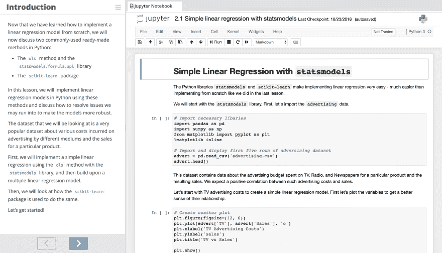
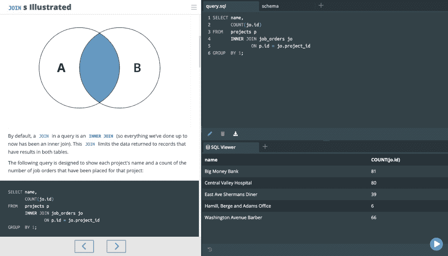

# 你下一步想学习什么技术技能？🤓

> 原文：<https://dev.to/nexttech/what-tech-skill-do-you-want-to-learn-next--9g>

上周，我们宣布了与技术出版商 Packt 的令人兴奋的合作关系。我们正在与他们合作，建立一个学习技术技能的实践课程库，我们希望听到您有兴趣学习的内容！

我们已经发布了许多课程，涵盖的主题包括:

*   软件工程
*   Web 开发
*   数据科学
*   机器学习
*   数据库和 SQL

这是一个包含 Jupyter 笔记本的机器学习课程的截图:

这是 SQL 课程的另一个例子:

这些课程都提供了基于浏览器的环境，您可以在其中获得所学内容的真实体验。开始实际建造一些东西是学习过程中的一个重要部分，但是经常花费数小时进行设置会妨碍掌握一项新技能。

我们构建了下一代技术 IDE 来解决这个问题，我们对与 Packt 的合作感到非常兴奋，因为这意味着我们将能够发布比以往更多的实践课程！

# 你想学什么？

好了，说够了，说说你吧！你对学习什么感兴趣？是一门特定的语言，一个通用的技术领域，还是别的什么？

如果你愿意，你可以从 [Packt 网站](https://www.packtpub.com/)选择一个标题，然后在下面回复它！我们会作出回应，让你知道我们是否已经在开发这个课程，或者让你知道我们什么时候可以发布它！

您的意见对我们非常有价值，因为 Packt 有六千本电子书和视频，所以我们可以从中挑选很多！🥴

同时，想看看现在的课程是什么样的？前往[我们的网站](https://c.next.tech/2NPMsFH)查看！