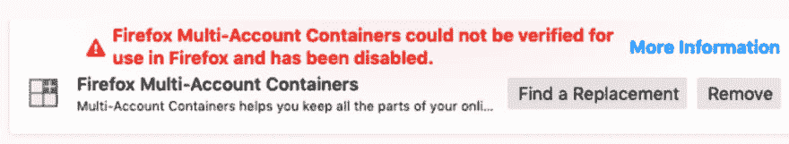

# 到底是什么证书问题搞乱了我们的附加组件

> 原文：<https://dev.to/trishul/what-the-heck-is-certificate-issue-that-messed-up-our-add-ons-3h93>

 
火狐让用户可以安装插件以增加效用。Firefox 确保插件(基本上是第三方代码)经过审查和签名(带有 Mozilla 证书)。这些已签署的附加软件可以在 addons.mozilla.org 上获得，也可以在开发者网站上托管。现在，一旦你在 Firefox 中安装了插件，它就会寻找证书，并且只允许那些由已知的 Mozilla 证书签名的插件。其余每个加载项都显示为损坏。

不幸的是，证书现在已经过期，因此所有的插件都显示为损坏，火狐插件团队正在努力解决这个问题，很快我们就会有一个解决方案。 [Bugzilla 条目](https://bugzilla.mozilla.org/show_bug.cgi?id=1548973)

请关注此 twitter 帖子，了解修复进度(mozamo)[[https://twitter.com/mozamo/status/1124484255159971840](https://twitter.com/mozamo/status/1124484255159971840)

作为一个非常快速的解决方法，你可以在这个 reddit 帖子上尝试一些想法，但是很明显这些都是暂时的！

*更新*

# amoFixed😎😎😎

[https://twitter.com/mozamo/status/1124627930301255680](https://twitter.com/mozamo/status/1124627930301255680)