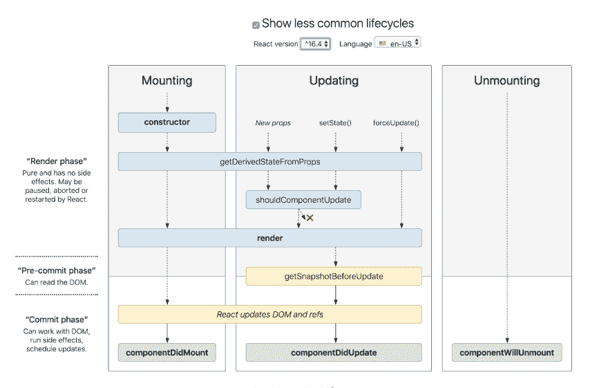
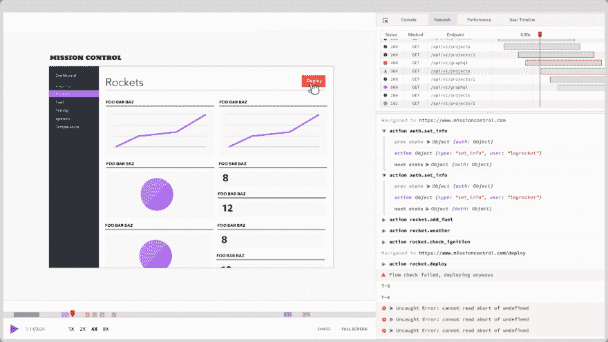

# React v17 有什么值得期待的

> 原文：<https://dev.to/bnevilleoneill/what-to-expect-in-react-v17-5b7g>

[](https://res.cloudinary.com/practicaldev/image/fetch/s--wZ0hFUtJ--/c_limit%2Cf_auto%2Cfl_progressive%2Cq_auto%2Cw_880/https://thepracticaldev.s3.amazonaws.com/i/1xh99uadtu8y7ustsfs7.png)

React Fiber(React v16)非常棒，已经采取了一些重要的措施来改善开发人员的体验以及用 React 构建的应用程序的质量。在本帖中，我们将看看 React 17 是如何基于 React v16 构建的。

### **为什么异步渲染？**

React 17 专注于异步渲染，旨在通过最大限度地降低计算和网络速度对用户体验的影响，为开发人员创建一个轻松构建高效应用的环境。

为了实现这一点，React 应用程序的编写方式将不可避免地发生一些变化，引入一些新功能，摒弃一些以前的功能。

以下是我们可以期待的变化:

*   不赞成使用某些生命周期方法
*   引入新的生命周期方法
*   时间分片
*   焦虑

我们一个一个来看。

[](https://logrocket.com/signup/)

### **折旧年限法**

在 React 17 中，某些生命周期方法将被弃用，因为它们不是为即将到来的功能设计的，使用起来不安全。这些方法是`componentWillMount`、`componentWillReceiveProps`和`componentWillUpdate`。

为什么它们不安全？在`componentWillMount`的情况下，异步渲染将在组件树上触发多个渲染过程，这对优化来说不是很好。为了处理这个问题，支持将通过`Suspense`完成，我们将在本文的后面介绍。

这三种生命周期方法在 16.3 版中被[标记为不安全，在 17 版中将被弃用。因此，在版本 17 中，它们仍将作为`UNSAFE_componentWillMount`、`UNSAFE_componentWillReceiveProps`和`UNSAFE_componentWillUpdate`存在，并将被新的、安全的生命周期方法所取代。](https://reactjs.org/blog/2018/03/27/update-on-async-rendering.html)

如果您正在处理任何想要升级到 React 17 的项目，您会想要考虑用引入的新方法替换这些不推荐的生命周期方法。

在 React 17 中，不推荐使用的生命周期方法将不可用。React 团队非常友好地在 React 16.3 中提供了不安全的替代方案，以允许计划迁移应用程序的开发人员开始为 React 17 做准备。这些方法的不安全版本将在 React 17 中可用，但值得注意的是，它们可能会导致应用程序崩溃，顾名思义。

如何才能避免这种情况？让我们看看新的方法。

### **新的生命周期方法**

取代不推荐的生命周期方法的是两种新的生命周期方法，`getDerivedStateFromProps`和`getSnapShotBeforeUpdate`。

如果您准备将您的应用程序迁移到 React 17，请记住这些要点。一个很好的起点是用这些新的生命周期方法替换不安全的方法。例如，`componentWillUpdate`可以通过结合使用`getDerivedStateFromProps`和`shouldComponentUpdate`来替换，`componentWillMount`应该被一起移除以进行异步渲染。

下面是 React v16.4 去掉不安全方法后组件生命周期的示意图。

[](https://res.cloudinary.com/practicaldev/image/fetch/s--Wqvhal2D--/c_limit%2Cf_auto%2Cfl_progressive%2Cq_auto%2Cw_880/https://cdn-images-1.medium.com/max/1600/0%2Als7dIj5g0q8hcpIj)

### **getDerivedStateFromProps**

这个生命周期方法取代了`componentWillReceiveProps`和`componentWillUpdate`，并且将在组件被创建之后以及当它接收到新的 props 时被调用。当道具改变时，它返回一个对象来更新状态；当状态没有改变时，返回`null`。

```
state = { cachedSomeProp: null };

static getDerivedStateFromProps(nextProps, prevState) {
  // do things with nextProps.someProp and prevState.cachedSomeProp
  return {
    cachedSomeProp: nextProps.someProp,
    ..
  };
} 
```

Enter fullscreen mode Exit fullscreen mode

但是，请记住，这种生命周期方法只适用于在 props 发生变化后组件需要更新其本地状态的情况。不必要的使用这个方法可能[引入一些 bug](https://reactjs.org/blog/2018/06/07/you-probably-dont-need-derived-state.html)，比如无条件复制道具到状态，当道具改变时擦除状态`componentWillReceiveProps`就是这种情况。

### **getsnapshotbefore update**

这将处理组件更新，并将有效地取代`componentWillUpdate`并与`componentDidUpdate`一起工作。它在任何 DOM 更新之前被调用，并返回一个传递给`componentDidUpdate`的值，后者随后处理更改:

```
class ScrollingList extends React.Component {
  listRef = null;

  getSnapshotBeforeUpdate(prevProps, prevState) {
    // Are we adding new items to the list?
    // Capture the scroll position so we can adjust scroll later.
    if (prevProps.list.length < this.props.list.length) {
      return (
        this.listRef.scrollHeight - this.listRef.scrollTop
      );
    }
    return null;
  }

  componentDidUpdate(prevProps, prevState, snapshot) {
    // If we have a snapshot value, we've just added new items.
    // Adjust scroll so these new items don't push the old ones out of view.
    // (snapshot here is the value returned from getSnapshotBeforeUpdate)
    if (snapshot !== null) {
      this.listRef.scrollTop =
        this.listRef.scrollHeight - snapshot;
    }
  }

  render() {
    return (
      <div ref={this.setListRef}>
        {/* ...contents... */}
      </div>
    );
  }

  setListRef = ref => {
    this.listRef = ref;
  };
} 
```

Enter fullscreen mode Exit fullscreen mode

### **时间分片**

时间切片是 React 的最大更新，旨在改善用户体验。它的目标是通过允许元素的优先渲染来使网站更加友好。所以高优先级更新不会因为呈现低优先级更新而被阻止。

丹·阿布拉莫夫将此比作 2018 年冰岛 JSConf 的版本控制。其中工作被分成分支，并且每个分支的工作一旦完成就被合并到主服务器。类似地，使用时间片，元素可以单独呈现，允许应用程序呈现就绪的元素和尚未呈现的元素的占位符。

一个很好的例子是我们获取用户的详细信息。用户头像和名字将会显示，他们的简历稍后会出现。时间片将允许我们显示准备好的细节(姓名和头像)，并有一个占位符，而生物被提取。一旦 bio 准备好了，它就会呈现出来，最终状态和预期的一样。这增强了应用程序在较慢的设备和网络上的响应能力，也意味着当某个元素仍在渲染时，应用程序的其余部分仍可使用。

这是如何实现的？通过 React 16.6 中引入的名为[悬念](https://reactjs.org/docs/code-splitting.html#suspense)的新 API。

### **悬念**

悬念负责在准备状态更新时呈现回退 UI(占位符)。在这些更新准备好之前，它会保留最终 UI 的呈现，同时呈现您选择的占位符。如果您打算用它来指示装载状态，这就是您应该放置微调器的位置。

这为处理数据加载提供了一个很好的替代条件呈现的方法。您还可以设置时间限制，如果数据在此时间内加载，回退 UI 将不会以并发模式呈现。太棒了，对吧？更好的是，悬念是在 React 16.6 中引入的，所以悬念现在就可以使用。

这里有一个使用悬念的简单例子:

```
const DataComponent = React.lazy(() => import('./DataComponent'));

function MySuspenseComponent(){
  return (
    <Suspense fallback={<Spinner />}>
      <DataComponnent/>
    <Suspense>
    )
} 
```

Enter fullscreen mode Exit fullscreen mode

在上面的例子中，悬念与 [lazy()](https://reactjs.org/blog/2018/10/23/react-v-16-6.html) 一起使用，lazy 加载 DataComponent，在加载组件时，会显示一个微调器，我们的组件仅在加载完成后显示。我们还可以使用其他异步操作(如 API 调用)来实现这一点。

React 17 还有望推出稳定版的 [react-cache](https://github.com/facebook/react/tree/master/packages/react-cache) 库，这将有助于扩展悬念的功能，并允许在同步操作中使用异步操作。下面是 react-cache 可能的样子:

```
const getInfo = () => fetch("https://myApi.apiexample").then(res => res.json())

const ApiResource = createResource(getInfo)

const SayHello = () => {
  const data = ApiResource.read()

  return <div>Hi {data.name}</div>
}

const App = () => (
  <Suspense fallback={<Spinner />}>
    <SayHello />
  </Suspense>
) 
```

Enter fullscreen mode Exit fullscreen mode

<figure>

react-cache 也可以与时间片一起使用，以低优先级更新的方式在后台加载数据，一个很好的例子是当数据显示为选项卡时，这使得数据在选项卡之间切换时立即可用。Andrew Clark 在 React Conf 2018 上做了一个很棒的演示，比如一个使用案例，请看下面:
[https://www.youtube.com/embed/ByBPyMBTzM0](https://www.youtube.com/embed/ByBPyMBTzM0)

<figcaption>Concurrent Rendering in React</figcaption>

</figure>

### **结论**

React 17 是一个主要版本，React 开发人员有几个理由感到兴奋。它不仅提供了一些令人惊叹的新功能，这些功能将重新定义 React 应用程序的构建方式，而且它还扩展了最近引入的功能，如钩子，并进行增量更改，使开发人员可以更好地利用它们。这将带来更好的应用程序和更好的构建体验。看到 React 的未来还会发生什么令人兴奋。

你可能还想看看 Dan Abramov 在 JS Conf 2018 上的演讲，我在编写这篇文章时提到过。
[https://www.youtube.com/embed/nLF0n9SACd4](https://www.youtube.com/embed/nLF0n9SACd4)

* * *

### Plug: [LogRocket](https://logrocket.com/signup/) ，一款适用于网络应用的 DVR

### [T4】](https://logrocket.com/signup/)

LogRocket 是一个前端日志工具，可以让你回放问题，就像它们发生在你自己的浏览器中一样。LogRocket 不需要猜测错误发生的原因，也不需要向用户询问截图和日志转储，而是让您重放会话以快速了解哪里出错了。它可以与任何应用程序完美配合，不管是什么框架，并且有插件可以记录来自 Redux、Vuex 和@ngrx/store 的额外上下文。

除了记录 Redux 操作和状态，LogRocket 还记录控制台日志、JavaScript 错误、堆栈跟踪、带有头+正文的网络请求/响应、浏览器元数据和自定义日志。它还使用 DOM 来记录页面上的 HTML 和 CSS，甚至为最复杂的单页面应用程序重新创建像素级完美视频。

[免费试用](https://logrocket.com/signup/)。

* * *

关于 React v17 的帖子[首先出现在](https://blog.logrocket.com/what-to-expect-in-react-v17/)[博客](https://blog.logrocket.com)上。