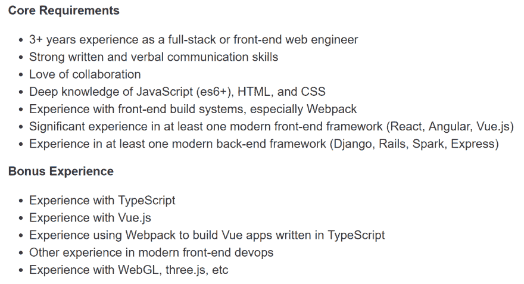
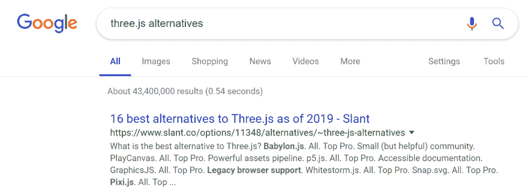

# 先学什么

> 原文：<https://dev.to/isaacdlyman/what-to-learn-first-4fj9>

*这是来自**的一个章节的早期版本，是一本给新开发者的实用指南和建议的书。如果你正在考虑从事软件行业，去 https://leanpub.com/firstyearincode*看看吧。

* * *

我偶尔会收到一个新开发人员的消息，他被软件开发世界中存在的所有技术和选择所淹没。你从哪里开始？其中一些开发人员已经看到了如下招聘广告:

这是一个标准的中级网站开发职位。它列出了 14 项具体技术，暗示了更多，如果这还不够，它还有一个“等”即使作为一家价值十亿美元的公司的高级软件工程师，我也不确定那是什么“等等”是指。也许我可以谷歌一下:

哦，太好了。16 多项技术。如果我是这方面的新手，我会想，“你的意思是我必须学习 30 种不同的编程语言才能得到一份中级工作？”然后我会放弃，申请一份要求不那么高的工作，比如脑外科。

让我们消除这种恐惧:不，你不需要学习 30 种不同的编程语言，无论是现在还是将来。你需要学一门。然后你需要学习一些常用于该语言的工具。那会让你得到一个初级职位。之后，你有选择:越来越好地使用你已经知道的语言和工具(你可以称之为“房间里的专家”路线)，或者学习更多的语言(“创业工程师”路线)。这两条路都会让你的职业生涯更上一层楼，赚更多的钱，而且两者都不一定比另一条更好，但是你可能会发现你更喜欢其中的一条。

那么你应该从哪里开始呢？

列出你正在考虑的技术。那就选一个。如果有一家你想去工作的公司，他们为其中一家大量招聘，选择那家。或者，如果你知道你想要构建什么样的,选择与之配套的技术(Android 应用程序使用 Java，iOS 应用程序使用 Swift，web 应用程序使用 JavaScript，等等)。或者，跟着感觉走。或者抛硬币，或者掷 d20，或者从帽子里选一个。没有“最好”的技术。这里重要的是你*承诺*。花时间了解这项技术，用它构建简单的项目，阅读关于它的文章，寻找使用它的 GitHub 项目。

有些人在使用一项新技术一两天后就开始怀疑自己，所以他们换了一种不同的技术，然后又换了一种，然后又换了一种。这就像学习用 50 种不同的语言说“早上好”。这是一个党的伎俩，而不是一个适销对路的技能。不要让自己这样。即使你在某样东西上花了五年时间，并决定它不适合你，这也不是完全的损失；你所学到的 80%或更多的技能将会整齐地转移到你的下一项技术中。选择“错误”技术的后果是微不足道的。

如果你还不懂编程语言，我推荐你从 JavaScript、Python 或者 C#开始。所有这些都非常受欢迎，需求量很大。如果你已经知道 JavaScript，学习一个像 Lodash 这样的实用工具和一个像 React 或 Vue 这样的 web 框架，或者学习 Node.js 和一个像 Express 或哈比神这样的服务器端框架。如果你懂 Python，学个 NumPy 或者 Pandas 之类的数据科学库，或者 Django 或者 Flask 之类的 web 框架。如果你懂 C#，学习 ASP.NET MVC 来构建 web 应用，Xamarin 来构建原生应用，或者 Unity 来构建视频游戏。

一旦你选择了一项技术，你能做的最好的事情就是开始一个项目。想出一些你想做的简单的东西，然后一步一步地向它努力，在前进的过程中学习你需要学习的东西。一旦你完成了它，你就有了一个很好的作品集，同时也有信心知道你能从头到尾看完一个项目。

我保证，只要你不刻意去选择陌生而晦涩的技术，你选择的任何东西都能通向成功的事业。外面有很多工作。

如果你需要任何额外的确认或帮助决定学习什么，你可以随时通过 Twitter ( [@isaacandsuch](https://twitter.com/isaacandsuch) )或电子邮件(【mentoring@isaaclyman.com】T2)联系我。祝你好运！