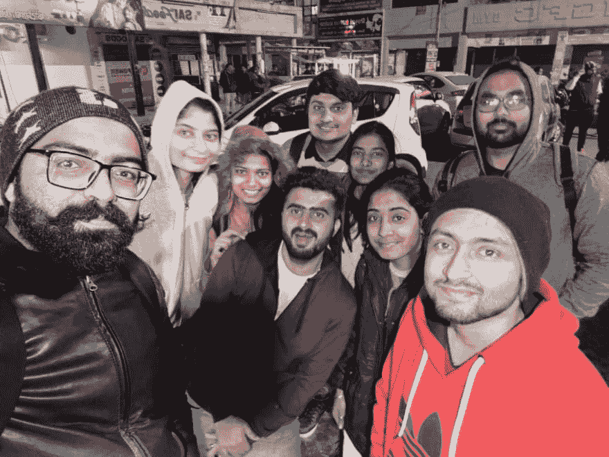
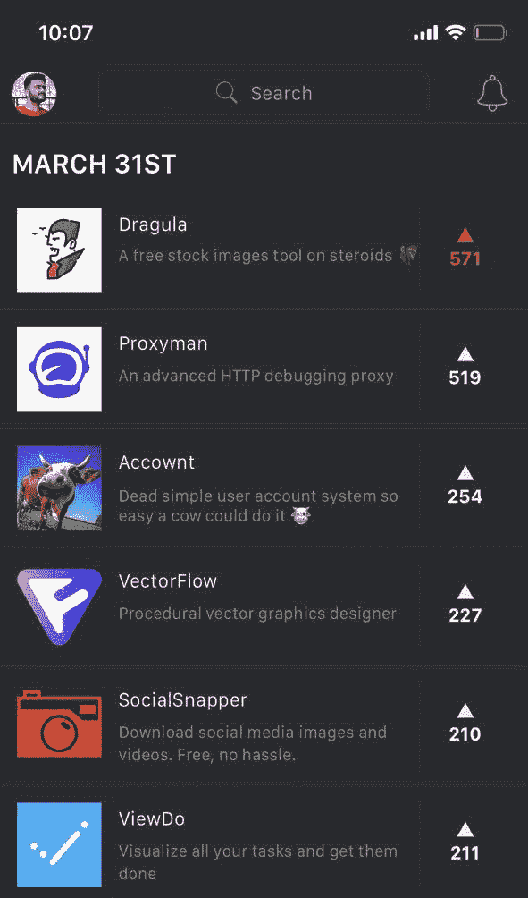
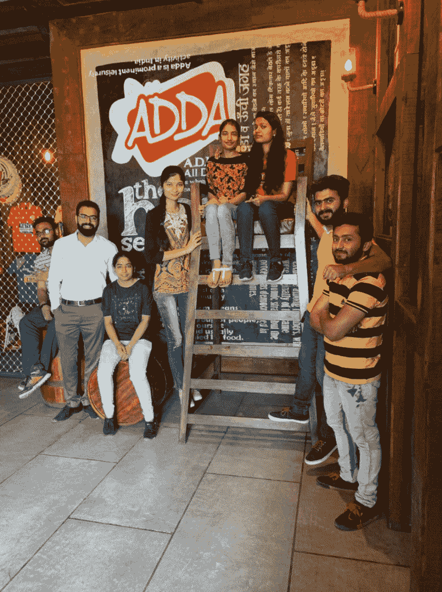

# 我们从几乎失败的产品搜寻活动中学到了什么

> 原文：<https://dev.to/xenoxdev/what-we-learned-by-almost-failing-our-product-hunt-launch-3jf2>

### *“任何可能出错的事情都会出错。”*

我相信你们都听说过墨菲定律，这句古老的格言描述了我们的宇宙表现出的某种反复无常。我们的计划经常被搞砸，不管多么细致。你曾经因为汽车抛锚而错过重要会议吗？工作面试迟到是因为找不到出租车还是交通堵塞？因为你的狗生病错过了和你喜欢的人的约会？宇宙有时似乎很不合理，不是吗？

有时候，它看起来是如此的不合理，以至于你觉得它试图给你传递一个信息，就像它试图告诉你它不会让你的计划实现。🙅‍♀️

那正是我和我的团队那天的感受。

## 我们的计划🤔

让我从二月底说起，当时我们刚刚在开发团队的帮助下成功推出了产品搜索的 [DEV-CLI](https://www.producthunt.com/posts/dev-cli) 。非常感谢 Peter、Ben、Jess 和整个社区！【XenoX 团队总部的情绪很高，我们很高兴按照承诺在 3 月份推出下一款产品。🙌💯

[Sarthak](https://dev.to/sarthology) 很快开始研发 [Dragula](https://dragula.teamxenox.com/) ，这是我们迄今为止最好也是最大的产品，我们开始为 2019 年的第三次发布做准备。这一次，我们想把一切都做好。我们希望继续向社区提供精彩的免费开源产品。我们希望 Dragula 成为 PH 上的头号产品，这是一个雄心勃勃的目标，但我们知道这是可以实现的，因为我们的概念是可靠的。所以我们研究了每一个小细节，直到我们想在哪天和什么时候发布。📆
1)我们决定为 Dragula 建立一个[发货页面](https://www.producthunt.com/upcoming/dragula)，一旦我们的应用接近我们想要的功能。随着我们对应用程序的不断改进，下一步将是建立一个早期订户的电子邮件列表。
3)下一步是制作一些营销材料，如视频、横幅、照片和 gif。最后，我们打算在 3 月的最后一个星期五，也就是 29 号发布这款应用。

然而，事实证明，宇宙对我们另有安排。

## 究竟发生了什么😰

T3】**Tldr；事情发生了，东西坏了，人们可能会哭，但我们还是交付了。**
不过如果你真的想知道细节，那我就从 3 月 26 日说起吧。我们还有几天时间，所以我们感觉很有信心。PH 即将到来的页面并没有很好地工作，所以我们没有一个电子邮件列表，但这不是一件大事。下次我们可以做得更好。我们仍然对发射相当乐观。😃😀当我发现我们没有任何宣传视频的素材时，真正的问题开始出现了。我曾让我的一群朋友使用这款应用，并给他们发了一些自己录制的视频，但没有成功。由于这样或那样的原因，他们都逐渐退缩了，而且是在关键时刻。在登陆日到来之前，我们又煎熬了几天。那天是 3 月 29 日，我们已经做好了发射的准备。我们没有准备好登陆页面，没有准备好视频，甚至应用程序在 Windows 上运行也突然遇到了问题。更糟糕的是，我们的网络提供商突然决定讨厌我们。我们认为今天不是我们的好日子，并同意第二天开始，一切都很完美，因为在月底之前我们还有一些时间。但是哦，天啊，我们会有更多的麻烦。
第二天开始也开始了一系列不幸的事件。事情是打破左，右和中心，看起来我们真的不能启动那天。但是现在不能放弃。我们无论如何都要发布这个应用，所以这只会让我们加倍努力。🏋️‍♂️

以下是发布当天的一些场景。

由于办公室的网络仍然中断，我们决定把整个团队带到 Sarthak 的地方，从那里开始工作，直到我们结束。

我们借助垃圾食品、可乐的力量，以及我们当地的吉祥物和萨尔萨克的宠物洛维偶尔的拥抱，挺了过来🐶。看看照片中的[安库尔](https://dev.to/i_ankurbiswas)有多开心👆。你甚至看不出他只是因为在代码中犯了一个愚蠢的错误而受到了责备。😛与此同时，我们的远程忍者[帕万](https://dev.to/pavanjadhaw)🐱‍👤，当时正在为 Dragula 开发 Linux 版本。最后，经过 12 个小时的紧张工作，我们在晚上 8:30 推出了产品搜索的 [Dragula。然后我们都回家了。这真是漫长的一天。庆祝活动可以等等。](https://www.producthunt.com/posts/dragula-2)

## 我们学到了什么🙇‍♂️

我们从这次经历中学到了很多东西。我肯定我可以一直这样说下去，但这里有一个简短的版本:

#### 1。更好地管理外部风险！

有那么多我们可以最小化的外部风险因素。我们只需要更加了解他们。有些事情超出了我们的控制(是的，我仍然对互联网的混乱耿耿于怀！)，但如果有更好的规划，其他问题是可以避免的。

#### 2。积极优先！

我们在三月的上半月做得相对不错，但是一旦我们在 PH 上发布了即将到来的页面，我们就有点失去了重点，不能很好地进行优先排序。这将提醒我们，如果我们想继续以我们要求自己的效率运行，我们总是需要积极地进行优先排序。

#### 3。时间紧迫，就不要实验了！

如果我们不去尝试新的东西，而是互相寻求帮助，我们甚至可以在发布当天节省很多时间。产品视频就是最好的例子。我浪费了很多时间编辑和整理一个音轨，但最终还是被拒绝了。如果一开始就问一下，我就可以节省所有的时间并提前几个小时交货！实验是伟大的，但当你时间紧迫时，这肯定不是你应该做的。

#### 4。不要放弃！

发射那天是我们工作中最累的一天，我们感觉糟透了，一天中几乎多次推迟发射。但尽管如此，我们还是赢了。只要有足够的毅力，一切皆有可能。听起来很老套，但那是因为这是事实。
**当事情变得棘手，墨菲定律开始起作用时，你能做的最好的事情就是直视宇宙，告诉它，*“去你的。无论如何我都要完成这件事"***

## 最终，德拉古拉大获成功！

尽管我们在发布会上犯了很多错误，我们知道我们可以做得更好，但我们很高兴我们没有半途而废。Product Hunt 推迟了 Dragula 的发布时间，将其推迟到第二天，即 3 月 31 日，但结果对我们有利。
 
我们的努力得到了回报，Dragula 成为当天的#2 产品！事实上，在超过 23 个小时的时间里，它都在榜首。我无法告诉你我们有多兴奋！💪

这么多人在这么短的时间内注册了 Dragula，可以说我们被震惊了。我们在不到一周的时间里为 Dragula 吸引了超过 500 名用户！所以，我们决定庆祝一下。😎✌

 
聚会在一起的团队呆在一起！🎉😻💯

#### *是的，Dragula 最终没有成为当时的头号产品，但它确实非常接近，这对我们来说足够好了，至少现在是这样。我们实现了自己的梦想，我们为此感到非常高兴。因为这就是 XenoX 团队的宗旨。我们致力于将梦想变成现实。所以我将以公开邀请你们所有人来结束我的演讲。如果你有一个想法，你需要帮助变成现实，请联系我们。我们会实现的。*😉🤘