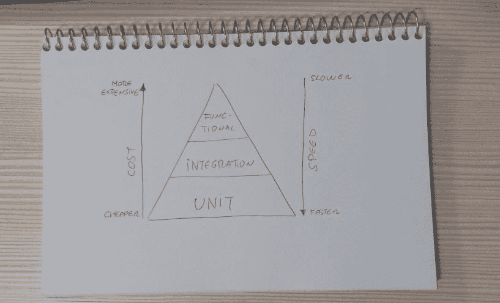

# 我们应该从测试中期待什么？

> 原文：<https://dev.to/xoubaman/what-we-should-expect-from-tests-5d9n>

前几天是我第一次在聚会上发言。一切都很顺利，我认为这也是我第一次来到德夫托。这是关于测试的。由于这篇文章太大，我将把它分成三篇:

*   这一篇，第一篇，是对考试的目的和特点的简要介绍。
*   第二个是关于如何有效地进行测试。
*   第三个是关于如何构建更好的测试，避免一些最常见的反模式。

开始了。

# 我们应该从测试中期待什么？

测试为我们编写的代码提供了信心，这既是因为它有效，也是因为它不会破坏以前有效的代码。

在我们作为开发人员的第一步中，我们全身心投入到手工测试中。但是，当应用程序只增长一点点时，这不是一个有效的策略。

当有一些复杂性时，手动测试变得不仅低效，而且不安全。在一个复杂的应用程序中，需要记住的东西太多了:不容易触发的后台进程、组件之间的交互、异步进程、具体的数据设置等等。这也非常耗时。

这并不意味着手工测试是浪费时间。除了检查我们所有的代码是否如预期的那样运行，它还有其他的目的。

这就是为什么我们想要一个好的测试套件，它能为我们提供快速的反馈循环，并在它们仍然便宜的时候很快检测出缺陷。这就是测试的全部意义:获得关于我们应用程序正确性的反馈，而且要快。

# 自动化测试的特征

想当然地认为自动化测试是自动化的。他们还有另外两个我们想要加强的特征——确定性和快速性。让我们总结一下这三个特征的含义和暗示:

*   自动化意味着设置应该简单快速，我们可以在尽可能少的人工干预下运行我们的测试。这是从我们的测试中获得最大收益的关键——经常运行它们并将其引入 CI 流程。

*   确定性意味着我们的测试总是用相同的输入产生相同的结果，不管我们运行多少次。为了实现这一点，测试必须处理我们在现实生活中无法控制的因素，比如随机性、供应商 API 等等。尽管某些类型的测试可以解决某些缺乏确定性的问题，但是越多越好。我们一会儿会谈到这一点。

*   快速意味着它们在短时间内被执行，所以我们可以尽快得到反馈。当事情花费太长时间时，我们往往会失去注意力——因此，如果我们的测试运行缓慢，我们就不会运行它们。

最有可能的是，一种类型的测试越不确定和越快，我们在测试套件中想要的数量就越少。

# 测试金字塔

自动化和确定性是相当客观的概念。但是 fast 需要一些参考来比较。

与手工测试相比，所有的自动化测试都很快。然而，有些测试比其他测试要快得多。测试的执行速度、成本和它所覆盖的功能类型之间也有关联。这在所谓的测试金字塔中进行了总结

测试金字塔是我们通常希望应用程序拥有的每种类型测试数量的简单表示。然而，尽管它没有涵盖测试自动化所继承的所有复杂性，但是它为这样的介绍提供了一个很好的画面。

<figure> 

<figcaption>一个简单化的测试金字塔。是的，我画的。是的，我的手机摄像头很烂</figcaption>

</figure>

主要的信息是，写作越便宜，改变越有弹性，我们就越需要它。通常，这意味着我们想要一个从下到上由单元、集成和功能测试组成的金字塔:

*   单元测试:它们覆盖了我们代码中单个单元的行为，因此得名。*单元*的意思是对我们测试套件的质量和一致性有重要影响的事情。我们将在本系列的第三篇文章中讨论这个话题。

    单元测试执行起来非常快——只有几毫秒。一个大套件应该在不超过 1-2 秒的时间内执行。虽然这里很难说绝对，但是不同的设置之间的度量标准有很大的不同。如果你的单元测试运行时间太长，考虑回顾一下那里正在发生的事情——也许它们根本就不是单元测试！

    他们在金字塔的底部，因为他们编码最便宜，运行更快。这就是为什么我们需要很多这样的人——他们是提供反馈最快的人。

*   集成测试:它们涵盖了系统的两个不同组件如何一起工作。典型的例子是与数据库的交互，但其他例子可能是与我们拥有的另一个服务(如支付服务许可管理)或与供应商 API(如登录脸书)的交互。

    集成测试通常比单元测试慢得多，因为它们依赖于一些正在运行的昂贵的服务(或者至少比同一个包中的常规类更昂贵)，比如数据库、消息代理或 web 服务器。

    我们希望它们比单元少，因为它们更费时，而且它们涵盖了一种在应用程序中较少表示的交互类型。组件本身应该比它们之间的交互有更多的逻辑。

*   *功能测试:*它们模拟真实的最终用户与系统的交互，不管最终用户指的是什么(一个人，一个触发推送通知的东西，一只河马，等等)。)，从系统的一个入口点(一些 UI，一个 API 端点等)测试整个系统。).

    与金字塔的较低部分相比，它们的速度很慢:许多服务仅仅是为了一次测试而建立的，并且需要等待很长的流程才能完成。

    因为有太多的事情发生，它们需要大量的设置，并且很容易因为不容易发现的原因而中断。没有合适的方法来处理确定性，UI 中不再有具有特定 ID 的按钮。

    好的建议是只对应用程序最重要的部分进行功能测试，不要处理边缘情况。从功能上测试什么能赚钱。这有时被称为*烟雾测试*。

# 总结

*   测试是为了获得关于我们的应用程序是否如预期那样运行的快速反馈。
*   手动测试成本很高，而且不可靠，无法确保应用程序按预期运行。这就是为什么我们想要自动化测试。
*   我们必须努力使我们的自动化测试具有确定性并快速执行。
*   有三种主要的测试类型，从更快/更便宜到更慢/更贵:单元测试、集成测试和功能测试。

在下一篇文章中，我们将会看到如何改进测试在我们的开发工作流程中扮演核心角色的方法(因为它们确实扮演了核心角色，对吗？)

# 进一步阅读

这篇文章是对自动化测试的一些核心概念的模糊介绍。这里有一些资源可以让你更深入地了解这个主题:

*   测试 101 是一个更长更精确的介绍。值得一读。这个帖子感觉像个 TL；实际上是博士版本。
*   Steve Freeman 和 Nat Pryce 所著的《由测试引导的面向对象软件的成长》一书除了令人惊叹和关注 TDD 之外，还包括了对测试和对象通信的精彩介绍。这也破坏了本系列接下来的大部分帖子！
*   Ham Voker 的实用测试金字塔是一篇关于测试的长篇完整文章。
*   Alister Scott 的这个[测试金字塔帖子](https://watirmelon.blog/testing-pyramids/)有大量的金字塔图。