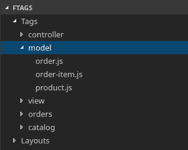
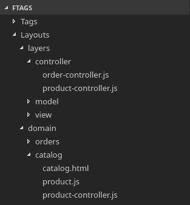

# 你会说什么...文件标记？

> 原文：<https://dev.to/goyo/what-would-you-say-for-file-tagging-26b2>

在过去的几年里，我花了相当多的时间思考代码组织这个话题。这个文件放在哪里？我们是按架构层还是按业务领域分割文件？那种东西。

前几天在做一件完全不相干的事情时，脑子里蹦出一个想法，想和大家分享一下。

如果我们不把文件放在一个单一的、固定的目录布局中，而是简单地标记它们(就像我们对 DEV 上的帖子所做的那样)，然后基于这些标记，我们可以创建所有我们认为有用的布局和层次结构，会怎么样？

标签和布局可以在我们的 repo 中的某种文件中指定，比如在 JSON 或 YAML:

```
{  "tags":  {  "controller":  ["src/controller/user-controller.js",  ...]  ...  },  "layouts":  {  "layers":  ["controller",  "model",  "view"],  "domain":  ["orders",  "catalog"],  ...  }  } 
```

Enter fullscreen mode Exit fullscreen mode

然后，根据我们指定的标签和布局，我们的文本编辑器/IDE 可以让我们方便地浏览文件:

[](https://res.cloudinary.com/practicaldev/image/fetch/s--etyb0ZaE--/c_limit%2Cf_auto%2Cfl_progressive%2Cq_auto%2Cw_880/https://thepracticaldev.s3.amazonaws.com/i/n46muiktzb4c6ijgkyha.png)

[](https://res.cloudinary.com/practicaldev/image/fetch/s--RbLaccaz--/c_limit%2Cf_auto%2Cfl_progressive%2Cq_auto%2Cw_880/https://thepracticaldev.s3.amazonaws.com/i/q374ht73egb0s6fk4mu4.png)

你们觉得怎么样？这会帮助你组织你的代码吗？又或许它解决了一个只在我脑子里，别人都不在乎的问题？

此外，让我知道如果这样的东西已经存在。我试着在网上搜索，但显然我用错了搜索词。