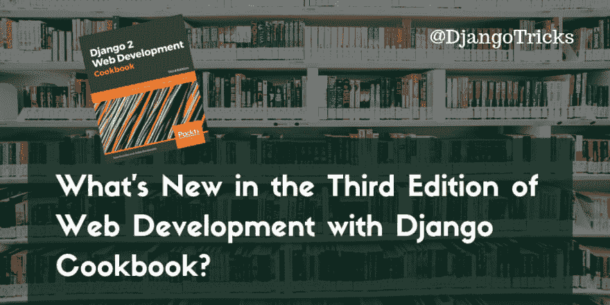

# Django Cookbook Web 开发第三版有什么新内容？

> 原文：<https://dev.to/djangotricks/whats-new-in-the-third-edition-of-web-development-with-django-cookbook-57cn>

几个月前，Django Cookbook 的第三版以标题 [Django 2 Web 开发 Cookbook -第三版](https://www.packtpub.com/web-development/django-2-web-development-cookbook-third-edition)出版。这个版本是由杰克·克罗尼卡彻底地逐步重写的，他审阅了我的第二版，并给它增加了很多价值。我确信他不会让读者失望，所以我邀请他来写更新。在这篇文章中，我将带你了解这本新书 500 多页的主要亮点。

## 最新的

就像 William S. Vincent 的书一样，Django 2 Web Development Cookbook-Third Edition 适用于 Django 2.1 和 Python 3.6。所以你将会用最先进的技术来建造你的 Django 项目。Unicode 字符串、f 字符串、`super()`不带参数、HTML5 标签和面向对象的 JavaScript 等等，在整本书中都有使用。代码被仔细地概括，甚至更加适应“不要重复自己”( DRY)原则。

## 用 Docker 工作

Docker 是最流行的部署技术之一，Jake 简要介绍了如何在 Django 中使用它。

## 使用环境变量进行配置

[12 因素应用指南](https://12factor.net/config)建议将应用配置保存在环境变量中。在书中，有一个如何使用它的实际例子。

## 多语言字段，甚至带有地区特定的语言代码

我在本书的前几个版本中介绍了多语言字段，但它们有一个限制，即不支持特定于地区的语言，如澳大利亚英语或瑞士德语。现在他们是了！

## 通过 schema.org 微数据使用精确的语义标记

Schema.org 微数据允许您更具体地定义内容的上下文，以便内容更易于机器阅读。这对我来说是新的，我仍然不知道它的实际价值，但我想它与可访问性、通过插件呈现数据的新方法以及人工智能有关。

## 为默认 Django 表单字段定义自定义模板

因为 Django 1.11 表单字段是使用模板而不是 Python 代码来呈现的，而且这些模板可以定制。有一个食谱可以告诉你如何做。

## 提供响应图像

HTML5 有带`<source>`子元素的`<picture>`标签，可以与`sorl-thumbnail` Python 包结合使用，根据你的视窗大小生成不同版本的图像:在手机上加载小图像，在平板上加载中间图像，在桌面或智能电视上加载大图像。

## 通过 Ajax 上传图片并删除

在我之前的版本中，我只展示了如何通过 Ajax 上传文件并将其附加到 Django 模型。在杰克的更新中，展示了如何删除图片。

## 验证有特殊要求的密码

从 Django 1.11 开始，你可以为你的用户的密码定义特殊的要求，例如，混合使用大小字母或者包括至少 1 个数字和 3 个特殊字符，等等。有一个实用的方法可以做到这一点。

## 给图像添加水印

当涉及到品牌或版权保护时，通常会在普通图片上添加特殊的水印，即半透明的图像。杰克补充了一个例子，如何做到这一点，我对此非常感兴趣。

## 用 Auth0 认证

在一个菜谱中，展示了如何使用 Auth0 登录 Django 网站，这似乎是一个无密码的认证系统，集成了 OpenID Connect、脸书、谷歌、Github、LinkedIn、PayPal、Yahoo！，以及其他。我自己还没有尝试过，但对于一个社交网站来说，这可能是一个有趣的选择。

## 使用 Redis 进行缓存

使用 Memcached 服务缓存网站是很常见的，但是使用 Redis 和 django-redis 缓存是一个不错的选择。此外，您可以轻松地在那里保存用户会话。

## 用 django-treebeard 创建层次

在之前的版本中，我介绍了用于创建层次结构的 django-mptt。然而，最近许多项目都在转向它的替代品- django-treebeard，它具有更高的稳定性和写入速度。在书中，杰克向你展示了如何使用它。

## 结论

有很多新的东西要学。例如，对我个人来说，Docker 的用法是新的，我还没有听说过本书中介绍的 schema.org 微数据和 Auth0。总之，我认为，杰克·克罗尼卡在这次更新中做了大量的工作，这本书真的值得购买，特别是因为有一个寒假销售，你可以只花大约 5 欧元就能得到 EPUB、MOBI 和 PDF 格式的代码示例。

祝你圣诞快乐，明年再来这个博客吧！

* * *

封面照片由 [chuttersnap](https://unsplash.com/search/photos/book-shelf) 拍摄。