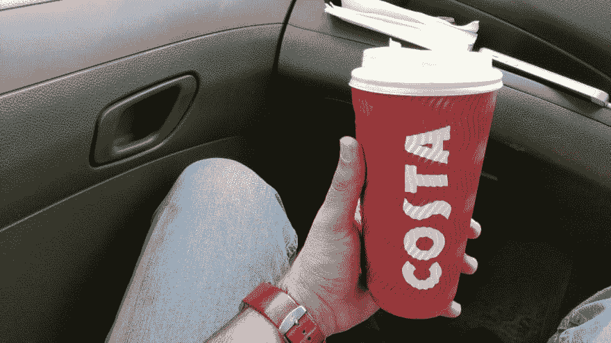
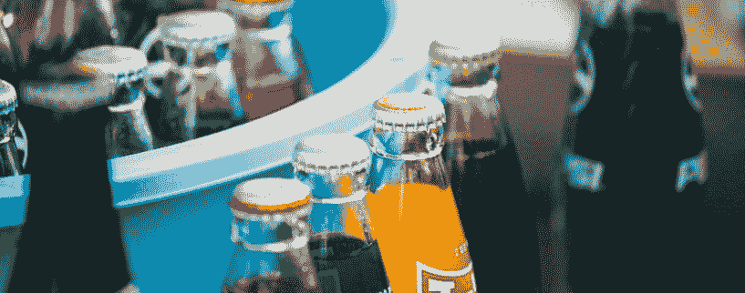
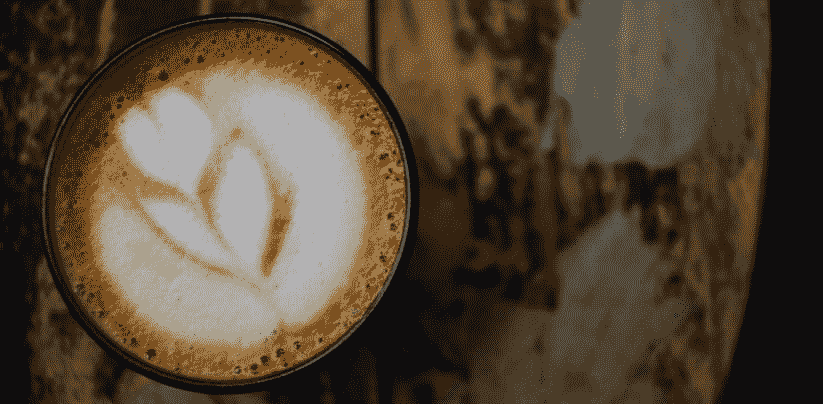
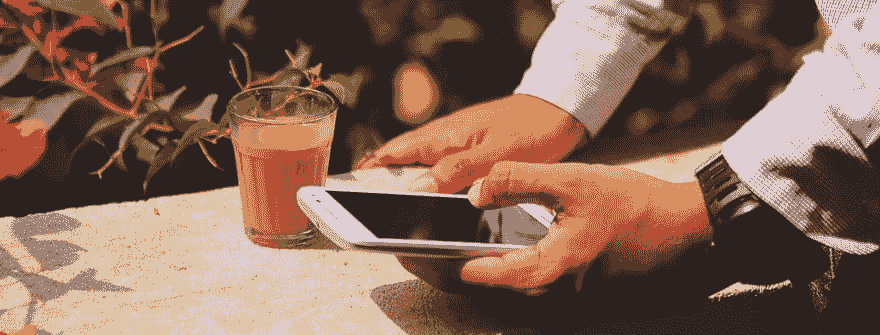
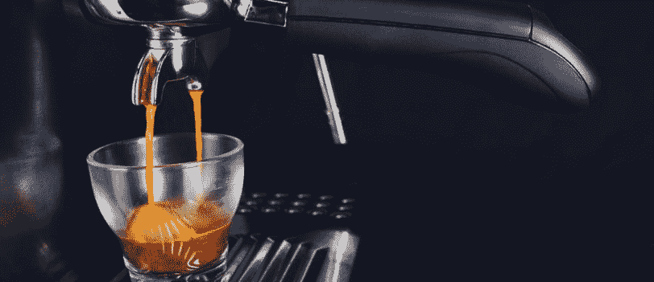
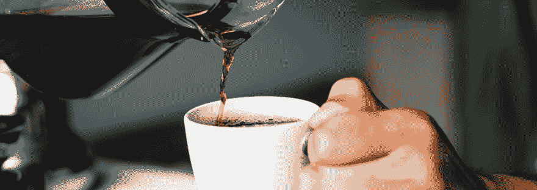

# 对你来说，咖啡因的最佳来源是什么？🤔

> 原文：<https://dev.to/xenoxdev/whats-the-best-source-of-caffeine-for-you--2lfd>

咖啡和开发者有很强的联系。我的意思是非常强的联系，就像咕噜和至尊魔戒一样。昨天喝一杯美式咖啡时，我开始思考——摄入咖啡因的最佳方式是什么。所以干杯，伙计们！这是我们今天菜单上的菜。😉

在对所有饮料和饮用方式进行排名时，我们会考虑每份饮料中咖啡因的含量以及随之而来的卡路里。所以在这篇文章的最后，你会有你最好的咖啡因来源。

#### 软饮料

**咖啡因:**27.8mg
T3】热量: 130

是的，你的可乐可能含有一些咖啡因。一小杯可能含有 27.8 毫克咖啡因和 31 克糖。这就是为什么除非你没有其他选择，否则不建议你喝可乐来满足咖啡因的需求。我知道你会说*“如果我服用健怡可乐呢？”*。嗯，有许多类型的研究表明，健怡可乐甚至更有害。检查[这个](https://www.healthline.com/nutrition/diet-soda-good-or-bad)环节出了问题。

#### 红牛

**咖啡因:**80mg
T3】热量: 117

好吧，老实说，我不是红牛的粉丝。它可能含有和一杯咖啡一样多的咖啡因，但是糖份太多了。虽然红牛在程序员中很受欢迎，但它实际上并不是咖啡因的主要来源。我见过很多人把黑客马拉松和能量饮料联系在一起，也许这就是红牛如此受欢迎的原因。还有神秘的*【牛磺酸】*，他们的营销团队把它宣传成某种神奇的仙尘，实际上一点也不神奇。一些人认为它更像是一种镇静剂，而不是兴奋剂，所以它实际上可能会减缓你大脑的活动，而不是加速它。很讽刺吧？😃

#### 拿铁和卡布奇诺

**咖啡因:**30-40 毫克
T3】热量: 120-30

我知道你有多爱你的拿铁和卡布奇诺，但可悲的是，我最喜欢的含咖啡因饮料对你来说也不是最好的咖啡因来源。它们含有大量的糖，我们甚至不要谈论那些我们喜欢加在上面的味道。多加点糖！这对你的味蕾可能是最好的款待，但对你的健康不是。不过，偶尔享受一下也无妨。只是不要欺骗自己，你喝它是为了别的而不是味道。😆

#### 柴茶(印度👳🏻‍♂️)

**咖啡因:** 67-78mg
**热量:** 140
*(注:如果你喜欢小杯的，数字会减半)*
一种典型的印度柴，显然是印度消费最多的饮料，或者西方人的柴拿铁。这是大多数印度人最喜欢的咖啡因来源。它含有相当数量的咖啡因，但也遭受了与卡布奇诺和拿铁相同的缺点。它里面有很多糖，所以你不应该吃很多。

#### 浓缩咖啡

**咖啡因:** 64 毫克
**卡路里:** 9
随着我们的体重下降，我们正在向更健康的咖啡因来源迈进。浓缩咖啡含有大量的咖啡因，而且只有 9 卡路里。最棒的是这是一次机会。所以不要再品尝美味了。一枪就搞定了。

#### 冲泡咖啡

**咖啡因:** 100-120 毫克
T3】热量:5

是的，对我来说，煮好的咖啡是咖啡因的最佳来源。新煮的咖啡含有高达 120 毫克的咖啡因，而摄入的热量不到 5 卡路里。它含有许多抗氧化剂，可以增强脑力。还有许多其他的健康益处。检查[这个](http://www.healthyeatingscience.com/the-7-awesome-health-benefits-of-freshly-brewed-coffee/)帖子。

#### 结论

所以你有它。剖析和分析了所有常见的咖啡因来源。但是这篇文章的目的不是告诉你停止喝某些饮料。你应该偶尔享受一下。毕竟，变化是生活的调味品。如果你像我一样，依赖咖啡因来主宰你的一天，试着偏向健康的一方。😉哦，说到这里，不要摄入太多咖啡因。任何东西适度都是好的，咖啡因也是如此。如果你想减少摄入量，试试这里没有列出的其他来源，比如黑巧克力或绿茶。如果你找的话，我肯定你能找到很多。

别忘了在下面评论你最喜欢的含咖啡因饮料！