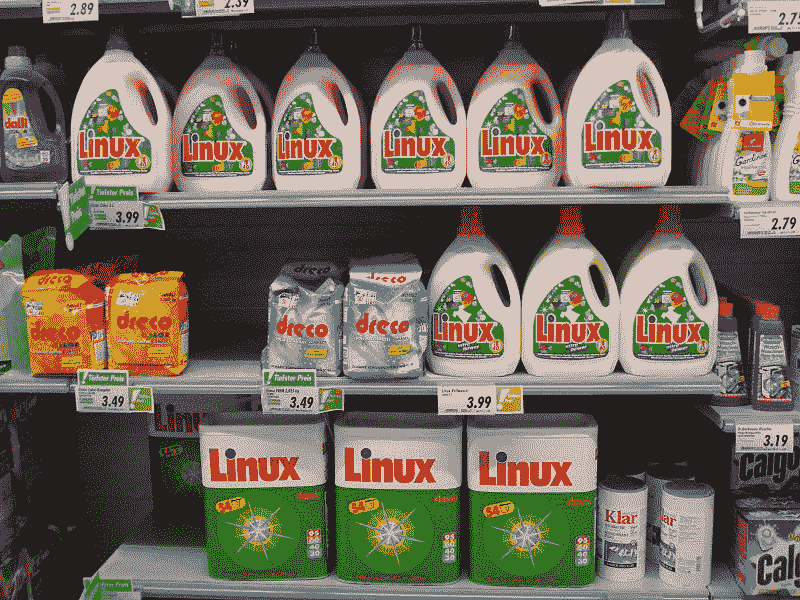

# 你的计算机鸡尾酒会是什么样的？

> 原文：<https://dev.to/awwsmm/whats-your-computing-cocktail-party-fact-34l>

受到卢卡斯的评论的启发...

 [ Lucas Olivera ](/lmolivera) • [<time datetime="2019-02-26T14:00:30Z"> Feb 26 '19 </time>](https://dev.to/lmolivera/comment/93lb) 

“总会有人知道一些你不知道的事情，因为每个人的视角都不一样。”

我想这就是我喜欢电脑的原因，你永远不会知道所有该知道的事情，任何时候都会有人出现在你的生活中，告诉你一些你从未听说过的事情。

...你的计算/编程鸡尾酒会的事实是什么？意思是，你知道的关于编程或计算机科学的很酷的话题或琐事是什么？这是我的:

*Linux* ，除了是世界上最流行的操作系统之一，还是瑞士[品牌的清洁剂](https://news.softpedia.com/news/There-a-Linux-Detergent-Out-There-and-It-s-Trademarked-484782.shtml)！

