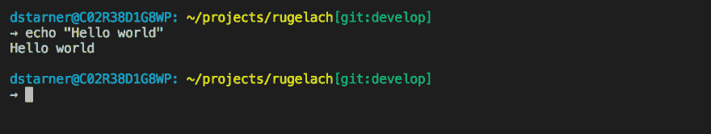

# 你选择什么外壳？

> 原文：<https://dev.to/dan_starner/whats-your-shell-of-choice-3phm>

所以我刚刚开始使用 [`zsh` shell](http://www.zsh.org/) 和 [Oh My Zsh](https://ohmyz.sh/) ，到目前为止这是一次相当棒的体验！我喜欢它给你的插件和配置选项的数量。我使用了相当数量的标准插件，以及一些自定义别名，并且我注意到我可以比以前更快地四处走动并执行基本的终端操作。

除了插件之外，我也是定制主题和`PROMPT`的粉丝，在花了一些时间了解格式如何工作之后，我想我确定了以下内容，其中包含我的用户名、计算机名、当前目录、`git`设置(以及它是否是最新的、脏的或干净的)，以及如果我没有插入充电器时的电池寿命。我还把提示符间隔开了一点，让我的终端看起来更整洁。

到目前为止，我对`zsh`很满意，与我试用 [`fish` shell](https://fishshell.com) 时相比，它似乎与我的工具和脚本配合得更好。

你选择什么外壳，为什么？`bash`、`zsh`、`fish`，还是别的？😃