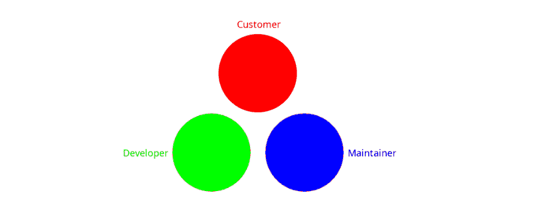
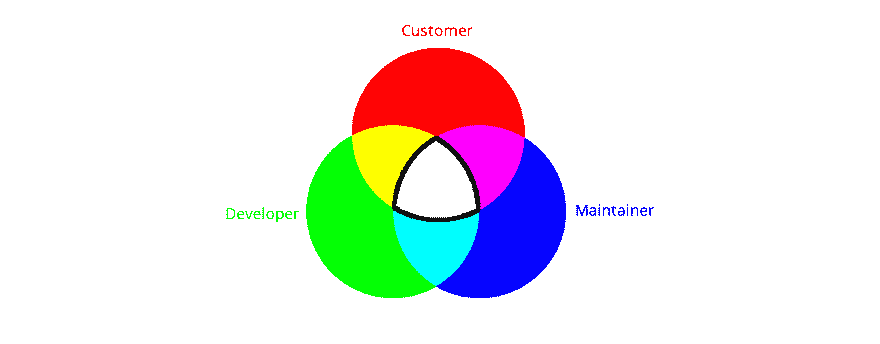

# 何时以及如何编写经得起未来考验的代码

> 原文：<https://dev.to/gtanyware/when-and-how-to-write-future-proof-code-6ff>

“生活真的很简单，但我们坚持让它变得复杂。”——孔子

在任何 web 项目中，都有两种代码；那种你永远不需要看里面的东西...其余的。天气控件和地图是第一类的明显例子，但是仔细检查任何项目都会发现大大小小的部分，它们可以被提取为我称之为*可信组件*。你能提取的越多越好，因为“其余的”会给你所有的悲伤。

可信组件是专业程序员领域的一部分。没有一个未来的系统维护者可能会看到它们的内部；这是最后的手段。即使一个组件是可疑的，通过将它放入测试工具或模仿它来验证也比深入研究另一个专业人员编写的未知代码(或者，可悲的是，甚至是您自己几年前编写的代码)更容易。一个组件使用得越广泛，它就越不可能出现问题，即使出现了问题，这些问题也会很快变得众所周知，并且很可能得到解决。所以，把那些可信的组件拿出来，尽可能广泛地使用它们。

完成所有这些后，您将会留下一个不可预测且难以控制的混乱的用户界面和业务逻辑，这两者都可能成为频繁修改的受害者，从而很难预测任何将长期适用的一致模式。你可能很幸运/不幸，拥有一份长期雇佣合同，保证你从现在到永远都可以做所有的维护工作，但如果没有，别人会做的。这就是问题所在。以这样一种方式编写这种代码，以便网站的所有者或未来的维护人员能够理解，最好的方法是什么？

如果你的答案是“使用一个框架”,你需要后退一点。框架代表了软件开发的艺术状态，而不是面向未来的。随着时间的推移，ui 和业务逻辑经历的这种不可预测的变化将不可避免地打破你现在的梦想。此外，你今天最喜欢的框架，很可能还有它所依赖的开发环境，在未来将会被遗忘，当涉及到这些东西时，时尚的变化速度是如此之快。从现在起，你能保证你的系统的维护者在十年或更长时间内都感到舒适的唯一东西就是普通的 JavaScript。

## 迎合不同的兴趣

软件项目涉及许多不同的兴趣，但我会把他们总结为开发人员、客户(也代表用户)和维护人员。不要犯把开发人员和维护人员等同起来的错误；他们往往是不同的人，拥有非常不同的技能。开发人员拥有所有最新的技能，很少需要解决遗留问题；维护人员需要在广泛的领域积累经验。深度与广度。

[](https://res.cloudinary.com/practicaldev/image/fetch/s--VPymIPcN--/c_limit%2Cf_auto%2Cfl_progressive%2Cq_auto%2Cw_880/https://thepracticaldev.s3.amazonaws.com/i/ngfrojagpq2wz20akchk.png)

这三种兴趣都是相互独立的，每一种都有自己的关注点，没有一种能保证洞察到其他任何一种的世界，从而导致误解和假设导致的频繁错误。我们可以尝试通过增加一个额外的通信层来处理这个问题，在三方之间来回传递消息，但这太依赖于纪律和发送消息的质量。

为了改善这种情况，我们需要找到一些共同的重叠区域，所以让我们将这三个圆拉近:

[](https://res.cloudinary.com/practicaldev/image/fetch/s--RZ0pJguf--/c_limit%2Cf_auto%2Cfl_progressive%2Cq_auto%2Cw_880/https://thepracticaldev.s3.amazonaws.com/i/nrcdcp4vakyflhkh78fx.png)

在这里，每一对都有一个重叠的感兴趣区域，在中间的白色部分代表一个区域，在该区域中所有 3 个都被表示。我们应该把所有各方感兴趣的东西都放在这里，但问题是，它应该采取什么形式？

## 说同一种语言

最重要的是，你需要任何人都能理解的东西，否则目标就失去了。你正在规划一个可能与今天看起来非常不同的未来世界，因此我在上面对框架提出了挑战性的评论。无论你选择什么样的路线，都必须是完全独立的，不要依赖于任何超出最少数量的假设，这些假设可能是很好理解的，或者存在于自身之外。

你能做的一件事是创造你自己的语言形式。这听起来可能很可怕，但如果没有很好的文档记录，这是一种非常成熟的技术。有几种方法可以做到这一点:

1.  普通的 JavaScript。初级水平的东西，请。即使是 JQuery 也只是勉强可以接受，而且只有在有全面的文档支持的情况下。最少使用函数作为参数，没有三元运算符，绝对没有庞大的 Node.js 依赖链。即便如此，你的信息仍然很难从你用来传递信息的机制中提取出来。

2.  XML。很难想象有比选择 XML 作为一种语言更反常的决定了，因为它显然不适合这项工作，但是我在几个 Java 项目中看到过这样做，而且还有点效果。它不容易阅读；消息往往淹没在 XML 标签的森林中，考虑到 XML 和 Java 之间的不匹配，这是一个非常笨拙的解决方案。改变是一个痛苦的过程，没有依赖注入的帮助，依赖注入在你想改变它的时候工作得很好。这有点弄巧成拙，因为没有未来的维护者能够理解这一点。

3.  JSON。令人惊讶的是，对于仅仅作为 XML 的轻量级替代的东西来说，差别是如此之大。这主要是因为 JSON 是 JavaScript 对象的*外化形式*；这两者本质上是可以互换的。对于一个假想的处理器来说，JSON 数组可以很容易地看起来像一种“汇编语言”,该处理器的指令集是您想要在 web 页面中做的事情，从 DOM 对象开始并从那里扩展。

## 装配工的乐趣

任何在 20 世纪 70 年代接触过计算机的人都会记得汇编语言。是的，高级语言编译器会更快地给出结果，但是用汇编语言，你永远不会怀疑到底发生了什么。每条指令只做一件事；明确无误地。而这正是我们对于 UI 代码所需要的；不是抽象而是确定。

我在这里提出的这种汇编器不会乱动寄存器和位；它与您在页面上看到的内容一一对应。事实上，就像 HTML 一样，但我们不必就此止步。如果你想让你的汇编语言包含一个嵌入地图或者 RTF 编辑器或者执行 REST 查询的指令，你可以有一个；毕竟，这是你假设的处理器。

一个假想的处理器需要一个运行时引擎来伪装成那个处理器。最好使用普通的 JavaScript 来完成这项工作，以防需要更新，尽管您最终可能会有足够的信心将其提升到可信组件的地位，在这种情况下，它不太可能需要维护。这是一个只有你能做的决定，但是和以前一样，你能作为可信组件提取的代码越多，未来维护者的工作就越容易。

因此，不再赘述，我将给出一个小脚本和处理它的运行时引擎。

这项工作非常简单；我们在页面上已经有一个 DIV，我们想向它添加一个超链接，单击它会弹出一个警告。所以在伪代码中是

```
- find the element with a given id
- add an <a> component to it
- when the hyperlink is clicked, show an alert 
```

下面是我们测试页面的源代码:

```
<html>
  <head>
    
    <meta content="">
    <style></style>
    <script type='text/javascript' src='scriptRunner.js'></script>
  </head>
  <body>
    <div id="test-div"></div>
    <pre id="script" style="display:none">
    [
        {
            "keyword": "attach",
            "id": "test-div",
            "name": "TheDiv"
        },
        {
            "keyword": "create",
            "parent": "TheDiv",
            "type": "a",
            "text": "Click me",
            "onClick": "ShowAlert"
        },
        {
            "keyword": "stop"
        },
        {
            "keyword": "alert",
            "label": "ShowAlert",
            "message": "You clicked"
        }
    ]
    </pre>
  </body>
</html> 
```

只有 3 个组成部分需要注意；一个 JavaScript 文件，一个`<div>`元素和一个奇怪的脚本。最后一项是一个不可见的`<pre>`元素，包含一个 JSON 对象数组，每个对象都有一组任意的属性。

接下来我们有 JavaScript `scriptRunner.js`代码:

```
window.onload = function () {
  const script = document.getElementById(`script`);
  ScriptRunner.start(script.innerText);
};

const ScriptRunner = {

  start: function (script) {
   ScriptRunner.run(JSON.parse(script));
  },

  run: function(script, pc = 0) {
    script.pc = pc;
    while (script.pc < script.length) {
      const keyword = script[script.pc].keyword;
      switch (keyword) {
        case `alert`:
        case `attach`:
        case `create`:
          const handler = `do${keyword.charAt(0)
            .toUpperCase()}${keyword.substr(1)}`;
          ScriptRunner[handler](script);
          break;
        case `stop`:
          script.pc = 0;
          break;
        default:
          script.pc++;
      }
      if (script.pc === 0) break;
    }
  },

  doAlert: function (script) {
    const command = script[script.pc];
    alert(command.message);
    script.pc++;
  },

  doAttach: function (script) {
    const command = script[script.pc];
    command.element = document.getElementById(command.id);
    script.pc++;
  },

  doCreate: function (script) {
    const command = script[script.pc];
    command.element = document.createElement(command.type);
    switch (command.type) {
      case `a`:
        command.element.setAttribute(`href`, `#`);
        command.element.innerHTML = command.text;
        command.element.onclick = function () {
          for (let n = 0; n < script.length; n++) {
            if (script[n].label === command.onClick) {
              ScriptRunner.run(script, n);
              break;
            }
          }
        };
        break;
    }
    for (let n = 0; n < script.length; n++) {
      if (script[n].name === command.parent) {
        const parent = script[n].element;
        parent.appendChild(command.element);
        script.pc++;
        return;
      }
    }
    script.pc = 0;
  }
}; 
```

该脚本是从`<pre>`元素中提取出来的纯文本，所以要做的第一件事就是将它解析成一个 JavaScript 对象。这当然是在 JavaScript 中使用 JSON 的好处；对象和它的外化形式之间的简单双向交换。

在这段代码中没有全局变量；脚本本身被用作运行程序所需的所有存储的暂存区，从程序计数器(`pc`)开始。这只是数组的一个索引；它通过程序控制我们的运动，允许像控制转移和事件处理这样的事情。程序线程的执行可以在任何地方开始；zero 是默认的入口点，它继续执行命令，直到其中一个命令返回程序计数器值零，这时线程停止执行，并允许另一个命令接管。

代码被构造成具有成员函数的单个对象，这避免了与其他 JS 模块发生名称冲突的任何可能性(只要`ScriptRunner`本身是唯一的)。

功能`run()`是中央的。它检查当前命令的`keyword`属性，并从它构建一个形式为`doXxx`的函数名。我称之为*包装器*，函数名必须存在，否则就是致命错误，尽管在这个示例代码中我没有包含任何错误处理。然后我们调用包装器，传递脚本给它。

### 内容包装器

我称`doXxx()`函数为*包装器*，因为它们中的每一个*都包装了*一大块内容。包装纸应该薄而内容物应该多。如前所述，每个内容项都是理想的可信组件，因为包装器很薄，所以出现错误的可能性很小。目的是尽可能多地包装不同的可信组件、DOM 元素和其他函数；这给了你一个丰富的，可靠的语言，你可以应用于广泛的问题。

这些是我在这里实现的包装器:

`doAlert()`提取当前命令，取出`message`属性，并在推进程序计数器之前将其传递给`alert()`。

`doAttach()`在 DOM 中查找带有请求的`id`的元素，并将找到的元素的引用放回脚本中，使用我们提供的唯一名称作为关键字，并准备在其他地方使用。同样，这里没有提供错误处理。

创建一个请求类型的新元素。这里只有一个简单的`<a>`元素的代码，但是在实际实现中，脚本可能需要的所有不同类型的 DOM 元素都有条目。它查找之前按名称保存的父元素，并添加新元素作为子元素。它还扫描脚本以查找具有命名标签值的命令；当用户单击链接时，我们希望在这里恢复处理。

非常简单，甚至没有自己的包装。它只是停止脚本。

因此，应该发生的是，程序查找具有给定 id 的 DOM 元素，向它添加一个超链接，并在它被单击时通过发出警告做出反应。这很容易验证。

### 可靠性

因为这种技术一次又一次地使用相同的运行时代码块，所以很少有地方可以隐藏 bug。一旦解决了这个问题，运行时引擎和用包装器包裹的又大又贵的组件很少会成为问题的根源。这种结构还使得添加诊断、断点、单步和其他功能变得容易，只需要一些额外的属性，因为`run()`中的中央循环会为每一条指令执行。

## 何去何从

你可能会想，仅仅是创建一个超链接就这么麻烦，你是对的。然而，这只是一个例子。并不是所有你想在页面中做的事情都像基本的 DOM 元素一样简单。以一个杂志或社交媒体网站为例，它有许多更大、更复杂的块，也可以用这种结构在顶层进行描述。像实时地图和天气窗口小部件这样的组件有简单的 API，可以用少量的属性来表示。字符串操作——通常是业务逻辑核心的文本逻辑，很容易出错——也很容易用任何领域专家都能理解的方式清楚地描述，REST 函数也是如此。我的例子没有提到条件或计时组件，它们也很适合用简单的 JSON 对象来描述。

编写和维护脚本不需要特殊的编程技能；只是了解每个“汇编”指令的可用选项。你的脚本变成了 [*通用语*](https://en.wikipedia.org/wiki/Lingua_franca) ，这是所有对系统如何工作以及如何在变化中保持系统工作感兴趣的人都能理解的通用语言。每条 JSON 指令中包含的功能越多，同时保持属性数量最少，这种技术就变得越强大，因为“语言”几乎不可能复杂到难以理解。(毫无疑问，有人会证明我是错的，并制造出一个完全不可理解的系统，但不管他们使用什么技术，他们都会这么做。)

事实上，以上所有只是一个更大的故事的一半。我们现在所拥有的——雏形——是浏览器脚本语言的后半部分，包括中间代码和运行时，缺少最初的解析器和编译器部分。这些部分可能是未来文章的主题。任何对这种类型的完整脚本语言感兴趣的人都可以访问 [EasyCoder](https://easycoder.software) ，这是一个真实世界的 web 应用构建器，已经被用于许多不同的网站。虽然并不完全基于我在这里展示的代码，但它使用了许多相同的技术。孔子会很高兴的。

我非常愿意谈论诸如如何实现特定类型的指令(`for`循环，也许？)在这种剧本里。只需在下面发布一个问题，我会尽力回应。

吉安卡洛·里韦尔多在 [Unsplash](https://unsplash.com/search/photos/broken?utm_source=unsplash&utm_medium=referral&utm_content=creditCopyText) 拍摄的标题照片