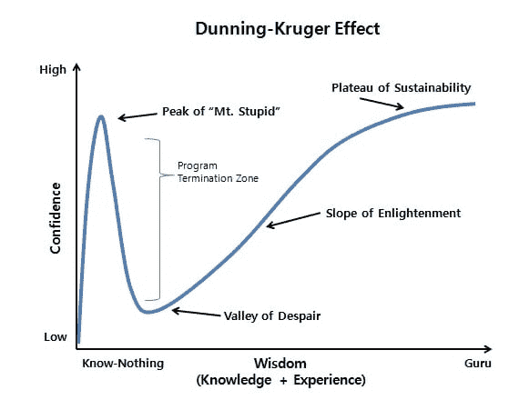
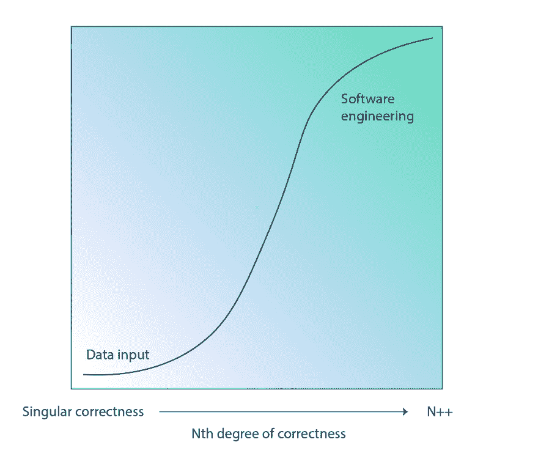

# 什么时候成为开发者？

> 原文：<https://dev.to/stephsmithio/when-do-you-become-a-developer-377e>

这篇文章最初发表在我的博客上，我经常在这里写远程工作、学习编码和技术领域的女性。

# 你*什么时候变成*开发商了？

在过去的一年里，我自学了编码。我已经建立并启动了四个 web 应用程序，学习了从前端到后端的课程，可以使用 API，并且知道什么是承诺。

然而出于某种原因，我仍然不觉得自己是一个开发者。

我以为随着时间的推移，这种感觉会慢慢消失，因为我学到了更多，构建了更多，代码看起来不再那么陌生。但直到今天，这种身份似乎仍然不合适，也不清楚什么时候会合适。我很疑惑...

> 什么时候我会觉得自己是一名开发人员？我什么时候“成为”一个？

我一直在思考*为什么*我仍然觉得自己像个冒名顶替者。这是由于个人的看法，还是外部的，或者完全是另一个原因？我决定走出自己的世界去寻找答案。

### TL；速度三角形定位法(dead reckoning)

> 什么时候成为开发者？**没人知道！**

> Tammo Pape@ tam _ mo[@ stephsmithio](https://twitter.com/stephsmithio)根据结果。没有人真正知道😅21:56PM-01 2019 年 3 月11

### 黄金问题

我决定对数百人进行民意调查，看看他们认为这一拐点何时出现。是不是当你…

*   写了你的第一行代码？
*   有了你的第一个用户？
*   创建了你的第一个项目？
*   被聘为开发人员？

> 斯蒂芬史密斯[@斯蒂芬史密斯](https://dev.to/stephsmithio)我一直在想..💭
> 
> 什么时候成为“开发者”？🤔
> 
> 当你...2019 年 03 月 01 日下午 15:16015

或者可能完全是别的什么东西？当你...

*   明白 X 和 Y 的区别吗？
*   可以教另一个人发展？
*   走过“愚蠢山”？

坦率地说，我原以为会有更多的人回答“哇，IDK”，因为我自己也不确定答案。有趣的是，许多人似乎对此有具体的看法。然而，或许同样能说明问题的是，这些观点彼此存在分歧。所有的答案都得到了大约 20-30%的投票，从定量的角度来看，对于什么是“正确的”答案并不清楚。或许这本身就是答案。

### 一种“发展中”的观点

首先，我想分享一些有明确观点的人的回应。

**编写第一行代码(17%)**

Quora :“当你能够写至少一行代码时，你就可以认为自己是一名程序员。我们不关心代码行的长度，但是这一行代码应该产生正确的东西。”

**创建第一个应用程序(33%)**

> 瓦尔特多姆🇲🇽[@瓦尔特多姆 _](https://dev.to/walterdom_)[@斯蒂芬西奥](https://twitter.com/stephsmithio)对我来说，二号。
> 
> 我的第一行代码是 Codepen 里的<h1>Hello World</h1>。Def 不是 dev😅有一些开发人员靠他们的代码生活，却从未被雇佣过。我认为创造一些有用的东西意味着作为开发者的认可。2019 年 03 月 01 日下午 17:0902

> Mayur Joshi[@ the coding uy](https://dev.to/thecodinguy)[@ steph smithio](https://twitter.com/stephsmithio)我选择了‘当你创建你的第一个应用的时候’。我个人认为任何人都可以编写单行代码，但是创建你的第一个应用程序需要一定的训练和批判性思维。从规划到部署！其次是工作机会下午 16:35-01 2019 年 3 月01

**被聘用为一名员工(22%)**

> Alex e .@ alexentprnr[@ stephsmithio](https://twitter.com/stephsmithio)人们通常以其职业身份(如律师、护士等)来称呼。)律师在执业(以某种身份受聘)时被称为律师。对一个开发者来说也一样。2019 年 03 月 01 日下午 15:3700

**哇哦 IDK (28%)**

> 卡琳·塔里加@ _ middle sis ter[@ stephsmithio](https://twitter.com/stephsmithio)我答谁谁谁 IDK。
> 
> 通过在一个开源项目中做志愿者开始。首先支持其他用户，然后贡献补丁，然后成为首席开发人员。都是在空闲时间做志愿者。
> 
> 线是什么时候越过的，那条线在哪里？不知道。2019 年 03 月 01 日下午 17:5901

> Mac@ theteaguns[@ stephsmithio](https://twitter.com/stephsmithio)我投了 IDK。这很大程度上取决于你对开发者的定义。除非你得到报酬，否则你不会成为“专业开发人员”。但是，仅仅因为某人没有开发完整的应用程序或被雇佣就说他不是开发者，这让人觉得是不必要的把关。2019 年 03 月 01 日下午 15:3201

**其他**

> Shahrooz[@ shahroozme](https://dev.to/shahroozme)[@ stephsmithio](https://twitter.com/stephsmithio)在我看来，作为一名开发人员，这与学习新事物并将自己的想法或他人变成现实的能力无关！20:30PM-01 2019 年 3 月12

### 如何拯救世界

这个思想实验的结果让我想起了我在早期的社会 media﹣back 中看到的一个视频，那时藤还是一个东西。

这段视频的标题是“如何拯救世界”。很自然，你会期待一些关于世界现状和/或我们未来的非常有启发性的东西，但是你却看到一个男孩说:

*   如何拯救世界:
*   搜索世界
*   点击图像
*   “拯救”世界(当他将图像保存到他的电脑上时)

显然这是一个笑话，但也许是一个无意的教训，我们不需要总是以表面价值来看待事情。也许对“开发人员”有更有趣的解释，那就是我们可以凭空想象，也许还能从中学到一两件事。

### “你是干什么的？”

经过进一步的考虑，很明显软件开发通常不像其他职业那样具有强制性证书。比如很少有自学博士或者开源建设项目。

当然，有许多软件工程学位，但是在软件行业也有相当数量的有偿/无偿贡献者没有任何种类的证书。

> 凯莉·沃恩💫@ kvlly我很好奇。你是怎么学会编码的？💻2019 年 1 月 03 日下午 16:35109197

我思考了一下为什么有些角色需要学位，而有些不需要。我得出了以下两点想法。需要学位的职业...

1.  有达成一致的正确方法来达到特定的结果
2.  具有学习所述方法所需的特定步骤集

例如，某个医生需要学习一套离散的理论，进行一套离散的外科手术，当情况危急时，他们需要知道“正确”的答案。当然也有一些情况有歧义，但很多情况下是有正确顺序的。

我发现软件非常有趣的一点是，有无数种方法可以用来获得无数种解决方案。换句话说，有许多错误的方法，但也有许多正确的 methods﹣and，你不需要经过正式训练就可以得到这些正确的方法。这部分是由于信息的民主化，但是软件开发在许多方面是没有单一正确答案的解决问题的行为。因此，学习它没有单一的方法。

例如，有些软件工程师可以用完全不同的输入(例如:语言、框架、工具、函数等)创建类似的解决方案。)，而其他人也在用相同的输入创建完全不同的解决方案(例如:使用相同底层工具的独特应用程序)。这也适用于其他创意产业。例如，如果你给两个人一张画布和一幅画，他们可以创作出完全不同的东西，而没有一个是不正确的。

> “那么，你是程序员吗？嗯，你是解决问题的人吗？”

### 第 n 次正确

我认为我们可以通过某些角色具有“第 n 个正确度”的概念来推进这个想法。我的意思是，不同程度的方法会让你得到一个“正确”的解决方案。例如，对于数据输入，有一个正确的解决方案:正确地输入数据。当然有像速度这样的变量，但最终只有一个正确的结果。正如我们已经认识到的，软件工程几乎总是有多个正确的解决方案。

> 事实上，没有人比一个计算机科学家更明白，面对一个看似无法应对的挑战，你既不应该永远苦干，也不应该放弃，但正如我们将看到的，完全尝试第三件事–赖以生存的算法

我们可以开始想象这些角色和他们的“正确程度”,以努力获得一些关于工作或行业如何发展的清晰信息。

越靠左(正确的解决方案越少)，特定的技能就越能被训练和重复。这同样适用于最终能被计算机训练学习和重复的技能。

相反，右边的技能更依赖于解决问题的能力，判断力，最终较低的准入门槛打开了新的学习途径，这是我们在许多领域看到的，如设计、开发和营销。

### 发展之美

如前所述，为了参与某些行业，你需要明确的认证。这本身就增加了独立方贡献和推进空间的难度。

也许这就是软件开发的美妙之处。它的进入门槛较低，这使得如此多的人能够做出贡献，并永久保持行业的增长和繁荣。

这就是为什么没有其他行业能够跟上软件所允许的创新水平，不仅仅是因为它的功能，而是因为它的开放性。当有数百万人公开地为某件事做出贡献时，这些贡献不可避免地会带来进步，随着这种不断的进化，总会有新的东西需要学习。这导致了一个无限的学习曲线，我认为这是美丽的。

### 保持自己的小身份

“成为一名开发人员”的概念也让我思考身份问题。著名的 YC 联合创始人保罗·格拉厄姆给出了“保持低调”的建议。也许我们可以利用这个想法来进一步理解原来问题的含义。

从直接取自 WWW 的定义开始，软件开发人员是:

> 程序员、开发人员、开发人员、编码人员或软件工程师是创造计算机软件的人。

请注意，该定义不包括任何关于学位、项目或状态的信息，而是侧重于创造的行为。如果软件开发不需要一个正式的学位，它真正的意思是创造软件，为什么这么多人认为自己是一个有困难的人。

> Mac@ theteaguns[@ stephsmithio](https://twitter.com/stephsmithio)可能值得补充的是，我做了相当多的前端开发，觉得自己相当精通 HTML/CSS/JS。然而，我仍然称自己为设计师，而不是开发商。称自己为开发者似乎很奇怪，不完全确定为什么。2019 年 03 月 01 日下午 15:3701

> Madison Taskett@ Taskett[@ stephsmithio](https://twitter.com/stephsmithio)我不认为自己是一名开发人员，不管我在编码方面有多棒，因为这不是我身份的核心部分——这只是我为这个世界带来好产品所做的事情。:)2019 年 03 月 01 日下午 16:2901

也许这是因为更多的时候，一个不同的画面被描绘出来。相反，有一种印象是，要成为一名“开发人员”，你需要 10 年以上的经验，并且可以闭着眼睛编码。我在这里开玩笑，但你得到了重点。存在某种程度的把关，不管是有意的还是无意的，我相信这有助于我们将自己视为开发人员，即使我们确实在开发。

例如， [Quora](https://qr.ae/TWTGne) 上有人提到:

> 我有一个教授曾经说过，“在你理解递归之前，你不能真正称自己为程序员。”

尽管理解这些基本原理是有好处的，但是这些情绪经常会阻止人们认同一个主题，并且不是每个人都能够有效地“保持他们的身份渺小”。

守门的行为或深入了解一个人直到 X 步才成为开发人员的事实，导致人们(像我一样)感觉自己是骗子。当有人觉得自己是个骗子时，毫不奇怪，他们不太可能继续下去，甚至不太可能从一开始就开始。

### 重新定义开发者

希望我已经让你相信了，当一个人成为开发人员时，并没有特定的例子。更重要的是，建立这些障碍可能会对人们造成潜在的伤害，因为他们无法从身份的角度看待自己。

我喜欢这个思想实验中出现的两个概念:

1.  对发展之美的思考。我相信，学习和创造的开源本质将继续使软件行业在未来许多年繁荣发展，这要归功于允许开放贡献的现有系统。
2.  这个概念是，也许我们应该去掉“头衔”,或者根据你的贡献程度和你以前的知识水平来决定。换句话说，你学习、创造和建设的亲和力。无论是通过开源项目，为社区创建工具，写文章，还是指导某人，我认为参与的行为更准确地定义了开发人员。

> 👍2019 年 03 月 01 日下午 16:1502

简而言之，现在我很清楚，特别是在软件开发中，头衔并不重要。作为一名“开发者”,应该以你是否仍在增值来衡量，而不是像学位那样的一次性称号。

也许这就是为什么“T1”发展“T2”和“T3”进化“T4”是同义词的原因。

PS:来[在 Twitter 上讨论](https://twitter.com/stephsmithio/status/1115996061481492480)或者[订阅我的博客](https://mailchi.mp/3e320512ed0b/stephsmith)。