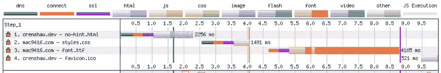
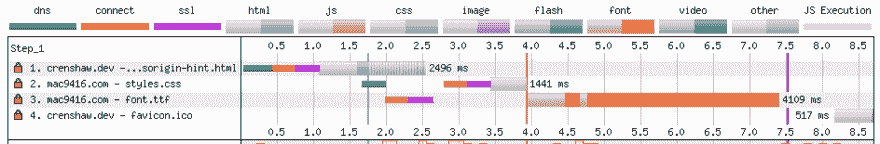
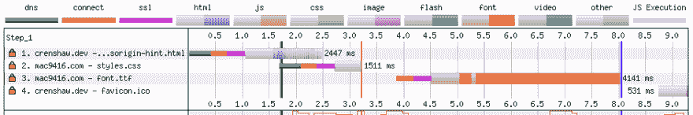
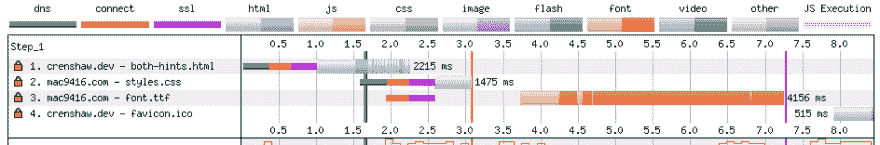

# 当浏览器不能接受(预连接)提示时

> 原文：<https://dev.to/crenshaw_dev/when-the-browser-can-t-take-a-preconnect-hint-6dn>

资源提示通过告诉浏览器将来需要什么资源来帮助页面加载得更快。例如，字体文件的`preload`提示告诉浏览器在解析样式表之前开始下载字体。

```
<head>
  <!-- other stuff -->
  <link rel="preload" href="https://cdn.example.com/font.woff2" as="font" type="font/woff2" crossorigin>
  <link rel="stylesheet" href="https://cdn.example.com/styles.css" type="text/css">
</head> 
```

有时，您无法提前知道页面中需要哪些资产。但是你知道它们将被托管在一个特定的域中。在这种情况下，您可以使用`preconnect`资源提示让浏览器领先一步。

```
<head>
  <!-- other stuff -->
  <link rel="preconnect" href="https://cdn.example.com/" crossorigin>
</head> 
```

## 无资源提示

假设我的站点上的一个页面使用了另一个来源的样式表，并且该样式表定义了一个自定义字体。

```
@font-face {
  font-family: 'Custom Font';
  src: url(https://mac9416.com/demo/preconnect/font.ttf) format('truetype');
}

body {
  font-family: 'Custom Font';
} 
```

如果没有资源提示，我的页面的 HTML 必须在下载样式表之前进行解析。(在本例中，我将样式表链接移到了一大块“lorem ipsum”文本的下面，以模拟一个后来发现的样式表，并使瀑布图更容易阅读。)

[](https://res.cloudinary.com/practicaldev/image/fetch/s--XSc5ahGg--/c_limit%2Cf_auto%2Cfl_progressive%2Cq_auto%2Cw_880/https://thepracticaldev.s3.amazonaws.com/i/4zel0u7nari2d7qdyh98.png)

在上面的 WebPageTest 瀑布图中，在 Chrome 连接到 mac9416.com 下载样式表之前，页面被完全下载并解析。

## 用交叉原点预连接

如果我为 mac9416.com 添加一个`preconnect`提示，资产将加载得更快。(记住，我们假装不知道哪些资产将从 mac9416.com 下载。否则，我们将添加预加载提示，以获得更大的性能提升。)

```
<head>
  <!-- other stuff -->
  <link rel="preconnect" href="https://mac9416.com/" crossorigin>
</head> 
```

[](https://res.cloudinary.com/practicaldev/image/fetch/s--apwIVzJQ--/c_limit%2Cf_auto%2Cfl_progressive%2Cq_auto%2Cw_880/https://thepracticaldev.s3.amazonaws.com/i/d9pvya6ka8wfiuu6srx2.png)

有了适当的提示，瀑布看起来会更好。下载完第一大块 HTML 后，会立即对 mac9416.com 进行 DNS 查找。用于下载我的自定义字体的连接在 DNS 查找完成后立即发生。但是看起来在 HTML 被下载和解析之后，还有一个到 mac9416.com 的连接。第二个连接用于下载自定义字体。

## 无交叉原点预连接

在上面的代码示例中，我主动复制了一个示例，并保留了`crossorigin`属性。我只是假设它的意思是“这个连接是到一个不同的领域”-它是。让我们看看当我删除这个属性时会发生什么。

```
<head>
  <!-- other stuff -->
  <link rel="preconnect" href="https://mac9416.com/">
</head> 
```

[](https://res.cloudinary.com/practicaldev/image/fetch/s--FyUjLM6y--/c_limit%2Cf_auto%2Cfl_progressive%2Cq_auto%2Cw_880/https://thepracticaldev.s3.amazonaws.com/i/hepu3jq6uha0s699rej6.png)

在这个瀑布图中，我们似乎有同样的问题，但是连接交换了。用于下载样式的连接立即发生，但是用于下载字体的连接在样式表下载和解析之后开始。

## cross origin 为什么会破事？

这是怎么回事？我错误地认为`crossorigin`仅仅意味着“目标在另一个域上。”但是浏览器可以通过比较`<link>`元素的`href`属性和当前页面的原点来推断。那么`crossorigin`属性是干什么用的呢？

`crossorigin`实际上告诉浏览器“这个连接上的资源是使用 CORS 下载的。”
默认情况下，它特指“没有凭据的 CORS”

CORS 提高网络安全性。这里我就说这么多了，因为聪明人在别的地方解释得更好。

为了加快这个网页的速度，我们需要知道的是，下载没有 CORS 的资源是在一个独立的连接上下载的，而不是那些使用 CORS 的。

快速浏览一下使用 CORS 的请求列表，可以看到我们的字体请求将使用 CORS，但是样式表请求不会。

## 有交叉原点和无交叉原点的预连接

所以让我们使用两个`preconnect`提示，一个用于非 CORS 请求，另一个用于 CORS 请求。

```
<head>
  <!-- other stuff -->
  <link rel="preconnect" href="https://mac9416.com/">
  <link rel="preconnect" href="https://mac9416.com/" crossorigin>
</head> 
```

[](https://res.cloudinary.com/practicaldev/image/fetch/s--6m4x4VIW--/c_limit%2Cf_auto%2Cfl_progressive%2Cq_auto%2Cw_880/https://thepracticaldev.s3.amazonaws.com/i/iresp0dsdjm45yvocy5w.png)

这个瀑布图看起来好多了。有了两个资源提示，在解析完第一部分 HTML 之后，就立即建立了到 mac9416.com 的两个连接。顺便说一下，我们已经实现了所有测试的最快的文档完成时间(瀑布图中的蓝线)。

为了更好地衡量，我将为不支持`preconnect`提示的浏览器添加一个`dns-prefetch`提示。

```
<head>
  <!-- other stuff -->
  <link rel="dns-prefetch" href="https://mac9416.com/">
  <link rel="preconnect" href="https://mac9416.com/">
  <link rel="preconnect" href="https://mac9416.com/" crossorigin>
</head> 
```

不需要`crossorigin`属性，因为 DNS 查询是在没有 CORS 的情况下执行的。

对于这个实验，我忽略了`crossorigin="use-credentials"`。我怀疑 CORS 的凭证请求需要第三个提示。

## 总结

当与 rel="preconnect "一起使用时，crossorigin 属性并不描述目标原点为的*，而是描述*将从该原点*下载何种资产。如果资产使用 CORS，则需要交叉起源。如果不使用 CORS，那么应该省略 crossorigin。如果两种类型的资产都存在，那么两个资源提示是必要的。*

如果您发现资源提示和 crossorigin 令人困惑，不要难过。发生了很多事。如果你觉得这个指南令人困惑，请联系我！大概是我的错，我很乐意澄清。

最初发布于 [crenshaw.dev](https://crenshaw.dev/preconnect-resource-hint-crossorigin-attribute) 。