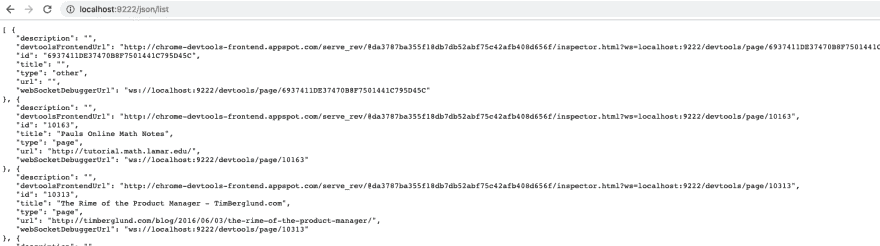
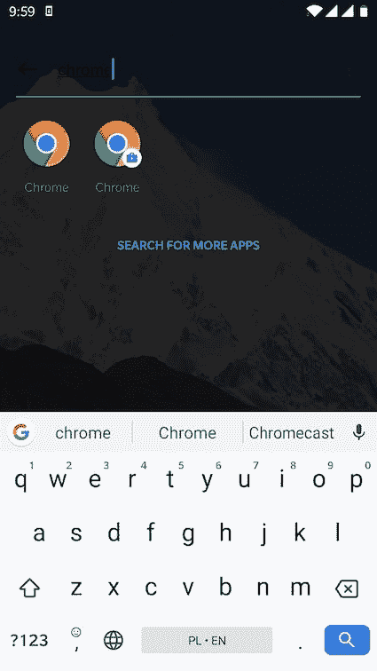
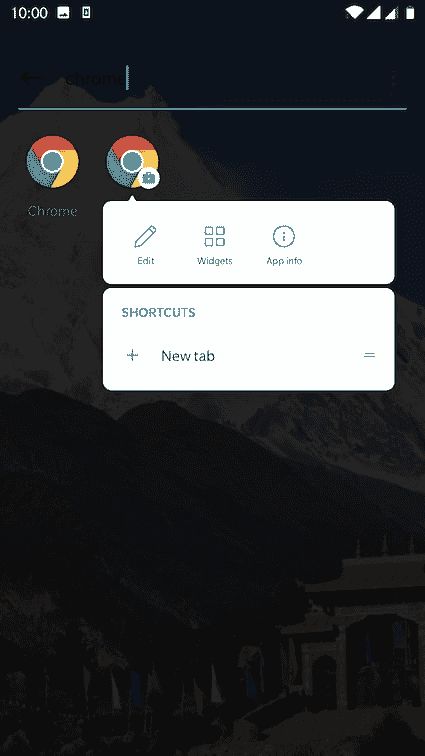
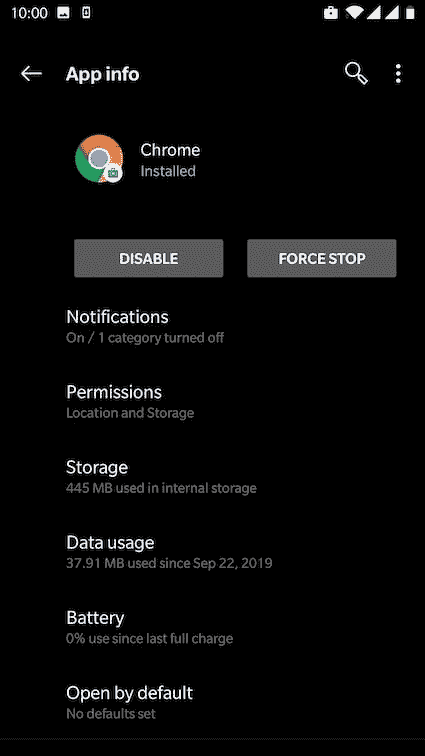

# 当你从不关闭手机浏览器上的标签页时

> 原文：<https://dev.to/piczmar_0/when-you-never-close-tabs-on-your-mobile-chrome-browser-2boj>

每当我在手机上浏览时，我经常会在 Chrome 上打开一个有趣的页面，然后留到以后再看。通常后者永远不会出现，所以我最终在我的手机 Chrome 上打开了 2500 多个标签。对，不是错别字！！！

最近我想做一些清理工作。我在我的桌面上，想快速地将有用的网址分类，然后做成书签，如果不再需要就扔掉。我意识到没有便捷的方法从 Chrome 中导出所有打开的标签页。在 Chrome 的桌面版本上，当你右键单击浏览器中任何一个打开的标签时，都有一个“书签标记所有标签”的功能，但这在移动版本中不存在。

我想和你分享一个简单的方法，如果你使用的是 Android 设备，可以绕过这个限制。

您需要在桌面上安装 Android 开发工具，并将您的移动设备置于开发人员模式。

如何做，一步一步来:

1.  下载并安装 Android 开发工具。

我们将只需要`adb`应用程序，但我们将不得不安装完整的工具箱。就我个人而言，我找到了下载和安装 [Android Studio](https://developer.android.com/studio) 的最简单方法，但如果你向下滚动，你也可以尝试从[这里](https://developer.android.com/studio)获得的独立 sdk 工具。

当你在 Mac 上安装了 Android Studio 后，你会在`~/Library/Android/sdk/platform-tools`中找到`adb`

在 bash 中打开这个文件夹。

1.  将你的安卓手机设置为开发者模式，用一根线连接到你的桌面。最好直接连接，而不是使用一些 USB 集线器，因为有时设备无法被 adb 发现。[这里](https://developer.android.com/studio/debug/dev-options)是如何开启它的官方说明。此外，您可能希望在“选择 USB 配置”菜单中打开 MTP 配置，如这里的[所述](https://developer.android.com/studio/debug/dev-options#networking)，否则 adb 可能找不到您的设备。

当您完成上述两个步骤时，您应该能够使用`adb`发现您的 Android 设备。尝试从 bash 中的文件夹`adb`二进制文件所在的位置:

```
./adb devices -l 
```

它应该列出您的设备，例如:

```
List of devices attached
e8acbd80               device usb:336592896X product:OnePlus3 model:ONEPLUS_A3003 device:OnePlus3 transport_id:1 
```

Chrome mobile 有一个功能可以在 tcp 套接字上显示远程调试器，你可以从你的桌面访问它。Chrome 开发者[文档](https://developer.chrome.com/devtools/docs/remote-debugging-legacy)中描述了所谓的“遗留”调试工作流程。
之所以称之为“遗留”，是因为现在有了更多使用 Chrome 开发工具调试移动 Chrome 的奇特方式。
然而，对于我们的目的而言,“传统”方式更有用，因为我们可以访问 JSON 格式的裸文本接口，这提供了提取打开的标签 URL 的简单方法。

简而言之，你需要执行:

```
./adb forward tcp:9222 localabstract:chrome_devtools_remote 
```

这里有更多关于它如何工作的信息。上面的行让 adb 通过 USB 将本地主机 TCP 端口 9222 上的任何连接转发到名为 chrome_devtools_remote 的抽象套接字。

现在，你应该可以在: [http://localhost:9222](http://localhost:9222) 浏览 Chrome remote API 了

包含所有打开的选项卡信息的 JSON 位于:[http://localhost:9222/JSON/list](http://localhost:9222/json/list)

看起来是这样的:

[](https://res.cloudinary.com/practicaldev/image/fetch/s--rfu3L-7A--/c_limit%2Cf_auto%2Cfl_progressive%2Cq_auto%2Cw_880/https://thepracticaldev.s3.amazonaws.com/i/v4frqhw4fdrw7cphde4m.png)

如果你已经安装了 [JQ](https://stedolan.github.io/jq/) 工具，你可以解析这个 JSON，只提取 URL 并保存在 txt 文件中，就像这样:

```
curl http://localhost:9222/json/list | jq .[].url > mobile.tabs.txt 
```

更新:
(感谢[阿莱特](https://dev.to/aletedini)的提示)

如果你的 Android 上运行着不止一个 chrome 实例，而`./adb forward tcp:9222 localabstract:chrome_devtools_remote`显示的是错误的实例，你可能需要找到另一个实例的进程，如下所示:

首先禁用不需要的 chrome 应用。
如何禁用一个 app？
在应用程序中查找应用程序。

[](https://res.cloudinary.com/practicaldev/image/fetch/s--HXRREEYU--/c_limit%2Cf_auto%2Cfl_progressive%2Cq_auto%2Cw_880/https://thepracticaldev.s3.amazonaws.com/i/l6j8fg8l5qdwi9xjn84z.jpg)

然后长时间按住一个图标，直到弹出菜单出现。

[](https://res.cloudinary.com/practicaldev/image/fetch/s--co0jv_Tk--/c_limit%2Cf_auto%2Cfl_progressive%2Cq_auto%2Cw_880/https://thepracticaldev.s3.amazonaws.com/i/3g16h728xwxbdjwwqzw6.jpg)

然后选择“应用信息”，你应该会看到像吹屏幕。

[](https://res.cloudinary.com/practicaldev/image/fetch/s--uqp-XO_G--/c_limit%2Cf_auto%2Cfl_progressive%2Cq_auto%2Cw_880/https://thepracticaldev.s3.amazonaws.com/i/epsx63h9jcy3tnpj06ci.jpg)

接下来，单击“禁用”按钮。

然后在你的电脑命令行执行:

```
adb shell "cat /proc/net/unix" 
```

将输出复制到文本编辑器中，并找到`chrome_devtools_remote`以找到实例，例如:
`localabstract:chrome_devtools_remote_31723`

然后

```
./adb forward tcp:9222 localabstract:chrome_devtools_remote_31723 
```

最后，您可以启用在之前步骤中禁用的应用程序。