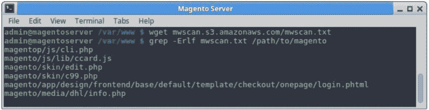
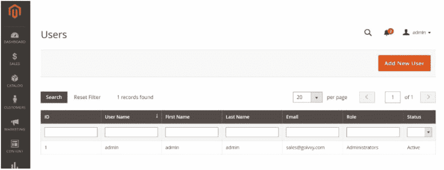
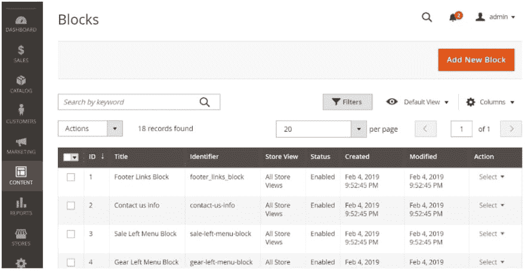
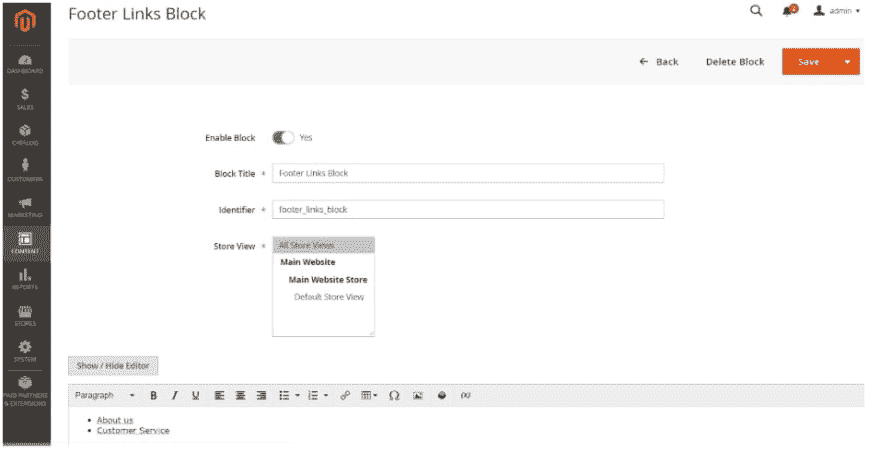
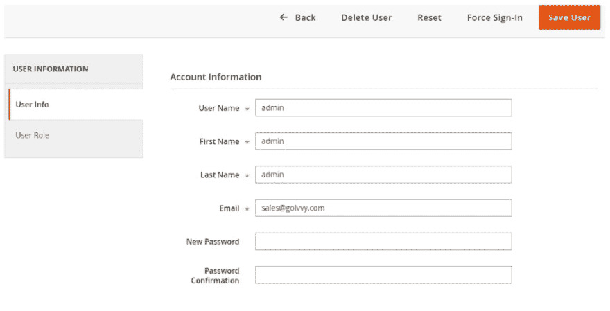

# 当你的 Magento 网站被黑了

> 原文：<https://dev.to/goivvy/when-your-magento-website-gets-hacked-12oh>

一个网站最重要的事情之一就是确保它是安全的，Magento 也不例外。企业主每天都在学习许多不同的方法来保证 Magento 网站的安全。

我曾经有一个客户雇佣了一个 Magento 开发者，付了第一笔钱，然后这个开发者就消失了。他们一次又一次地试图联系开发商，但都没有成功。

有一次他们错过了第二次付款，开发商突然联系他们，说在第二次付款之前不做任何工作。自然，客户拒绝了。

第二天，客户发现他们的网站完全瘫痪了，代码一片混乱。

我被雇来看看我是否能清理黑客。以下是我验证和清理黑客的步骤。

## 1.识别黑客

如果你认为你的网站被黑了，你必须做的第一件事就是确认黑客入侵。

确认一次黑客攻击有时可能就像看你的主页，发现屏幕有问题一样简单。

其他时候，黑客攻击可能更难确认。

这里有一些有用的提示，可以确认你的网站被黑了。

### 扫描您的网站

在标准的 Linux 或 OSX 服务器上，Magento 建议您执行以下操作:

*   在本地服务器上安装 Git。
*   在操作系统上安装 Yara 和 Python 包。
*   下载推荐的恶意软件工具。
*   运行以下代码:

wget https://mwscan.s3.amazonaws.com/mwscan.txt

grep -Erlf mwscan.txt /path/to/magento

如果在您的站点上没有检测到恶意软件，您的代码应该如下所示:

如果代码中出现额外的项目，请务必记下您可能会发现的额外的行或错误。请务必执行以下操作:

*   请注意网站上特定的黑名单警告。
*   寻找任何关于未经授权的信用卡收费的客户对话。
*   确保您的后端没有未授权的用户帐户。

在你的 Magento 网站上寻找小东西可以帮助你挽救你的生意。

### 检查 Magento 文件系统

检查 Magento 后端是否有新的或最近修改过的文件。在这段时间里，当你进入代码的时候，最好有一个网站的备份。

有看起来不熟悉或恶意的代码是你的网站被黑客攻击的一个明确标志。

要检查新的或最近修改的文件，您必须与您的主机联系以获得对您的 SSH 文件的访问权。

一旦您拥有访问权限，您就可以通过运行以下代码来访问核心文件完整性:

$ mkdir magento-2 . 1 . 3
$ CD magento-2 . 1 . 3
$ diff-r 2 . 1 . 3。/public_html

使用 SSH 时，您还可以通过运行以下代码来查找在过去 15 天内修改过的文件:

$ find。/-f-mtime-15 型

一旦你找到了新的文件，建议你寻找你认识的和你不认识的。新的、无法识别的文件应该由经过认证的 Magento 开发者进行调查。

### 验证网站用户

当你认为你的 Magento 网站被黑了，你需要去确保网站上没有新的或陌生的用户。你可以去后台确认一下。为此，只需遵循以下说明:

**系统→权限→所有用户**

您应该会看到以下屏幕:

一旦在那里，你应该能够看到所有的用户，你应该能够过滤出他们的角色，姓名，电子邮件和所有其他过滤器你在那里看到的。

过滤掉你的用户的最好方法是去你的备份，把你的备份用户列表和被黑的用户列表进行比较。

## 2.清理黑客

验证网络攻击可能会有压力，而清理网络攻击可能会让你付出比压力更大的代价。它还会造成大量的停机时间，并最终导致金钱损失。

然而，自己清理黑客并不是不可能的任务。

当你清理黑客时，这里有三个最好的步骤。

### 清理文件和数据表

你要做的第一件事就是清除黑客留下的恶意代码。寻找这些文件的最佳起点是通过 SSH 或 FTP。

此时，建议咨询经过认证的 Magento 开发人员。但是，如果您选择自己清理数据库，您应该在登录 SSH 后执行以下操作:

*   为你的站点文件创建一个备份，以防你不小心删除了你应该保存的文件。
*   识别最近更改的文件，并确认它们已经过授权。
*   查看由站点核心检查标记的文件。
*   从站点文件中删除可疑代码。
*   测试以验证该站点是否仍在运行，或者是否已经开始运行。

### 拆下后门

如果黑客能够进入你的网站，他们很可能留下了后门。黑客通常会在网站上留下后门，这样他们就有机会再次返回。

后门往往隐藏在核心文件中。您可能会在代码中找到一个全新的文件夹。像这样的文件夹看起来像是属于你网站的核心文件。

您可以在后端的内容部分访问这些文件。你所要做的就是:

**内容→元素→块**

您的屏幕应该如下图所示:

从那里，只需点击你想检查的块，并在“行动”，选择“编辑”。您应该会看到以下屏幕:

在这个页面上，您可以检查您站点上的任何可疑活动。

要更深入地查看网站的代码，比如查看 PHP 文件夹，你能做的最好的事情就是让一个经过认证的 Magento 开发者更深入地查看网站，以确保所有隐藏的后门都被清除了。

### 重置密码

一旦文件被清除，后门被移除，最重要的事情就是[采取措施](https://www.goivvy.com/blog/magento-security-audit)确保黑客下次不会这么容易进入。

最有效的方法之一是重置所有用户密码。您可以通过执行以下操作来实现这一点:

*   **管理员→系统→权限→所有用户**
*   单击用户
*   在“新密码”下输入新密码
*   确认密码
*   点击“保存用户”
*   继续步骤 1-5，直到成功更改了每个用户的密码。

考虑添加双因素身份验证以使您的站点更难被入侵也很重要。

作为额外的预防措施，您还应该考虑让您的团队每 30 天更改一次密码。这将给黑客一个更小的时间窗口来配置和使用你的密码，从而使网络攻击更难实施。