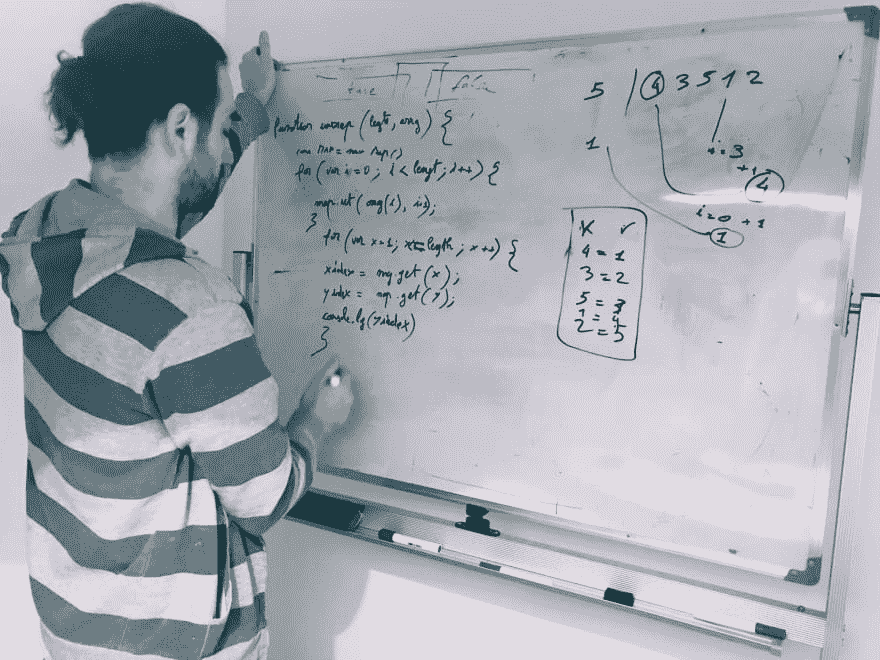
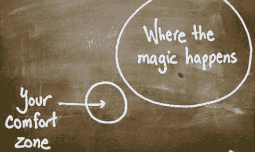

# 白板面试烂透了！_ 但你无论如何都要主动)

> 原文：<https://dev.to/dvddpl/whiteboard-interviews-suck-but-you-should-practice-anyway-2479>

白板面试现在越来越普遍了。过去，至少从我的第一手经验来看，面试过程是:

*   招聘人员电话
*   与公司进行电话/视频介绍性聊天
*   技术面试
*   人力资源面试

在过去的几年里，它变成了:

*   招聘人员电话
*   **家中的编码挑战**
*   与公司进行电话/视频介绍性聊天
*   技术面试
*   **白板编码环节**
*   人力资源面试

嗯，我对正式面试和“非正式”聊天很满意——我甚至被几家初创公司邀请参加午餐，虽然有些人可能会觉得在实际上评估你的其他人面前吃饭很尴尬，但我发现这是一种非常有效的方式，可以在日常的公司环境中看到候选人，谈论激情和爱好，谈论你的梦想和目标，并经常讨论技术问题(对我来说，这经常是谈论我的激情的方式)。

但是**我真的很讨厌在白板上写代码**:

*   我真的感到很大的压力，肩膀后面两三双盯着我的眼睛的重量
*   我的书法看起来像一个十几岁的精神病患者
*   因为我非常依赖 IDE 的自动完成特性，所以大多数时候我都不记得正确的语法或 API
*   大多数时候，任务及其限制是我在日常工作中很少遇到的。

为什么我现在要知道把 HTML 解析成 markdown——有很多 NPM 模块在做这个。做**重新发明轮子**是非常愚蠢的(恢复字符串或实现冒泡排序也是一样)。
如果我主要使用`map.filter.reduce`用函数式方法编写(如果我得到这份工作，你希望我这么做)为什么你禁止我使用它们，并且想看看我如何努力只编写一个循环和散列表？

不要误解我的意思，要知道[大 O 符号](https://www.interviewcake.com/article/javascript/big-o-notation-time-and-space-complexity?)和链接 map.filter.reduce 的影响，而不是在一个循环中做所有的事情，这对于避免泄漏或性能问题非常重要，但它更多的是关于知道它们如何工作以及何时使用什么，而不是关于知道实现细节。事实上，我会喜欢一个关于我将如何实现 HTML-markdown 转换器的技术聊天，遵循的步骤，可能的不同方法，时间和空间复杂度的分析，性能优化等，但不是实际编写它。
讨论两个不同的库，快速检查它们的实现并讨论利弊，我也会觉得很有趣。在我看来，这将表明你理解这个概念及其实现，并且你能够为你的任务选择正确的工具。

说了这么多，我们应该**练习白板编码**。正是因为以上所有原因，尤其是**因为它让人不舒服**。
所有让你走出舒适区的事情都会让你成长和进步。
[T8】](https://res.cloudinary.com/practicaldev/image/fetch/s--rtpIASS8--/c_limit%2Cf_auto%2Cfl_progressive%2Cq_auto%2Cw_880/https://thepracticaldev.s3.amazonaws.com/i/b8a9bkevd8hugbzd72dr.png)

因为你失去了你认为理所当然的东西，比如自动补全、代码林挺、编译警告和花哨的助手方法(不管是本地的还是来自其他库的)，你被迫以不同的方式思考和编码。你必须以不同的方式处理这个问题，这样你的创造力就会迸发出来。

此外，更新或学习基本的数学和计算机科学技能总是好的。
而且最重要的是**在向他人展示你的想法时学会管理压力**，并且以有序和清晰的方式去做，无论是面试、演示还是简单的代码设计会议。

有几个月，我开始每周一大早和一位同事开会，我们给我们 15 分钟来解决来自 [Hackerrank](https://www.hackerrank.com) 的一个简单任务。开始时，每次轮到我时，我都觉得自己拿不住记号笔，我的大脑开始融化。

现在情况有所好转，即使我有时会为一些任务而挣扎，但在我安静的办公桌前，这些任务会变得轻而易举，我必须说这也很有趣。

所以，去吧。从众多的编码挑战网站中挑选一些问题并练习。(我在上面的白板上解决的问题是 )
挑战自己，为下一次面试做准备！