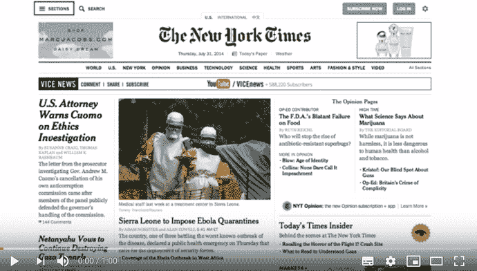
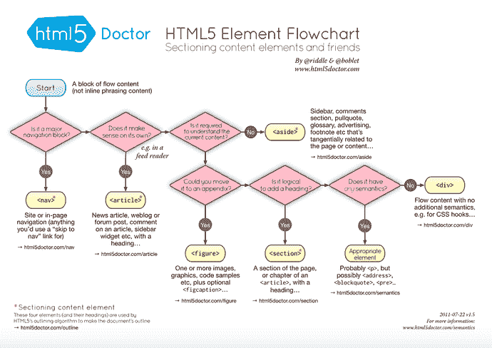

# 为什么一个优秀的前端开发人员应该关心 Web 可访问性

> 原文：<https://dev.to/mokkapps/why-a-good-frontend-developer-should-care-about-web-accessibility-545m>

根据 [CC 2.0](https://creativecommons.org/licenses/by/2.0/) 授权的 [Poakpong](https://www.flickr.com/photos/poakpong/4681315789) 封面图片

回到 2017 年，当我开始前端开发时，我听到了我以前的同事 [Francesco Schwarz](https://francescoschwarz.de/) 的一个有趣的演讲，题目是“无形的美学”。这都是关于网站的可访问性，[相应的博客文章](https://francescoschwarz.de/en/blog/aesthetics-of-the-invisible/)以一个非常好的陈述开始:

> 有时候，HTML 标记中的一个隐藏符号就决定了一个好的前端和一个优秀的前端。

我很快了解到，可访问性是一个非常两极分化的话题。以下是我听到的与此话题相关的典型陈述:

*   “我们没有时间讨论辅助功能”
*   “只有少数盲人，我们不需要支持这少数人”
*   “我讨厌这些难看的边框，我总是把它们去掉”
*   “如果我们有更多的用户，我们可以稍后再考虑可访问性”

在这篇博文中，我想告诉你，什么是可访问性，为什么它对网站很重要，为什么我关心它，为什么你也应该关心它。

# 什么是网页无障碍？

如果需要我用自己的话来描述，我会把它定义为

> 任何人都可以完全访问网站并与之互动

维基百科官方文章将其描述为

> 包容性做法，确保没有阻碍残疾人与网站互动或访问网站的障碍。

所以一个好的网站应该让每个人都能访问它的内容，甚至是残疾人。

顺便说一下，accessibility 经常缩写为 **A11Y** 。

A11Y 就是所谓的 [numeronym](https://a11yproject.com/posts/a11y-and-other-numeronyms/) ，有点类似于缩略词。与首字母缩略词不同，用数字代替字母来缩短术语。你可能已经熟悉了其他的数字名称，比如“K-9”代表“犬科动物”，或者“W3C”代表“万维网联盟”。

# 什么是残疾？

正如我在开始时已经提到的，有一种错误的观念认为网页可访问性只与盲人用户相关。

根据世卫组织的一份报告，大约有 13 亿人患有某种形式的视力障碍。其中，3600 万人是盲人。但是对于轻度和重度视力障碍的人来说，阅读网站上的内容会有困难。

当然，不仅仅存在视觉障碍。 [Google 的可访问性基础知识](https://developers.google.com/web/fundamentals/accessibility/)展示了现实世界中的一些访问障碍示例:

|  | 环境形成的 | 暂时的 | 永久的 |
| --- | --- | --- | --- |
| 视觉的 | 分心的司机 | 脑震荡 | 失明 |
| 发动机 | 抱着一个婴儿 | 断臂 |  |
| 听力 | 嘈杂的办公室 |  | 聋的 |
| 认知的 |  | 脑震荡 |  |

因此，我们所有人都可能遇到这样的情况，我们需要与网站互动，但却有某种情况，暂时或永久的残疾。

我喜欢引用文章[“可访问性很重要，这是我们正在做的事情”](https://product.voxmedia.com/2016/5/11/11612516/accessibility-matters-and-heres-what-were-doing-about-it):

> **我们永远不应该对我们的用户做出假设**
> 
> 让产品变得易于使用并不意味着瞄准特定的人群。更确切地说，无障碍设计，或者说通用设计，就是让尽可能多的人使用产品。我们不应该假设我们知道我们的用户如何参与我们的内容，>并且应该理解它可能被许多辅助技术“看到”，包括自动化工具、纯键盘导航和>屏幕阅读器。

你现在可能在想:“但是我的客户是不同的”。

不，我不这么认为！

正如你在上面的表格中所看到的，你的网站用户很有可能有情境性的、暂时性的或永久性的残疾。

你应该关心所有人，而不是关心少数人。

不要忘记:网站是你生意的大门！

当然，你想让尽可能多的人加入你的企业，所以你应该关心。所以热烈欢迎他们！

# 可以辅助浏览网站的工具

我想向您介绍一些工具，如果您有某种残疾，这些工具可以帮助您浏览网站:

*   允许向计算机口述单词和命令的语音识别软件。对于不能使用键盘或鼠标与计算机交互的人很有帮助。
*   为聋人准备的字幕或手语版本。
*   扩大显示器内容的软件，可以帮助有视觉障碍的人。
*   屏幕阅读器软件，使用合成语音读出计算机显示器上的元素。

你绝对应该尝试一下，感受一下。我特别推荐测试屏幕阅读器，你可以在这里阅读更多关于如何使用它们的信息。

此视频显示了屏幕阅读器的用法:

# 如何让网站更容易访问？

| 用户约束 | 无障碍解决方案 |
| --- | --- |
| 无法使用鼠标或标准键盘 | 对页面进行编码，使导航在没有鼠标的情况下也能工作。因此，[不删除轮廓属性](http://www.outlinenone.com/)是很重要的。 |
| 视觉障碍 | 在页面上使用较大的文本和图像以及良好的颜色对比。 |
| 失明 | 对于屏幕阅读器来说，拥有一个语义上有意义的 HTML(更多信息在表格下面)以及图片和链接的文本描述(例如使用 alt-tag 来描述图片:``)是很有帮助的 |
| 耳聋并且听力不好 | 添加隐藏式字幕视频或提供手语版本。 |
| 色盲 | 给链接加下划线和颜色(或以其他方式区分),帮助色盲用户注意到它们。 |

这些只是其中的一些例子，在 [Web 内容可访问性指南 2.0](http://romeo.elsevier.com/accessibility_checklist/) 中可以找到一份包含更多信息的清单。

一般来说，如果可能的话，应该避免使用`
`作为 HTML 标签。因此，你可以随时查看这张来自 [HTML5 Doctor](http://html5doctor.com/downloads/h5d-sectioning-flowchart.pdf) 的惊人图片:

我还建议在开发过程中使用一些辅助工具，如 [eslint-plugin-jsx-a11y](https://www.npmjs.com/package/eslint-plugin-jsx-a11y) ，这是一个 npm 包，为 jsx 元素的可访问性规则提供了一个静态 AST 检查器。

# 如何测试我的网站是否可访问

我主要使用[谷歌灯塔](https://developers.google.com/web/tools/lighthouse/)来检查我的网站是否可访问。

您可以使用在线提供的许多可访问性清单中的一个，但是我建议您使用[可访问性测试工具](https://css-tricks.com/accessibility-testing-tools/)中描述的任何工具。

# 实现无障碍真的这么费时间吗？

是的，如果项目已经处于后期阶段，或者您有一个遗留代码库，有大量的可访问性问题，您现在需要修复。

不会，如果你能从项目一开始就考虑易访问性，并在整个开发过程中关心它。

# 为什么易访问的网站是好网站

*   一个结构良好的语义 HTML 网站有助于提高你的搜索引擎优化。例如，一个搜索引擎机器人是盲的，听不见，并且具有幼儿的认知能力。所以他是你网站最重要的访问者之一。如果他不能正常访问你的网站，你将在搜索请求中获得较低的排名。
*   几乎每个人都可以访问你的网站并与之互动
*   关心可访问性是专业 web 开发人员的良好品质
*   一个可访问的网站感觉更专业
*   您将节省资金，因为您不需要回答残疾用户的支持问题。

# 总结

我希望看完这篇文章后，你能理解为什么网页可访问性很重要，为什么你应该关心它。

它不是为少数人提供支持，而是为网站的每个用户提供良好的用户体验。

你的网站是你企业的大门:让你的用户知道他们是受欢迎的，你关心他们，你的企业关心质量和专业性。

希望你现在也是其他开发者的导师，这些开发者仍然认为可访问性是不必要的。

# 重要环节

*   [MDN“什么是可访问性？”](https://developer.mozilla.org/en-US/docs/Learn/Accessibility/What_is_accessibility)
*   [谷歌网络基础无障碍](https://developers.google.com/web/fundamentals/accessibility/)
*   [为什么网页可访问性很重要，以及如何实现这一点](https://medium.com/fbdevclagos/why-web-accessibility-is-important-and-how-you-can-accomplish-it-4f59fda7859c)
*   [网络无障碍清单](https://a11yproject.com/checklist)