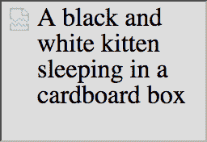

# 为什么以及如何使用 alt 属性

> 原文：<https://dev.to/eys/why-and-how-to-use-the-alt-attribute-428j>

1992 年 7 月 18 日，第一张图片发布在网络上。从那以后又发生了几起。但是这些图片的数量多得令人难以置信，并不是每个人都能在网上轻易看到。

我想当然地认为每个人都知道这可以通过使用`alt`属性来解决，但是我意识到事实并非如此。

## `alt`属性有什么作用？

属性定义了图像的可选文本描述，并允许我们通过非文本内容的 [WCAG 成功标准。](https://www.w3.org/WAI/WCAG21/quickref/#non-text-content)

## 为什么？谁看不到图像？

最明显的，也是最不被关注的，是屏幕阅读器。“我们没有盲人用户”是我害怕听到的一句话。如果我没有机会争论这一点，我只是悄悄地在我工作的所有项目的所有图像上包含 alt 属性。这就是全部——一个属性。瞧！该网站更容易访问:)

搜索引擎也从中受益，因为他们现在获得了图像的文本描述，而不是依赖一个不可靠的人工智能来解释它。

非图形浏览器在有视力的人群中也变得越来越普遍，尽管我们不认为它们是浏览器。众所周知的语音助手，如谷歌助手、苹果 Siri、亚马逊 Echo，以及你的下一辆汽车安装的任何东西可能不会显示图像，但应该能够描述它们。

最后，但同样重要的是，图像可能根本无法加载。发生这种情况的原因有很多:

*   一开始就放入了错误的 URL。(CMS '可硬了，见过网址指向`file:///`的网页？)
*   图像文件已在服务器上移动，但`src` URL 尚未更新。
*   访问者在国外，在数据漫游时阻止了图像的加载。
*   当火车驶入隧道时，访问者失去了互联网连接，设法及时下载了标记，但没有加载图像(也没有 JavaScript 或 CSS，但那是另一回事)。

## 怎么修！

```
 
```

如果我要发布一张可爱小猫的图片，但不包括`alt`描述，浏览器只会显示“图片损坏”图标，如下图所示。

[](https://res.cloudinary.com/practicaldev/image/fetch/s--9zXwxaa8--/c_limit%2Cf_auto%2Cfl_progressive%2Cq_auto%2Cw_880/https://thepracticaldev.s3.amazonaws.com/i/m3lag2uecjfaq4cbk932.png)

但是如果我加上一个很好的恰当的描述，每个人都会明白有一只黑白相间的小猫睡在一个纸板箱里。

[](https://res.cloudinary.com/practicaldev/image/fetch/s--g90X1In8--/c_limit%2Cf_auto%2Cfl_progressive%2Cq_auto%2Cw_880/https://thepracticaldev.s3.amazonaws.com/i/s2blqn2jhjbdvstis7eu.png)

### 形象概念

在描述中使用什么样的*有点棘手，因为有许多不同类型的图像。这里有一个简短的列表，涵盖了最常见的，我会在下面更详细地介绍它们。*

*   信息图像
*   装饰图像
*   功能图像
*   文本图像

#### 翔实的图像

显示概念和信息的图像，如插图、照片和图片。文本应该传达图像中的基本信息，就像上面小猫的例子一样。

#### 装饰图像

如果图像只是装饰性的，将属性文本设置为空

```
 
```

您还可以考虑将带有 CSS 的图像作为`background-image`包含进来。

注意:如果一个图像仅仅用于装饰目的，不要完全省略`alt`属性。浏览器将假定没有属性的图像是信息图像。

#### 功能图像

通常图像会被包裹在一个锚链接元素(`<a>`)或者一个`<button>`)中。然后，在描述中应该使用该函数的文本替代项。例如，如果在按钮上使用打印机图标来打印页面，文本应该是“打印”，而不是“打印机的单调图标”。

#### 图片文字

有时文本会出现在图像中。如果是这种情况，替换文本应该与图像中的单词相同。

## 外卖

所有图像上都应包含`alt`属性。

如果图像是装饰性的，保留一个空的属性值是没有问题的。如果图像添加信息，我们必须包括一个描述。

### 资源

*   [W3C 围图教程](https://www.w3.org/WAI/tutoriaimg/)
*   [MDN web docs:图片嵌入元素](https://developer.mozilla.org/en-US/docs/Web/HTML/Element/img)
*   可怕的鹿