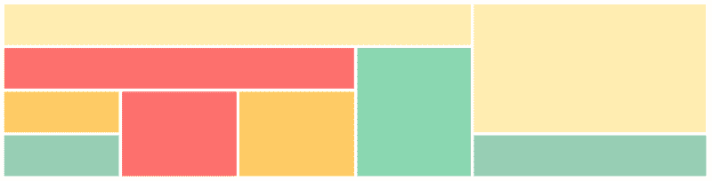
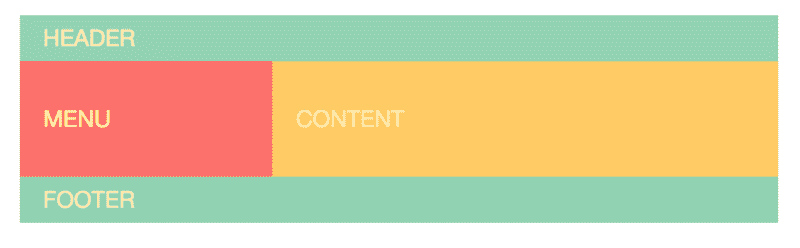
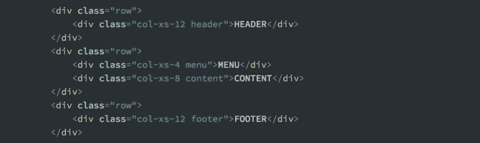
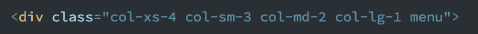
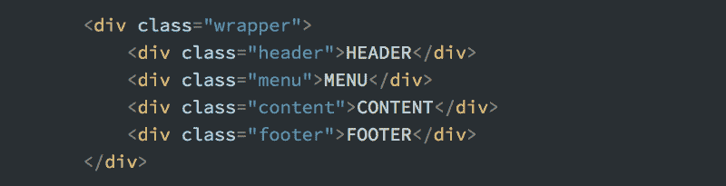
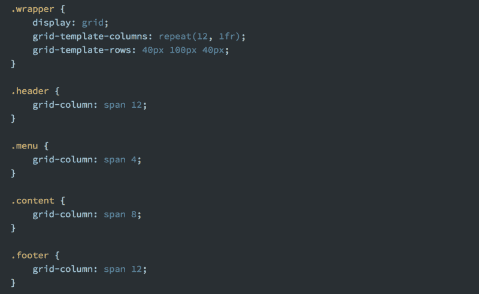
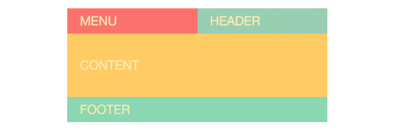
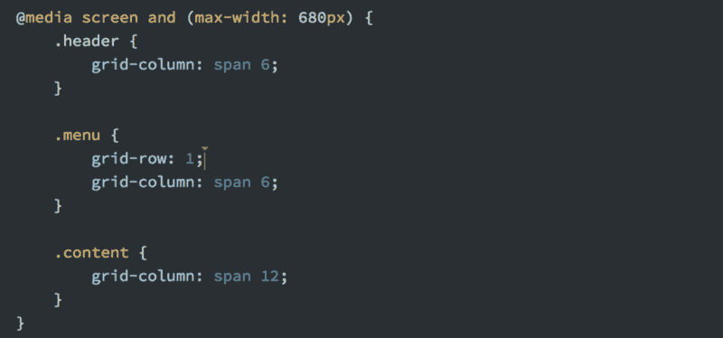
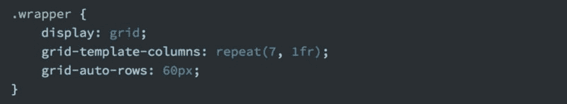
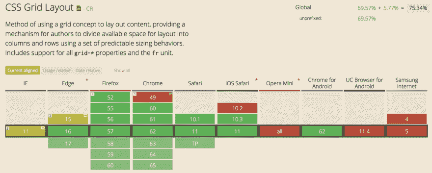

# 为什么 CSS 网格比 Bootstrap 更适合创建布局

> 原文：<https://dev.to/scrimba/why-css-grid-is-better-than-bootstrap-for-creating-layouts-4gg4>

CSS 网格是一种在网络上创建布局的新方法。我们第一次在浏览器中有了一个合适的布局系统，这给了我们很多好处。

如果你将 CSS Grid 与其中最流行的框架 Bootstrap(我们已经在这里顺便说一下，创建了一个[免费课程)相比较，这些好处会变得特别明显。您不仅可以创建以前不引入 JavaScript 就无法创建的布局，而且您的代码将更易于维护和理解。](https://scrimba.com/g/gbootstrap4?utm_source=dev.to&utm_medium=referral&utm_campaign=gR8PTE_grid_better_than_bootstrap)

在这篇文章中，我将解释为什么。

> 注意:我还创建了一个免费的 CSS 网格课程。[点击此处获得全部访问权限。](https://scrimba.com/g/gR8PTE?utm_source=dev.to&utm_medium=referral&utm_campaign=gR8PTE_grid_better_than_bootstrap)

 *点击图片进入课程*

现在让我们来看看我认为 CSS Grid 胜过 Bootstrap 的三大理由。

### 你的标记会更简单

用 CSS Grid 替换 Bootstrap 会让你的 HTML 更干净。虽然这不是最重要的好处，但它可能是你注意到的第一个好处。

为了举例说明这一点，我为一个网站创建了一个虚拟布局，这样我们就可以比较两个版本所需的代码。这是:

> 注意:我给了这个例子一点设计。然而，这与 CSS Grid 和 Bootstrap 之间的比较无关，所以我将 CSS 的这一部分保留在我的代码示例之外。

#### 自举

让我们首先看看在 Bootstrap 中创建这个网站所需的标记。

这里我想让你注意两件事:

1.  每一行都必须在自己的`
`标签中。
2.  你必须使用类名来指定布局(`col-xs-2`)。
3.  随着这种布局越来越复杂，HTML 也越来越复杂。

如果这是一个响应式网站，标签通常会看起来更糟:

#### CSS 网格

现在让我们看看 CSS 网格是如何做到这一点的。这是 HTML:

 
我本可以在这里使用语义元素，但是我选择继续使用 div，以便更容易与 Bootstrap 示例进行比较。

我们可以立即看到这个标记更简单了。难看的类名和每行所需的额外 div 标签都不见了。它只是一个网格的容器，以及里面的项目。

> 与 Bootstrap 不同，这种标记的复杂度不会随着布局复杂度的增加而增加。

然而，虽然 Bootstrap 示例不要求您添加任何 CSS，但是 CSS 网格示例当然要求这样做。具体来说，您必须添加以下内容:

对于一些人来说，这可能是一个支持 Bootstrap 的论点:你不必担心 CSS 来创建一个简单的网格，因为你只需在 HTML 中定义布局。

但是正如您将在下一点中理解的，标记和布局之间的这种耦合实际上是灵活性的一个弱点。

### 灵活多了

假设你想根据屏幕大小改变你的布局。例如，当在手机上查看菜单时，将菜单拉至顶行。

换句话说，改变布局如下:

变成这样:

#### **CSS 网格**

用 CSS Grid 做到这一点超级简单。我们只需添加一个媒体查询，然后根据需要随意排列项目:

事实上，你可以像这样重新安排布局，而不用担心 HTML 是如何编写的，这被称为*源顺序独立性*，这对开发者和设计者来说是一个巨大的胜利。

> CSS Grid 允许你把 HTML 变成它本来的样子。内容的标记。不是视觉效果，它属于 CSS。

#### 自举

如果我们想在 Bootstrap 中做同样的事情，我们实际上必须改变 HTML。我们必须将**菜单**标签移动到第一行，除了**标题，**作为**菜单**被困在第二行。

基于媒体的询问来做这件事并不简单。仅仅使用 HTML 和 CSS 是做不到的，所以你必须开始使用 JavaScript。

这个例子说明了到目前为止我使用 CSS Grid 的最大好处。

### 不再有 12 列限制

这并不是一个大问题，但它让我烦恼了好几次。由于引导网格被分成 12 列，如果你想要一个 5 列的布局，你会遇到麻烦。或者七个。或者九个。或者任何加起来不到 12 的东西。

对于 CSS Grid，情况并非如此。您可以让您的网格拥有您想要的列数。这是一个七列网格。

这通过将`grid-template-columns`设置为`repeat(7, 1fr)`来完成，如下所示:

现在可能有一种方法可以破解 Bootstrap 并使其工作。

我知道 Bootstrap 4 使用 Flexbox，这也使这成为可能。但是 CSS Grid 确实让做这些事情变得很容易。

#### 浏览器支持

在结束之前，我们当然还得谈谈浏览器支持。在写这篇文章的时候，92%的全球网站流量支持 CSS 网格。

然而，在你完全放弃使用 CSS 网格的想法之前，我想听听 Morten Rand-Henriksen 关于这个主题的看法，他认为 CSS 网格是一个重新构建我们关于向后兼容性的思考方式的机会:

> CSS 网格是一个**布局**模块；它允许我们改变一个文档的布局而不影响它的源代码顺序。换句话说，CSS grid 是一个**纯可视化**工具，如果使用正确，它应该不会影响文档内容的交流。由此得出一个简单但令人惊讶的事实:旧浏览器缺乏对 CSS 网格的支持不应该影响访问者的体验，相反**只是让体验变得不同**。

换句话说，因为你已经把内容和视觉分开了，结果是所有的访问者都会看到内容，然而，CSS Grid 会通过更好的布局来增强那些支持它的人的体验。

#### 最后备注

最后，我想分享 Mozilla 的开发者倡导者 Jen Simmons 的一句话。她描述了我在了解 CSS Grid 后对它的同样看法:

> 我使用 CSS Grid 越多，我就越确信在其上增加一层抽象层没有任何好处。CSS Grid 是布局框架。直接嵌入到浏览器中。—珍·西蒙斯

如果你确信 CSS Grid 是未来的趋势，并且你想了解更多，请点击这里查看我的免费课程。

感谢阅读！我的名字是 Per，我是一个创建交互式编码截屏的新工具 [Scrimba](http://scrimba.com?utm_source=dev.to&utm_medium=referral&utm_campaign=gR8PTE_grid_better_than_bootstrap) 的联合创始人。如果你有任何问题或意见，请随时通过[推特联系我。](https://twitter.com/perborgen)