# 为什么 Dev.to 赢了 Hashnode？

> 原文：<https://dev.to/sarthology/why-devto-is-winning-over-hashnode-27nj>

所以，你们中的一些人可能已经熟悉了，Dev.to 和 Hashnode 都是开发人员的在线社区，或者至少它们是这样表示自己的。

**Hashnode:**
[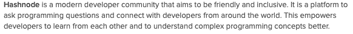](https://res.cloudinary.com/practicaldev/image/fetch/s--Zv5YR2f5--/c_limit%2Cf_auto%2Cfl_progressive%2Cq_auto%2Cw_880/https://thepracticaldev.s3.amazonaws.com/i/7cjkemwpqeq68sjqn6av.png)

**Dev.to:**
[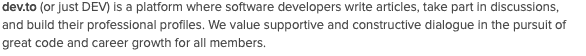](https://res.cloudinary.com/practicaldev/image/fetch/s--o7LFhl5Y--/c_limit%2Cf_auto%2Cfl_progressive%2Cq_auto%2Cw_880/https://thepracticaldev.s3.amazonaws.com/i/7qv46zzhk70hh3eobgob.png)

但是 *Dev.to* 很快领先 *Hashnode* 正如我们在下面的统计中可以清楚看到的。

[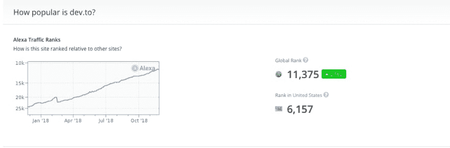](https://res.cloudinary.com/practicaldev/image/fetch/s--QTEeQwF8--/c_limit%2Cf_auto%2Cfl_progressive%2Cq_auto%2Cw_880/https://thepracticaldev.s3.amazonaws.com/i/cm59dnn48afnf74028jl.png)
[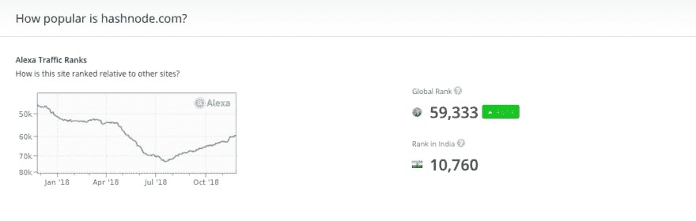T6】](https://res.cloudinary.com/practicaldev/image/fetch/s--dMBgu2m0--/c_limit%2Cf_auto%2Cfl_progressive%2Cq_auto%2Cw_880/https://thepracticaldev.s3.amazonaws.com/i/1ihhdv0wfsc5h2l1eekt.png)

我认为这将成为一个有趣的案例研究，以了解为什么会发生这种情况。因此，我试图深入挖掘，这让我发现了一些关键点，可以帮助年轻企业家制造出伟大的产品，并让它们发挥作用。让我们开始吧。

#### 不是要做很多功能，而是要让几个关键功能发挥作用。

我的朋友向我介绍了 Hashnode，他说这是一个为任何社区设计的最好的平台。当然，这并不是我离开 dev.to 的唯一原因，但我报名只是为了好奇，想实际检验一下他们的产品。毫无疑问，这个平台有一个很棒的用户界面；但是在那上面多花一点时间，你就会发现问题了。

Dev.to 的设计非常简单。他们有博客、讨论、ama 和挑战，拥有 Hashnode 所拥有的一切，但他们所有人的起点都是一样的——**“写文章”**——一切都由标签分隔。这就是他们为用户简化事情的方式。另一方面，在 Hashnode 上，用户在注册过程中会被大量选项淹没。有一个单独的页面来添加所有内容，设计也略有不同。

#### 社群是建立在互动之上的，你永远是第一个开启它的人。

我是[本·郭馨予](https://medium.com/@theunixbeard?source=post_header_lockup)的这篇文章[“产品搜寻的崛起”](https://medium.com/@theunixbeard/product-hunt-s-rise-d49249a1a2c0)的超级粉丝。这解释了[瑞安·胡佛](https://twitter.com/rrhoover)实际上是如何让产品搜索社区运转起来的。如果你仔细观察，你会发现[本·哈尔彭](https://twitter.com/bendhalpern)也在做类似的事情。

[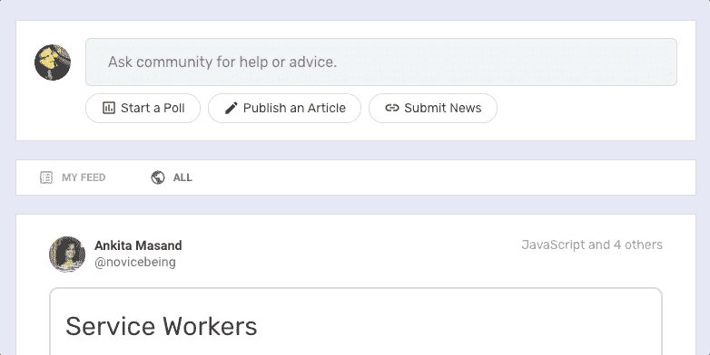](https://res.cloudinary.com/practicaldev/image/fetch/s--cvESVSHn--/c_limit%2Cf_auto%2Cfl_progressive%2Cq_66%2Cw_880/https://thepracticaldev.s3.amazonaws.com/i/9fwf4bdrkws84blyuomg.gif)

当你冲浪的时候你看到的第一件事是什么？“零互动”。大多数热门帖子要么只有 1 票，要么没有，人们很少对彼此的帖子发表评论。他们只是顺便来推销他们的东西，然后离开。

[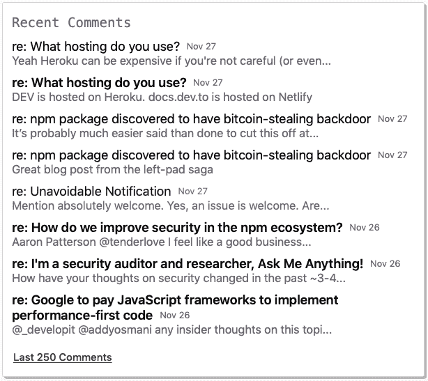](https://res.cloudinary.com/practicaldev/image/fetch/s--ulM49UeO--/c_limit%2Cf_auto%2Cfl_progressive%2Cq_auto%2Cw_880/https://thepracticaldev.s3.amazonaws.com/i/oqak20i0ad9ety7yv8jm.png)
[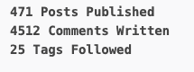T6】](https://res.cloudinary.com/practicaldev/image/fetch/s--CIrwJpHc--/c_limit%2Cf_auto%2Cfl_progressive%2Cq_auto%2Cw_880/https://thepracticaldev.s3.amazonaws.com/i/gdfb8j1usqkpll66n0c9.png)

当你开始你的社区时，显然互动不会自动开始。你必须启动它，这样人们也可以加入进来。查看 Ben 到目前为止发表了多少评论和帖子。

“开发一个应用，就像你自己是第一个也是最后一个用户一样。”

本活在这句咒语中。我看到他在几乎每一个伟大的讨论或博客上发表评论。有时他是第一个发表意见的人，即使没有其他人在场。

与此同时，Hashnode 的创始人在 4 年的时间里只发表了 15 篇文章，他甚至没有回答在他的个人资料上直接问他的问题。

我肯定他是个大忙人，有更重要的事情要做。)

但是你可以清楚地看到不同之处。

Dev 的另一个锦囊妙计是这些很酷的按钮。我不知道你是否知道这一点，但每个用户可以点击所有三个按钮，这将算作 3 个向上投票/喜欢/心。我认为这是一个非常酷的技巧，因为作者自己可以点击所有三个按钮。这意味着无论如何，每个帖子都可以有 3 个赞。所以“无死帖”！

#### 向初始用户展示❤️，让他们感到与众不同

Dev .有这么棒的每周顶级系列。他们发布专门针对上周热门帖子和评论的每周文章。是的，你没看错——评论。

[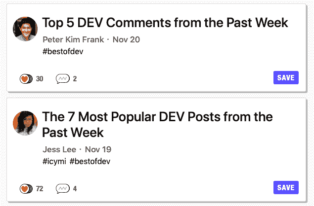](https://res.cloudinary.com/practicaldev/image/fetch/s--i9ChF-Qq--/c_limit%2Cf_auto%2Cfl_progressive%2Cq_auto%2Cw_880/https://thepracticaldev.s3.amazonaws.com/i/005s0jwjui6e2u5519go.png)

他们永远不会忘记每天在推特上发布每个类别的热门帖子。这不仅有助于作者接触到更多的读者，也有助于他们在帖子上获得更多的关注者和互动。现在**这就是**你如何授权给你的用户。

> 开发社区👩‍💻👨‍💻[@ thepracticaldev](https://dev.to/thepracticaldev)分享 6 款用于 Mac 的开源菜单栏应用。
> 
> ——Itsycal📆
> -武士刀✂️
> - Youtube 下载器📹
> -裸奔者🐙
> -日期天气🌦
> -菜单计💻
> 
> {作者:[@ Sarthology](https://twitter.com/Sarthology)}
> [dev.to/sarthology/bes…](https://t.co/iciCwDF8gP)2018 年 8 月 30 日晚 20:05

他们不断想出新的方法让他们的用户感到特别。例如，上周，因为我的帖子[“我们开发者正在帮助谷歌建立一个不可阻挡的垄断吗？”](https://dev.to/sarthology/are-we-developers-helping-google-build-an-unstoppable-monopoly--39ki)，我发现~~开发人员到~~两个铁杆粉丝创建了一个播客，他们在这里讨论开发人员到自己的帖子😱。太棒了，看看吧。

[https://w.soundcloud.com/player/?url=https://soundcloud.com/malikanddan/devto-review-episode-9&auto_play=false&color=%23000000&hide_related=false&show_comments=true&show_user=true&show_reposts=false&show_teaser=true](https://w.soundcloud.com/player/?url=https://soundcloud.com/malikanddan/devto-review-episode-9&auto_play=false&color=%23000000&hide_related=false&show_comments=true&show_user=true&show_reposts=false&show_teaser=true)

对你们中的一些人来说，这些可能看起来很小，但这些正是创造真正粉丝的东西——不仅仅是用户，还有真正的粉丝。这些真正的粉丝就是你的免费营销大军。当你访问 Hashnode 的 [twitter 页面](https://twitter.com/hashnode)时，你可以看到明显的不同。你也不会发现与他们的用户群有任何互动。毫不奇怪，这两个平台的粉丝数量存在巨大差异。

#### 付出多于索取

过度表达的习惯是成功的关键。如果你是一个普通用户，你可能已经注意到 Dev.to 团队有各种帖子可以帮助你找到你需要的人。

可以找到投稿人:
[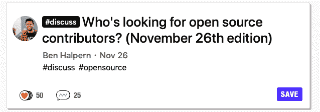](https://res.cloudinary.com/practicaldev/image/fetch/s--BoDThCZ---/c_limit%2Cf_auto%2Cfl_progressive%2Cq_auto%2Cw_880/https://thepracticaldev.s3.amazonaws.com/i/6zjbhsa4le5j9qm8qn7i.png)

可以雇佣的人:
[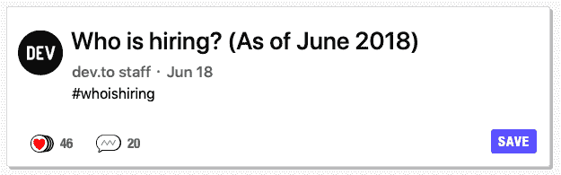](https://res.cloudinary.com/practicaldev/image/fetch/s--jgjpQxDd--/c_limit%2Cf_auto%2Cfl_progressive%2Cq_auto%2Cw_880/https://thepracticaldev.s3.amazonaws.com/i/q0q2016tjmgfyxmncboe.png)

而这些只是除了令人惊叹的社区之外的额外收益。我自己也在这样的帖子里找到了一些新朋友。顺便说一下，Hashnode 过去在他们的平台上发布工作是收费的，他们最近才免费提供这项功能。

[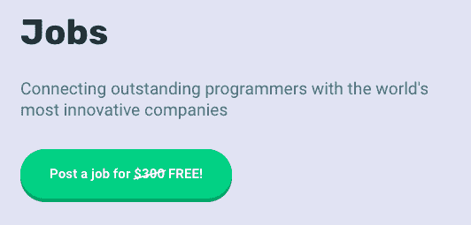](https://res.cloudinary.com/practicaldev/image/fetch/s--xchtw_4G--/c_limit%2Cf_auto%2Cfl_progressive%2Cq_auto%2Cw_880/https://thepracticaldev.s3.amazonaws.com/i/qddd467vbo1ycx54huu5.png)

如果你的平台做了它承诺要做的事情，它就是一个有用的平台，但是这些小特性才是让人们*喜欢*你的平台的真正宝石。

#### 要开放，要谦虚

我们都知道 Dev.to 是开源的，但另一个有趣的事实是他们也是一家非常开放的公司。我是说公布自己的弱点有点公开。这不仅给了他们贡献者，也给了用户在评论区毫不犹豫地指出错误的机会。

上周在关于我的[帖子](https://dev.to/sarthology/are-we-developers-helping-google-build-an-unstoppable-monopoly--39ki)的讨论中，Ben 陈述了真正代表 Dev.to 核心价值的东西——“谦虚是关键”。我想这就是 Dev.to 开源的原因。这表明他们对自己的目标非常开放，即他们希望为开发者建立一个社区。

#### 结论

我不是说 Hashnode 死了。我相信他们可以从他们有才华的竞争对手那里学到一些东西，并有所提高。因为最终，开发者也会从中受益。

伙计们，感谢你们的阅读。我希望这对你来说是一次很好的学习经历，就像我对我一样。构建产品很容易；另一方面，构建有意义的产品是事情变得有趣的地方。

如果我错过了什么，欢迎在评论区分享。如果你喜欢我的文章，分享给你的朋友，点击❤️或者三个都可以😂。

顺便说一句，我也在中号上。点击查看[。](https://medium.com/@Sarthaksharma0)