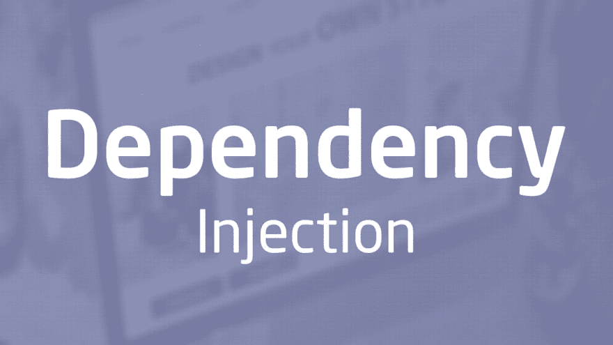

# 为什么我必须在 JS 中使用依赖注入？

> 原文：<https://dev.to/vyzaldysanchez/why-do-i-have-to-use-dependency-injection-in-js-code-35an>

[](https://res.cloudinary.com/practicaldev/image/fetch/s--vnT8nenS--/c_limit%2Cf_auto%2Cfl_progressive%2Cq_auto%2Cw_880/https://thepracticaldev.s3.amazonaws.com/i/rjq9ifk31ejlm555qi3j.jpg)

每当我们进入一个项目，无论是现有的还是新创建的，我们总是会考虑我们要构建的东西如何更易于管理、可伸缩和易于测试。这就是使用依赖注入可以派上用场的地方。

但是首先，*我们所说的依赖注入是什么意思？*

> 这是一种软件设计模式，它允许我们通过将获取依赖它的代码之外的依赖的责任转移到代码单元，从而使代码单元可测试。它还指从我们代码的某个部分向依赖这些依赖关系的某个对象、函数或模块提供一些依赖关系的行为。

# 这个为什么有用？

如前所述，如果我们在需要的时候抽象出他们需要的特定依赖关系，我们可以使代码片段更容易测试。例如:

```
//File: services/notifications/index.js

import User from '../database/models/user';
import { logError } from './logger';
import { sendEmailNotification } from './emails';

const DEFAULT_NOTIFICATION_MESSAGE = 'Hi, friend. :)';

export const sendNotificationsToUsers = async (ids = []) => {
  try {
    const users = await User.find({
      id: ids
    });

    const promises = users.map(({
      email,
      // This we'll add notifications into a queue to process them in the background.
      // Don't freak out.
    }) => sendEmailNotification(email, DEFAULT_NOTIFICATION_MESSAGE));

    await Promise.all(promises);

    return {
      success: true
    };
  } catch (e) {
    logError(e);

    return {
      success: false
    };
  }
}; 
```

Enter fullscreen mode Exit fullscreen mode

在前面的例子中，我们试图向一些用户发送通知。这里没什么奇怪的。但是为了测试这个我们要做什么呢？模拟这 3 个依赖项以便作为一个单元进行测试容易吗？

*对我来说，没有*

## 我会怎么做？

我们可以有两个案例。第一个，如果我们模块中只有这个函数需要依赖关系。或者第二个，模块中的所有函数都需要这些依赖。

对于第一种情况:

```
//File: services/notifications/index.js

const DEFAULT_NOTIFICATION_MESSAGE = 'Hi, friend. :)';

export const sendNotificationsToUsers = async ({
  User,
  logger,
  notifier
}, ids = []) => {
  try {
    const users = await User.find({
      id: ids
    });

    const promises = users.map((user => notifier.notifyUser(user, DEFAULT_NOTIFICATION_MESSAGE)));

    await Promise.all(promises);

    return {
      success: true
    };
  } catch (e) {
    logger.logError(e);

    return {
      success: false
    };
  }
}; 
```

Enter fullscreen mode Exit fullscreen mode

我们在这里做了一点重构:

*   我们将依赖关系作为第一个配置参数传递给我们的`sendNotificationsToUsers`函数。
*   我们允许我们的函数不关心我们需要什么样的日志或通知程序，所以这个函数可以是通用的，可以在将来重用。比如使用短信通知或任何我们想到的方式。

现在这段代码是可测试的，依赖关系可以被模仿:

```
//some test file
import assert from 'assert';
import {
  sendNotificationsToUsers
}
from '../core/services/notifications';

describe('Notification service', () => {
  const mockUserDB = {
    find() {
      return Promise.resolve([{
        email: 'some-email@gmail.com',
        phone: 'some-phone-number'
      }]);
    }
  };
  const logger = {
    logError(e) {
      console.log(e);
    }
  }

  describe('#sendNotificationsToUsers', () => {
    it('can send notifications via emails', async () => {
      const notifier = {
        notifyUser(_user, _message) {
          return Promise.resolve(true);
        }
      };
      const notificationResponse = await sendNotificationsToUsers({
        User: mockUserDB,
        logger,
        notifier,
      }, [1]);

      assert(notificationResponse, 'Notifications failed to be sent.');
    });
  });
}); 
```

Enter fullscreen mode Exit fullscreen mode

*整个模块问依赖怎么办？*

我们只需将我们的模块导出为一个接受这些依赖关系的函数，并如下使用它:

```
export default ({
  User,
  logger,
  notifier
}) => ({
  async sendNotificationsToUsers(ids = []) {
    try {
      const users = await User.find({
        id: ids
      });

      const promises = users.map((user => notifier.notifyUser(user, DEFAULT_NOTIFICATION_MESSAGE)));

      await Promise.all(promises);

      return {
        success: true
      };
    } catch (e) {
      logger.logError(e);

      return {
        success: false
      };
    }
  }
});

//Usage

import User from 'services/users';
import logger from 'services/logger';
import notifier from 'services/emails';
import getNotificationsService from 'services/notifications';

const { sendNotificationsToUsers } = getNotificationsService({ User, logger, notifier });

sendNotificationsToUsers([1, 2, 3]); 
```

Enter fullscreen mode Exit fullscreen mode

# 结论

我相信这种编码方式将对我们所有人都有帮助，它将帮助我们把模块写成真正的单元，并且它还将帮助我们在测试和开发时更有效率。

`Please share your thoughts, corrections or comments below and until the next time. Happy Coding.`