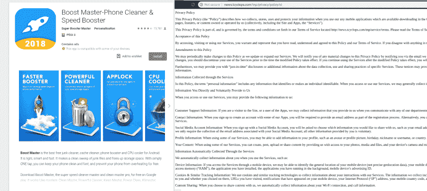
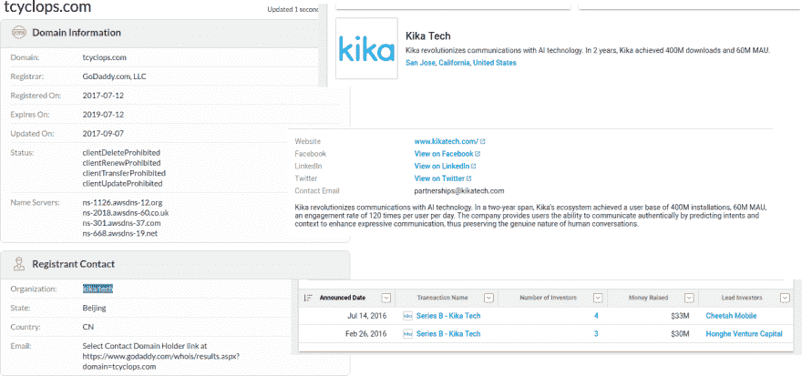
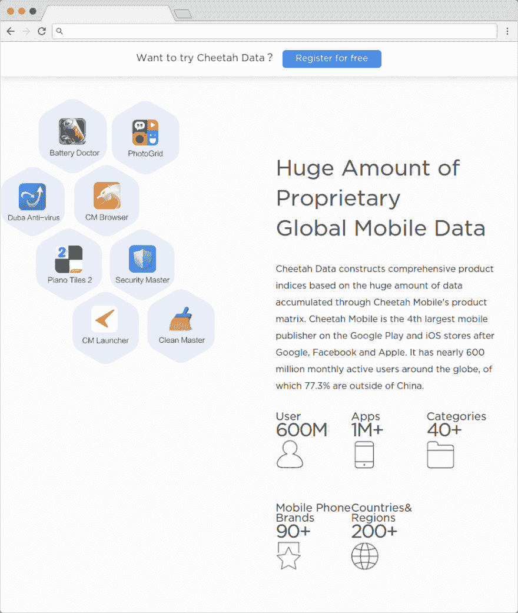
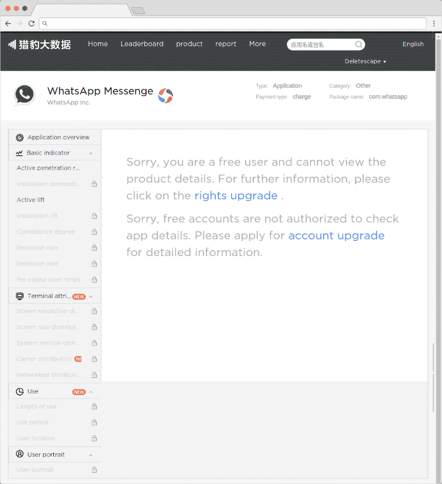
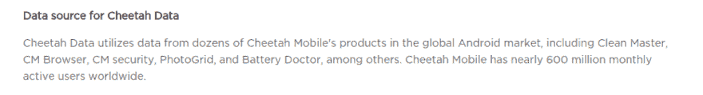
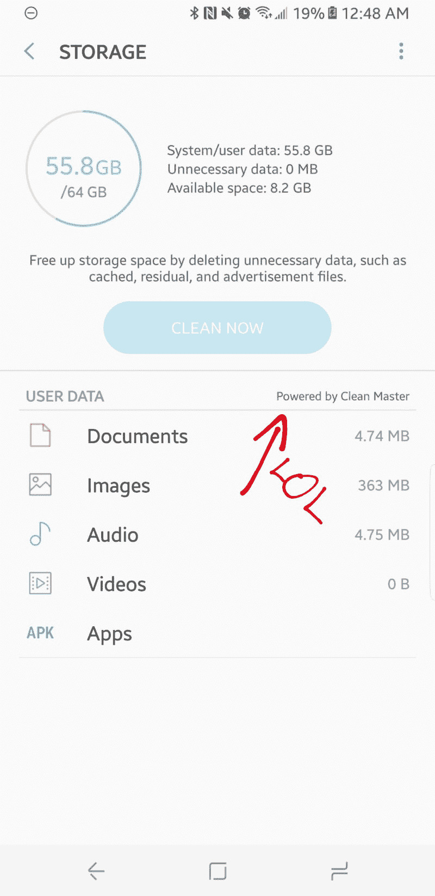
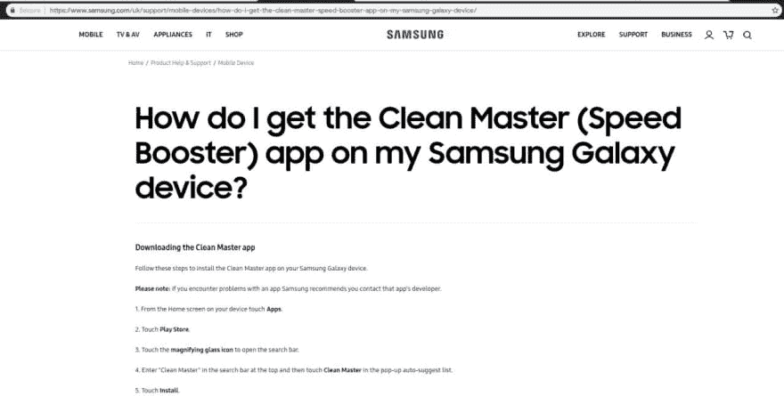
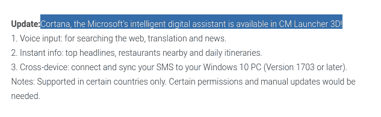
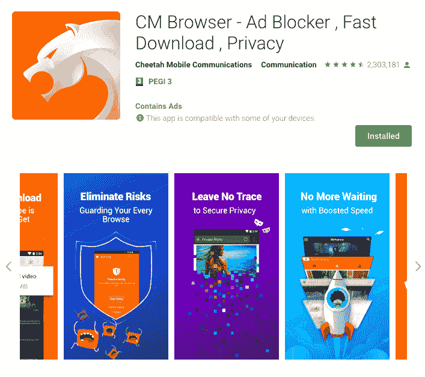

# 2018 年，人们为什么还信任猎豹移动？

> 原文：<https://dev.to/deletescape/why-do-people-still-trust-cheetah-mobile-in-2018-337j>

可以很有把握地假设，几乎每个人以前都用过猎豹移动应用，主要例子包括 Clean Master 或 CM Launcher 3D。即使你从未听说过它们，其他几十个应用和游戏，如抖音(前身为 [Musical.ly](http://musical.ly/) )至少与猎豹移动有间接联系，由猎豹移动资助或拥有。毕竟，他们是谷歌 Play 商店和苹果应用商店的第四大发行商，仅次于谷歌、脸书和苹果。我们稍后会谈到这一点。如果你还在使用他们的应用，现在是时候停止使用了。让我告诉你为什么。

### 一张巨大的垃圾网

首先，让我们澄清一些事情。猎豹移动不是一家 Android 应用公司，他们是一家人工智能/大数据公司，在他们的 LinkedIn 公司页面上，他们甚至梦想着机器人和改变未来。

"那么，他们为什么首先要开发实用程序呢？"，你可能会问。答案很简单。他们想要你的数据，他们碰巧发现了一个弱点。出于某种原因，许多 Android 用户会不假思索地下载助推器、启动器和电池保护程序，认为这些类型的应用程序请求 Android 提供的所有权限是正常的。在 Clean Master 出现之前，Speed booster 应用程序根本不存在，现在 Play Store 已经被它们困扰了。如果你仔细看看他们和他们背后的名字，你很快就会发现自己陷入了一个小公司的网络，这些公司都从猎豹移动(或其他可疑公司杜理科应用)获得了神秘的资金。如果你更进一步，实际上把应用程序拆开，你会发现几乎每次都有猎豹移动提供的库。

<figcaption>Let’s take a look at Boost Master for an example, at the right you can see the privacy policy linked in the listing and inside the app</figcaption>

<figcaption>A quick look on whois.com and crunchbase reveals that the domain is owned by Kika Tech, an “AI” company funded directly by Cheetah Mobile</figcaption>

我现在可以花几个小时解释为什么清洁/增强应用不好，你不应该使用它们，但这是另一篇文章的主题，以前也讨论过。

### 猎豹移动出售你的数据，这甚至不是什么秘密

“但是伙计们，你们还是没有拿出任何证据证明他们在出售我们的数据！”猎豹移动官网应该够好证明了吧？这正是我能提供的。'

<figcaption>This official Cheetah Mobile website (https://data.cmcm.com) should probably be proof enough, right?</figcaption>

几个月前，我第一次发现了 [Cheetah Data](http://data.cmcm.com/) ，虽然我对它的存在并不感到惊讶，但看到这真的是一件大事还是令人惊讶。很明显，我不得不注册一个有限的免费账户，看看他们实际上收集了什么样的数据。好家伙，他们收集了很多！如果你自己是一个开发者，你可能知道谷歌分析和它提供给你的统计数据。想象一下，但是对于所有的应用，包括你的竞争对手。每两天更新一次。

<figcaption>Cheetah Data essentially allows paying users to get full analytics and profiles of the users of any app</figcaption>

是的。猎豹移动应用不仅在你使用它们时收集统计数据，它们还会分析你使用哪些应用、在什么时间使用以及使用多长时间。所有这些数据被公开出售的事实让我怀疑这只是冰山一角。

<figcaption>They aren’t even ashamed to tell us how they get their data</figcaption>

### 当我说三星和微软是叛徒时，我是认真的

你可能想知道这和这篇文章有什么关系，你这么问是对的。三星的 Android 软件恰好有一个存储清理工具，起初你可能会认为这是一个很好的功能…直到你仔细看看它。

<figcaption>That’s interesting, to say the least (source: [Reddit](https://www.reddit.com/r/Android/comments/68rtn1/clean_master_is_what_samsung_uses_for_their/)</figcaption>

Clean Master 和很多 app 一样，恰好是猎豹移动开发的。谷歌 Play 商店上的应用程序有超过 10 亿次下载，并且这个数字还在不断上升。每有一个人下载它们，猎豹移动就会从用户那里获得越来越多的数据。这可能是一个冒险的赌注，但我非常确信，几乎每个使用 Android 手机的人都曾在某个时候使用过一个至少与他们间接相关的应用程序。

<figcaption>Why would more than a billion people downloads this…</figcaption>

哦，如果你碰巧想在你的三星 Galaxy 上安装 [Clean Master](https://play.google.com/store/apps/details?id=com.cleanmaster.mguard&hl=en_US) 但不知道怎么做，你没必要担心。三星为您提供了如何安装该应用程序的官方指南。

<figcaption>I am not really sure if this guide is really helping anyone at all</figcaption>

现在，微软和这一切有什么关系呢？为了向您展示这一点，我们需要仔细查看 CM Launcher 3D 的 Play Store 描述来揭示这一点:

<figcaption>Wait… They actually did that?</figcaption>

## 哦，对了

即使你以前从未使用过任何可疑的实用程序，你也很可能下载过至少一款过去几年流行的游戏，比如 Piano Tiles，但这款游戏很可能是由 Cheetah Games 或另一家由 CM 神奇资助的公司开发的。你可能没有意识到猎豹移动拥有的其他应用和公司包括抖音(前 Musically)和直播服务 [Live.me](http://live.me/) 。

[Musical.ly](http://musical.ly/) 和猎豹移动去年合并。众所周知，社交网络从用户那里获取每一点数据。这次合并后，猎豹移动开发了自己的应用程序，抖音。 [Musical.ly](http://musical.ly/) 恰巧被关闭，切换到抖音。 [Musical.ly](http://musical.ly/) 甚至关闭了他们的流媒体直播服务 [live.ly](http://live.ly/) 并鼓励用户转向猎豹移动的 LiveMe。

在这一点上，应该清楚的是，他们竭尽全力收集各个领域的数据，所以在应用程序面板上也有一个浏览器才是有意义的，不是吗？向您展示“CM 浏览器”，它可以将您丰富的浏览器历史和使用数据发送到您最喜爱的价值数百万美元的新公司，随时准备与上帝和世界共享。

<figcaption>And of course they label it as a secure browser, with your privacy in mind (duh)</figcaption>

## TL；博士:

CM 只开发挖掘数据的应用程序。他们出售这些数据。基本上没有什么是他们不收集的。如果你安装了他们的某个应用程序，任何人都可以分析你是如何使用你的设备的，以及你在用它做什么。你成为大数据池的一部分。

如果您的任何朋友正在使用猎豹移动软件，请务必告诉他们并在此链接他们。如果你也在报道这个问题，你也可以自由引用这篇文章。如果你发现了其他卑鄙的应用/开发者，或者只是想知道你正在使用的应用是否在跟踪你，[在 Twitter 上联系我](https://twitter.com/deletescape)。

我还要感谢与我一起撰写这篇文章的[甜瓜煎饼](https://melonpancakes.xyz/)(这篇文章发表的刊物)的联合创始人[克里斯托弗·卡尔达斯](https://twitter.com/chris_kardas/)，以及[马克斯·温巴赫](https://twitter.com/mweinbachxda)，感谢他们在撰写本文期间的反馈和意见。在出版、披露和传播这个故事时，他们帮了大忙！