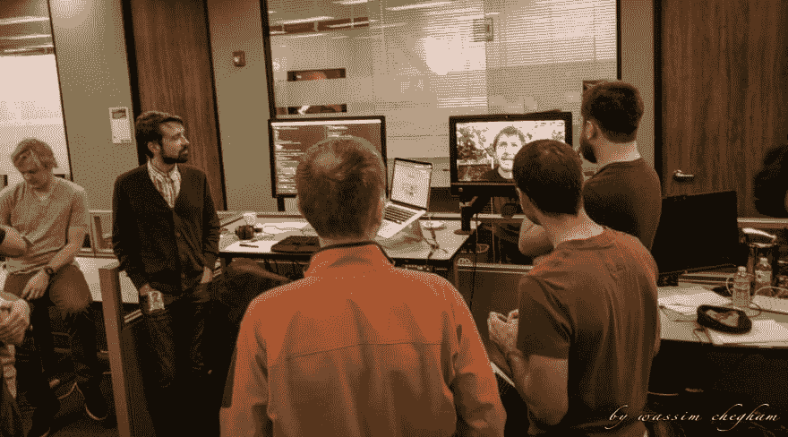

# 为什么棱角对我很重要？

> 原文：<https://dev.to/angular/why-does-angular-matter-to-me-2jbf>

*免责声明:这不是一篇技术博客文章！*

亲爱的 Angular 社区，

了解我的人都可以告诉你我有多在乎 Angular。你甚至可能已经从我在当地和国际活动中到处发表的演讲、我发布的开源应用程序以及我写的博客帖子或推文中猜到了这一点。这一切都是为了让你看看棱角有多牛逼！它可以说是当今市场上最具特色的完整框架！但是，现在我想告诉你为什么棱角对我很重要，为什么它对你也很重要。这不仅仅是关于框架或技术，Angular 不仅仅是一个工具。

让我解释一下...

* * *

# 7 年前

我第一次接触 AngularJS 框架是在 2011 年底，Angular 的第一个版本叫做 AngularJS。那时，在工作中我们需要一个更健壮的框架来为我们的“企业 y”项目构建下一个技术栈。我们之前的技术栈是建立在 Backbone.js 和一堆 jQuery 插件之上的。不要误解我的意思，那个堆栈做了一个不可思议的工作。我个人对此相当满意；当团队成长时，它就不能扩大规模。它还缺少一些核心组件，比如一个可靠的单元测试框架和一个定义良好的构建和打包过程。然后，我发现了 AngularJS。

我们使用 AngularJS 越多，团队就越喜欢前端开发(这是 2011 年！).你可以清楚地看到它。它为我们的企业应用程序提供了几乎所有我们需要的东西(MVVM 模式、表单、HTTP、路由、测试、DI 等等)。有些功能在当时的前端开发中是创新的。不管怎样，我们非常高兴，使用这个工具非常有效率。

> AngularJS 中我最喜欢的特性是依赖注入实现。

此外，我个人用 AngularJS 做的越多，我就越能看到 AngularJS 核心团队为这个工具所做的不可思议和天才的工作。我最喜欢的特性是依赖注入实现。我甚至从阅读实现中学到了很多。

然后我立刻爱上了这个工具，它成了我每个项目的首选，无论是个人项目还是专业项目。即使在今天，我开始研究这么多很酷的技术，但我总是会回到 Angular 平台。

但是故事并没有到此结束...

[https://www.youtube.com/embed/THvaySUZjMc](https://www.youtube.com/embed/THvaySUZjMc)

Papa Misko Hevery 首次公开谈论 AngularJs！当然，我不是唯一一个使用 AngularJS 的人，这个框架已经变得越来越流行，许多开发人员也在使用它来构建他们的企业 Web 应用程序。

在花了一些时间学习这个工具及其来龙去脉后，我决定介入并开始通过博客帖子和当地会议上的技术讲座来分享我的学习和发现，希望这最终能帮助到一些人。

事实上，我惊讶地发现，使用 AngularJS 的人比我想象的要多得多。安古拉杰周围有一个真实的社区。所以我决定加入这些热情的人。我从未后悔 7 年前的选择。

当我还在与 AngularJS 社区分享我的点滴学习时，我总是在寻找新的方法来帮助更多的人；因为除了工具本身，我还关心我的开发伙伴(顺便说一下，不仅仅是 Angular)，我关心我们的生产力和开发人员的体验。

# 4 年前...

然后，在 2014 年，该框架的第二个版本公布了:Angular，正如我们今天所知道的。核心团队决定从头开始重写 AngularJS，并构建一个大大改进的版本，该版本可以利用现代 JavaScript APIs 和工具来构建更快的现代和可伸缩的 Web 应用程序。

就我而言，我已经是这个社区的一部分，或者像每个人喜欢称之为“一个积极的成员”。这意味着我分配了一些个人时间来帮助社区，分享和回馈。这最终让我在 2015 年加入了 Angular 团队的[谷歌开发专家](https://developers.google.com/experts/about) (GDE)项目。这个计划基本上支持社区的积极成员。这是一个完美的时机，因为我一直在寻找如何帮助更多的人。所以我把谷歌和 Angular 团队的提名作为提升我贡献的主要动力。作为 GDE 项目的一部分，我认识了社区里这么多了不起的人。我甚至在 Angular 核心团队的办公室里见到了他们，当时他们正在开发 Angular。多牛逼啊！

*从左至右:马蒂亚斯·尼梅莱、维克托·萨维金、伊戈尔·米纳尔(身着橙色衬衫)、罗布·沃瓦尔德(屏幕上)、维克托·贝切特(身着红色衬衫)、杰夫·克罗斯。*

> 请注意，并非所有核心团队成员都出现在这张照片中。

然后，它击中了我！我意识到 Angular 不仅仅是我们日常工作中使用的工具。Angular 实际上是关于谷歌核心团队的工程师，加上来自社区的数千名其他贡献者，他们正在努力工作，使我们的日常工作变得更好，更有成效。这也是数百万开发者选择 Angular 作为他们构建产品的主要平台的原因。

伊戈尔·米纳尔和我的肖像照，背景是其他一些了不起的谷歌人和 GDEs。

当我与来自谷歌和社区贡献者的人们谈论 Angular 时，当我看到和听到他们的反应时，我可以告诉你 Angular 不仅仅是关于工具，而是关于构建它的人和使用它的人。这就是为什么它很重要！

作为一名 GDE 人，这让我想做得更多。从第一天起，我就决定非常认真地对待这个角色，充当搭建 Angular 的核心团队和使用 Angular 的开发者社区(也就是我们)之间的桥梁。尽我所能帮助双方。

我从帮助 PatrickJS 和 Jeff Whelpley 开始，他们建造了第一个版本的 [Angular Universal](https://medium.com/google-developer-experts/angular-universal-for-the-rest-of-us-922ca8bac84) ，并最终加入了这个团队。

[ and [Jeff Whelpley](https://twitter.com/jeffwhelpley). Photo taken at ng-conf 2016.](img/61e13862db863418a5cde5d0943c003f.png)](https://res.cloudinary.com/practicaldev/image/fetch/s--60w6EsL1--/c_limit%2Cf_auto%2Cfl_progressive%2Cq_auto%2Cw_880/https://cdn-images-1.medium.com/max/2400/1%2AhpPinhjj57xvuQg-HPF_Uw.jpeg)

由 Patrick JS Stapleton 和 Jeff Whelpley 组成的“原创”Angular Universal 核心团队。照片摄于 ng-conf 2016。

# 今日...

我仍然很高兴能成为这个神奇社区的一员。充满激情地工作，让 Angular 更加出色！尽我所能帮助我的开发伙伴并向他们学习。我仍然通过在全球任何地方发表关于 Angular 的演讲、撰写技术博客、提供培训和研讨会、指导需要帮助的人、构建开源工具和应用程序来帮助 DX、在我的 [Twitter 帐户](https://twitter.com/manekinekko)(我的 DMs 始终开放)上回答问题等方式提供帮助...

> Angular 中我最喜欢的功能是它的社区。

我们能做的互相帮助的事情是无限的！非常感谢每一个支持我工作的人，这对我意义重大！我还承诺将我的内容免费分享给所有人！

就在 2018 年北欧海盗大会之后，我和我的未婚夫在芬兰的公路旅行中。

> 有趣的事实:我被邀请在芬兰举办的 NgVikings 2018 上谈论 Angular。这是完美的，因为我计划了很长时间向我的女朋友求婚，我希望是在北极光下！邀请来得正是时候。你能想象我有多兴奋和紧张吗？但是，谢天谢地，她答应了！

* * *

这也是为什么棱角对我很重要！这是我和 Angular 的个人故事。

> “我告诉我的学生，‘当你得到这些你受过出色训练的工作时，请记住，你真正的工作是，如果你自由了，你需要解放其他人。如果你有一些权力，那么你的工作就是赋予别人权力。这不仅仅是一场抢包糖果的游戏”——托尼·莫里森
> 现在，我想让你思考一下:棱角对你来说重要吗？为什么这对你很重要？它只是你喜欢使用的工具吗？你个人有参与 Angular 社区吗？你想参与进来吗？让我知道我能帮上什么忙…

我想听你的故事...

你真诚的。

* * *

在 Twitter 上关注我 [@manekinekko](https://twitter.com/@manekinekko) 获取更多关于 Angular 的更新。