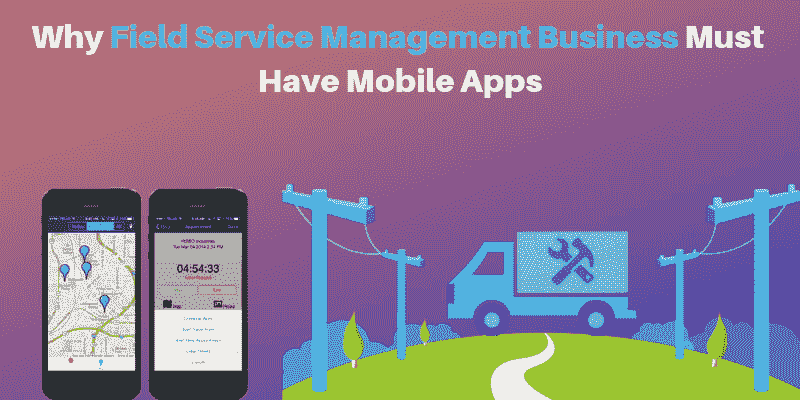

# 为什么现场服务管理业务必须有移动应用

> 原文：<https://dev.to/appdevelopmentagency/why-field-service-management-business-must-have-mobile-apps-186e>

你一定听说过流行的短语“有一个应用程序可以做到这一点！”-在 iPhone 早期由苹果公司创造并注册商标。尽管这句流行语已经存在了近十年，但它在今天比以往任何时候都更有意义。毕竟，最初被视为消费产品的移动应用早已渗透到商业环境中，并成为商业结构的一部分。如今，您几乎找不到任何一家企业不使用移动解决方案。

但是在我们讨论移动应用的好处之前，让我们先来了解一下我们正在谈论的是哪种应用。为了保持事物的一般性，考虑一家出于各种目的派遣员工到远程位置的企业——可以是会见客户、调查等，然后他们在一天结束时向办公室报告。这种现场服务结构被不同行业的大量企业所使用，但正如你所看到的，仍然非常低效，在各个层面都有很大的改进空间。

## 更好的沟通

一般来说，在任何给定的时间都有大量的工人在现场工作，很少或根本没有协调。这通常会导致重叠，手动协调会浪费大量时间。移动应用程序提供了一个公共平台，通过这个平台他们可以访问他们的任务，并带来透明度以避免任何重叠。此外，当两个或更多的工作人员需要协调时，这些应用程序可以帮助保持所有任务在循环中。

## 文书工作少

文书工作繁琐、耗时且难以管理。例如，如果员工到达现场并意识到他/她没有特定的表格，该怎么办？移动应用及其数字形式提供了无缝的工作流程，并在此过程中提供了额外的安全层。无论是从客户那里收集数据、生成发票，还是通过签名进行身份验证，员工只需一台设备就可以完成比装满纸张的袋子更多的工作。

## 运营效率

数字化不仅有助于现场工作人员，也有助于后台操作。一般来说，一旦工人提交文档，就需要大量的人工工作来将这些数据集成到系统中，效率非常低。借助移动应用，这类企业可以自动完成许多任务，并在不同层面上减少运营瓶颈。

## 管理与人力资源

对于与生产效率密切相关的企业来说，跟踪现场员工仍然是一个重大挑战，并使他们面临欺诈性输入的风险。有了基于位置服务的移动应用，企业可以实时跟踪每个员工的位置，并做出最准确的评估。对于员工来说，它成为了联系经理的便捷渠道。无论是请求现场帮助、申请休假还是简单地结束一天的工作，所有这些任务都可以在应用程序中完成，而不必手动前往办公室。

## 顾客满意度

不只是工人讨厌文书工作，顾客也讨厌。无论是请求/跟踪服务、付款还是简单地提供细节，数字服务都是众所周知的无障碍服务，因此可以显著提高客户满意度。

也就是说，许多企业认为企业应用解决方案只是财大气粗的大公司的工具。公平地说，移动应用程序的构建成本很低。但是，当你做一个详细的投资回报分析时，你会发现这种应用程序提供了更高的效率并节省了成本——这最终超过了移动应用程序开发的前期投资。如果你再加上更好的员工管理和客户满意度的好处，由顶级应用程序开发人员开发的这类应用程序似乎是业务发展的一种方式，而不仅仅是方便的工具。