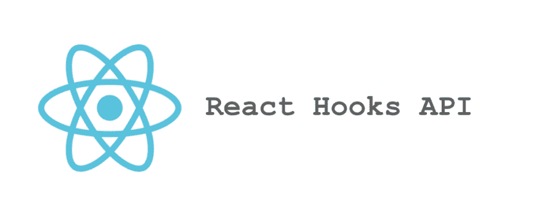

# 为什么我对 React Hooks 感到兴奋？

> 原文：<https://dev.to/highercomve/why-i-m-excited-with-react-hooks-1efe>

[](https://res.cloudinary.com/practicaldev/image/fetch/s--x4Qv6Cyz--/c_limit%2Cf_auto%2Cfl_progressive%2Cq_auto%2Cw_880/https://cdn-images-1.medium.com/max/1024/1%2ALaTU0GpA_arBSXOmuXdwuQ.png)

2 月 6 日，React 16.8 发布，随着 React 16.8 的发布， [React Hooks](https://reactjs.org/docs/hooks-intro.html) 在稳定版中可用！

这意味着我们可以开始使用钩子，而不用担心编写不稳定的代码。

下面是本帖中代码的一个实例:

[https://frontarm.com/demoboard/?id = af4f 455 f-1d 30-4823-90 a9-b 15 cf C3 e 92 f 9](https://frontarm.com/demoboard/?id=af4f455f-1d30-4823-90a9-b15cfc3e92f9)

### 但是，钩子是什么？

钩子是允许您使用功能组件的状态和“生命周期”的函数，这意味着您不需要编写类来构建 React 组件。

对我来说，这是令人兴奋的，因为我不喜欢绑定“这个”(你看到我在那里做了什么？).我的意思是，React 中的类有点乱(我不是唯一这样认为的人)。大部分时候和“这个”有关。但那是以后的事了。

所以你可以在不使用类的情况下访问几乎所有的状态生命周期。但是怎么做呢？

### 有哪些钩子可用，有什么作用？

直接从 React 的页面，我们有这个钩子列表([https://reactjs.org/docs/hooks-reference.html](https://reactjs.org/docs/hooks-reference.html))

[基本挂钩](https://reactjs.org/docs/hooks-reference.html#basic-hooks)

*   [使用状态](https://reactjs.org/docs/hooks-reference.html#usestate)
*   [使用效果](https://reactjs.org/docs/hooks-reference.html#useeffect)
*   [使用上下文](https://reactjs.org/docs/hooks-reference.html#usecontext)

[附加挂钩](https://reactjs.org/docs/hooks-reference.html#additional-hooks)

*   [useReducer](https://reactjs.org/docs/hooks-reference.html#usereducer)
*   [使用回调](https://reactjs.org/docs/hooks-reference.html#usecallback)
*   [使用备忘录](https://reactjs.org/docs/hooks-reference.html#usememo)
*   [useRef](https://reactjs.org/docs/hooks-reference.html#useref)
*   [使用命令句柄](https://reactjs.org/docs/hooks-reference.html#useimperativehandle)
*   [useLayoutEffect](https://reactjs.org/docs/hooks-reference.html#uselayouteffect)
*   [使用的调试值](https://reactjs.org/docs/hooks-reference.html#usedebugvalue)

我将尝试从列表中的前 3 个元素开始。(一开始我想在 4 中发布，但是帖子太长了，我会把它分开)

### 使用状态钩子

这个钩子让你在一个功能组件中有一个内部状态。下面是一个计数器组件与类组件和函数组件的比较。

让我们以一个计数器为例:

```
import React from 'react'

export default class Counter extends React.Component {
  constructor (props) {
    super(props)
    this.state = {
      count: props.initialCount || 0
    }
    this.add = this.add.bind(this)
    this.minus = this.minus.bind(this)
    this.reset = this.reset.bind(this)
  }
  add () {
    this.setState((state) => ({ count: state.count + 1 }))
  }
  minus () {
    this.setState((state) => ({ count: state.count - 1 }))
  }
  reset () {
    this.setState((state) => ({ count: 0 }))
  }
  render () {
    return (
      <div className="counter">
        <span className="counter\_\_count">{ this.state.count }</span>
        <button onClick={this.add}>+</button>
        <button onClick={this.minus}>-</button>
        <button onClick={this.reset}>Clear</button>
      </div>
    )
  }
} 
```

现在相同，但使用状态

```
import React, { useState, useEffect } from 'react'

export default function CounterUseState (props) {
  const [count, setCount] = useState(props.initialCount || 0)
  const add = () => { setCount(count + 1) }
  const minus = () => { setCount(count - 1) }
  const reset = () => { setCount(0) }

  return (
      <div className="counter">
        <span className="counter\_\_count">{ count }</span>
        <button onClick={add}>+</button>
        <button onClick={minus}>-</button>
        <button onClick={reset}>Clear</button>
      </div>
    )
} 
```

我们再也没有“这个”了！因此,“状态”更容易使用，处理程序更干净，并且更容易与组件范围之外的函数组合。

现在我们如何处理组件的“生命周期”呢？我们将使用 **useEffect** 钩子

### 使用效果挂钩

这个钩子接收了两个参数，第一个参数是一个在组件被渲染时运行的回调函数，这个回调函数要么在组件第一次被渲染时被调用(**componentdimount**)，要么在每次组件被重新渲染时被调用( **componentDidUpdate** )，第二个参数对此非常重要，因为它决定了你想要“观察”哪些变量或道具的变化。因此使用 useEffect 将作为**组件安装**和**组件更新**工作

我们如何清除这些影响？在效果中运行的函数应该返回另一个函数，这个函数是在组件被卸载时运行的。神奇！！

```
import React, { useState, useEffect } from 'react'

export default function FunctionalTimer (props) {
  const [count, setCount] = useState(props.initialCount || 0)
  const [running, setRunning] = useState(false)

  const start = () => setRunning(true)
  const pause = () => setRunning(false)
  const reset = () => setCount(0)
  const tick = () => running && setTimeout(() => setCount(count + 1), 1000)

  useEffect(() => {
    tick()
  }, [running, count])

return (
      <div className="counter">
        <span className="counter\_\_count">{ count }</span>
        <button onClick={start}>Start</button>
        <button onClick={pause}>Pause</button>
        <button onClick={reset}>Clear</button>
      </div>
    )
} 
```

**setTimeout** 和 **setInterval** 是功能组件的纯粹性质之外的效果。这同样适用于改变组件之外的其他内容，例如，document.title 或向非合成事件添加事件侦听器。

```
import React, { useState, useEffect } from 'react'

export default function FunctionalTimer (props) {
  const [count, setCount] = useState(props.initialCount || 0)
  const [running, setRunning] = useState(false)

  const start = () => setRunning(true)
  const pause = () => setRunning(false)
  const reset = () => setCount(0)
  const tick = () => running && setTimeout(() => setCount(count + 1), 1000)

  useEffect(() => {
    tick()
  }, [running, count])

  useEffect(() => {
    document.title = `${count} seconds pass`
  }, [count])

useEffect(() => {
    const logOnSizeUpdate = () => console.log({ count, running })
    window.addEventListener('resize', logOnSizeUpdate)
    return () => window.removeEventListener('resize', logOnSizeUpdate)

  }, []) // when the array is empty only runs on mount not update

return (
      <div className="counter">
        <span className="counter\_\_count">{ count }</span>
        <button onClick={start}>Start</button>
        <button onClick={pause}>Pause</button>
        <button onClick={reset}>Clear</button>
      </div>
    )
} 
```

钩子令人敬畏的能力之一是创建自定义钩子的能力，而自定义钩子只是简单的函数！

让我们重写计时器代码，并将所有状态逻辑转移到名为 **useTimer** 和 **useSetTitle**
的自定义挂钩中

```
import React, { useState, useEffect } from 'react'

function useTimer (initialCount = 0, autoStart = false) {
  const [count, setCount] = useState(initialCount)
  const [running, setRunning] = useState(autoStart)

const start = () => setRunning(true)
  const pause = () => setRunning(false)
  const reset = () => setCount(0)
  const tick = () => running && setTimeout(() => setCount(count + 1), 1000)

  useEffect(() => {
    tick()
  }, [running, count])

  return {
    count,
    running,
    start,
    pause,
    reset
  }
}

function useSetTitle (count) {
  useEffect(() => {
    document.title = `${count} seconds pass`
  })
}

export default function FunctionalTimer (props) {
  const timer = useTimer(props.initialCount, props.autoStart)
  useSetTitle(timer.count)

  return (
      <div className="counter">
        <span className="counter\_\_count">{ timer.count }</span>
        <button onClick={timer.start}>Start</button>
        <button onClick={timer.pause}>Pause</button>
        <button onClick={timer.reset}>Clear</button>
      </div>
    )
} 
```

这允许我们构建一堆有状态的逻辑，它们存在于钩子中，可以在任何功能组件中使用，使我们能够以更好的方式重用和组合我们的代码。

### useRef

这个钩子允许我们在组件渲染之间有一个持久的值。为什么我们需要它，如果你注意到在前面的例子中，时间的工作方式是在下一个计数器改变时设置时间。这样做的问题是，如果我们清除计时器，下次运行的函数，将在清除之前有 count 的值，因为你需要暂停，清除并重新开始。效果中的函数引用将具有变量被设置时的值。那样的话，我们将需要 **useRef** 在组件每次渲染时存储一个回调，以保持计时器的稳定性。

```
import React, { useState, useEffect, useRef } from 'react'

function useTimerInterval (initialCount = 0, autoStart = false) {
  const [count, setCount] = useState(initialCount)
  const [running, setRunning] = useState(autoStart)
  const cb = useRef()
  const id = useRef()

  const start = () => setRunning(true)
  const pause = () => setRunning(false)
  const reset = () => setCount(0)

  function callback () {
    setCount(count + 1)
  }

  // Save the current callback to add right number to the count, every render
  useEffect(() => {
    cb.current = callback
  })

  useEffect(() => {

    // This function will call the cb.current, that was load in the effect before. and will always refer to the correct callback function with the current count value.   
    function tick() {
      cb.current()
    }
    if (running && !id.current) {
      id.current = setInterval(tick, 1000)
    }

    if (!running && id.current) {
      clearInterval(id.current)
      id.current = null
    }
    return () => id.current && clearInterval(id.current)
  }, [running])

  return {
    count,
    start,
    pause,
    reset
  }
}

function useSetTitle (count) {
  useEffect(() => {
    document.title = `${count} seconds pass`
  })
}

export default function FunctionalTimer (props) {
  const timer = useTimerInterval(props.initialCount, props.autoStart)
  useSetTitle(timer.count)

  return (
      <div className="counter">
        <span className="counter\_\_count">{ timer.count }</span>
        <button onClick={timer.start}>Start</button>
        <button onClick={timer.pause}>Pause</button>
        <button onClick={timer.reset}>Clear</button>
      </div>
    )
} 
```

下面是本帖中代码的一个实例:

[演示板](https://frontarm.com/demoboard/?id=af4f455f-1d30-4823-90a9-b15cfc3e92f9)

也许你想多了解一下为什么定时器需要持久引用。如果是那样的话，本文将深入探讨这个问题[https://overreated . io/making-setinterval-declarative-with-react-hooks/](https://overreacted.io/making-setinterval-declarative-with-react-hooks/)

这是一个关于 React 钩子的基本例子，我推荐看 React 会议上关于钩子的视频。

[https://www.youtube.com/embed/dpw9EHDh2bM](https://www.youtube.com/embed/dpw9EHDh2bM)

我将继续这个话题，用 **useContext** 和 **useReducer** 来讨论 React 钩子，以及我们如何用这两个钩子来构建像 Redux 这样的东西。

直到下一个帖子，愿原力与你同在

* * *