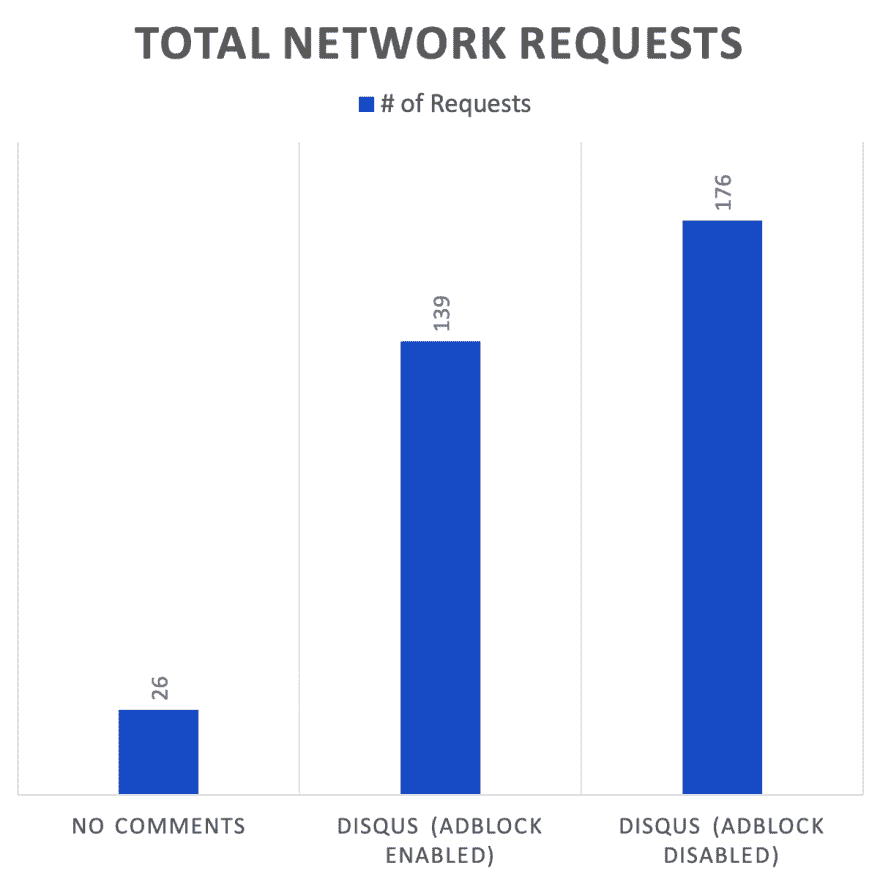
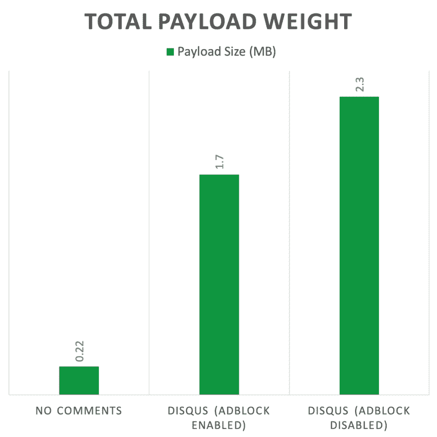
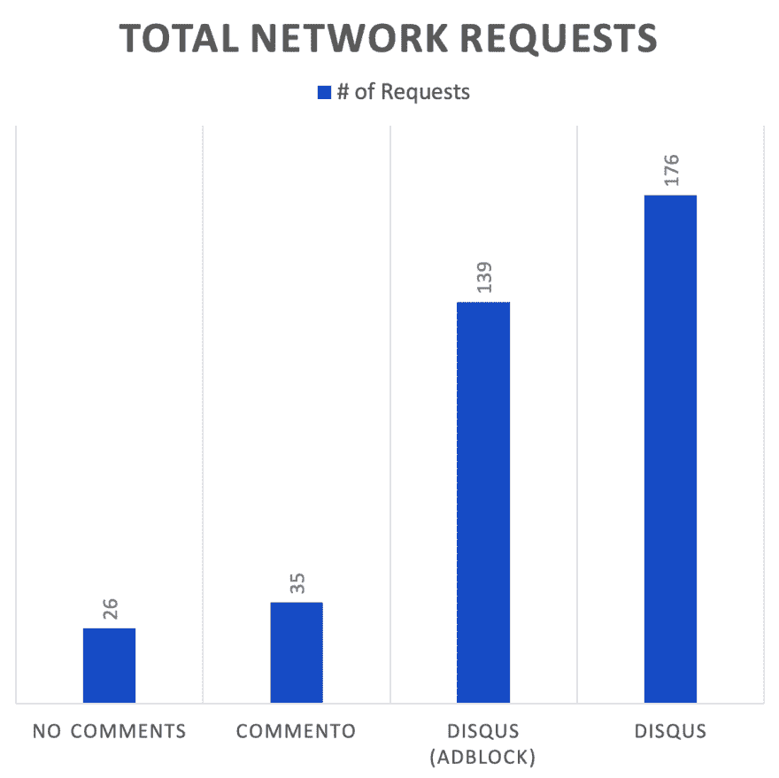
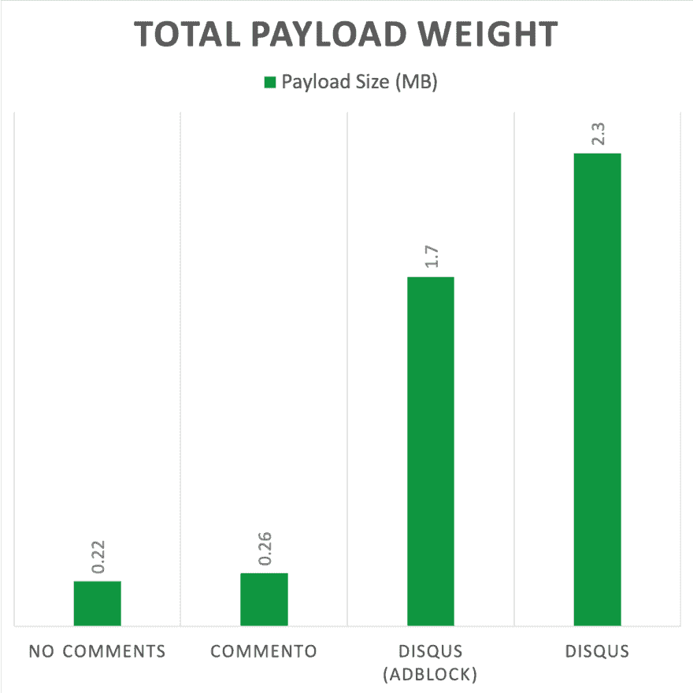

# 为什么我取代了 Disqus，你也应该

> 原文：<https://dev.to/vzhou842/why-i-replaced-disqus-and-you-should-too-2o0e>

当我开始[我的博客](https://victorzhou.com)时，我用[的问题](https://disqus.com/)来评论帖子。这是一个自然的选择:我在互联网上见过很多使用 Disqus 的网站，它很容易设置，而且他们有一个免费层。我愉快地整合了 Disqus 并继续前进。

事情是这样的:我一直知道使用 Disqus 是以页面膨胀为代价的。我以前写过关于网页性能的文章，并且通常努力让我的网页更快，但是我只是认为有缺陷是值得的。我的逻辑是:如果 Disqus 真的如此臃肿，那么现在每个人都应该远离它们了。Disqus 肯定优先考虑保持他们的有效载荷合理的小，对不对？

**我错了**。上周，我终于做了一开始就应该做的事情:自己对它进行基准测试。以下是我的结果(在[我的博客帖子](https://victorzhou.com/blog/why-you-should-use-webpack/)上的基准测试):

[T6】](https://res.cloudinary.com/practicaldev/image/fetch/s--IDe1_lr5--/c_limit%2Cf_auto%2Cfl_progressive%2Cq_auto%2Cw_880/https://victorzhou.com/media/commento-post/size1.png)

**添加 Disqus 使我的页面权重增加了 10 倍以上，请求数增加了 6 倍以上**。太荒谬了！我立即开始寻找替代 Disqus - [web 性能很重要](https://developers.google.com/web/fundamentals/performance/why-performance-matters/)。

## 一种替代:Commento

不久前，我看到一篇[黑客新闻](https://news.ycombinator.com/item?id=19210697)的帖子，内容是一种快速、注重隐私的 Disqus 替代方案，名为 [Commento](https://commento.io/) 。吸取了教训之后，我在承诺之前对 Commento 进行了基准测试:

[T6】](https://res.cloudinary.com/practicaldev/image/fetch/s--sRlUTTRu--/c_limit%2Cf_auto%2Cfl_progressive%2Cq_auto%2Cw_880/https://victorzhou.com/media/commento-post/size2.png)

差别真大。 **Commento 比 Disqus** 轻*个数量级*。

还有更好的。以下是我在 Commento 上被出售的更多原因:

*   是[开源](https://gitlab.com/commento)。
*   它是[关注隐私的](https://commento.io/privacy)——它不出售用户数据，并试图收集尽可能少的数据。考虑到我博客的读者可能比普通互联网用户更注重隐私，这一点尤其好。
*   你可以[支付你想要的](https://commento.io/pricing)。Disqus 的免费层是广告支持的，其最便宜的付费层是 9 美元/月。Commento 其实更便宜(如果你愿意的话)！
*   是[可配置的](https://docs.commento.io/configuration/frontend/)。如果你向下滚动到这篇文章的评论，你会看到 Commento 集成的风格与网站其他部分的风格相匹配。
*   它有一个简单易用的从 Disqus 导入的**工具。我能够快速地将我所有的旧 Disqus 评论转移到 Commento。**

Commento 对我来说很棒，但我并不是说它对每个人都是正确的解决方案——有几个好的，轻量级的评论平台。

你还在用 Disqus 吗？你知道它给你的页面增加了多少臃肿吗？是什么让你没有换工作？

* * *

*最初发表于[victorzhou.com](https://victorzhou.com)T3】*