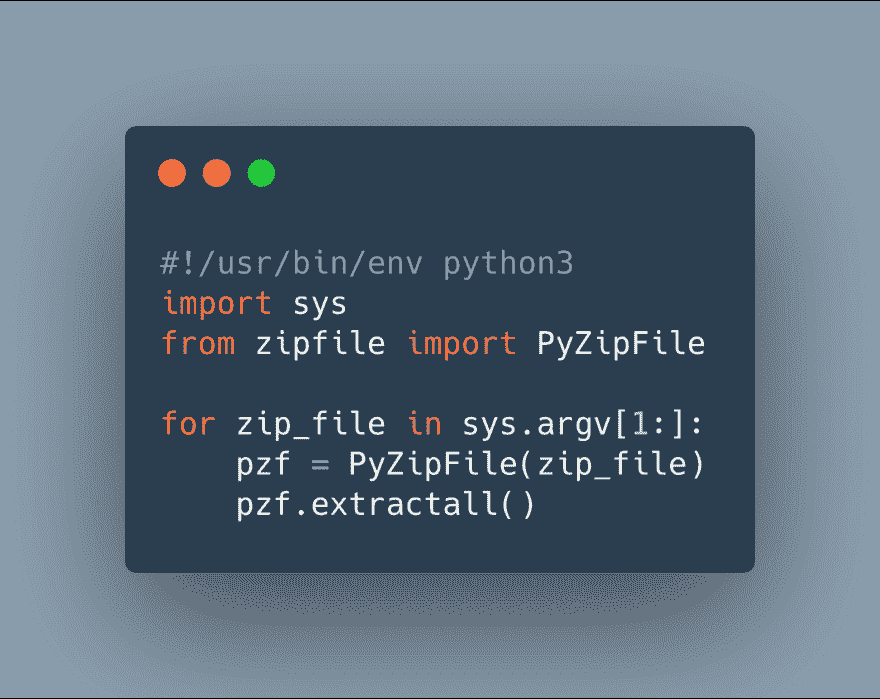

# 为什么我使用 Python 解压文件

> 原文：<https://dev.to/alvinmilton/why-i-used-python-to-unzip-a-file-a2b>

所以我的一天是这样开始的:

我进入了数据中心一个非常封闭的服务器。

这台服务器运行着一个 Wordpress 实例，我的任务是将它迁移到 Wordpress。

现在图片 wordpress.com:
需要用大 XML 文件导入，不能通过终端访问服务器，不能访问 mysql，没有日志，只能通过前端 wp-admin。

我需要在我正在迁移的网站上安装一个插件，但不能通过管理面板，因为它被锁定了。

#### 晴。

通常，我只需下载插件并从本地到远程运行 scp，就能让它到达目的地。

看起来是这样的:

```
cd /to/install/dir
scp <filename> serveraddres:/dir/to/save/file/to 
```

输入你的 ssh 密码，就可以了。

#### *备用路径...*

然而，有时我已经 ssh 到服务器，这是其中的一种情况。我本可以打开一个新的终端标签，然后做上面的事情，但是再次尝试用最少的步骤加快速度。

我所做的是使用 curl 从源文件下载文件到服务器，跳过了先把它放在我的机器上，然后再把它复制到服务器的步骤。

那看起来是这样的:
`curl http://sitename.com/wp-fileIwant.zip --output wp-fileIwant.zip`

太好了，文件在服务器上。

所以我尝试先运行`unzip`，但没有成功，因为它没有安装。
然后我试着安装 unzip，但由于某种原因我不想调试，所以没有成功。我对那些不断迫使我们开发人员进行上下文切换的兔子洞保持警惕。

然后我发现了这块宝石:

[](https://res.cloudinary.com/practicaldev/image/fetch/s--c-1WpTVB--/c_limit%2Cf_auto%2Cfl_progressive%2Cq_auto%2Cw_880/https://thepracticaldev.s3.amazonaws.com/i/rhf0kyxz4db7jwzenqla.png)

有趣的是，我*无法用`nano`或`emacs`打开*,因为两者都没有安装。所以`vim`在这里派上了用场。

编写代码并保存在目录中。

然后我运行了它。是这样的:
`python unzip.py wp-fileIwant.zip`

你瞧，我的文件被解压了。

我可以通过前端激活它，做我需要的事情。

**由此，python。**