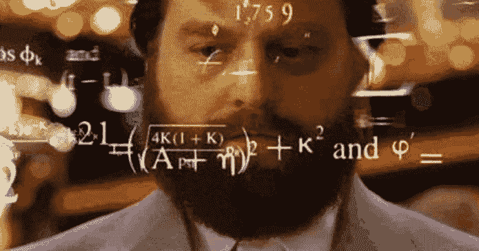

# 为什么我 39 岁还在学数学。

> 原文：<https://dev.to/dakoon2003/why-im-studying-math-at-39-years-old-5fj3>

我记得高中并不像大多数人那样美好，而是一个我一直处于压力之下的地方。你看，我是一个糟糕的学生，当我说糟糕的时候，我指的是 C，D 和 F。问题不是学习障碍、注意力不集中或其他什么，而是我很懒。我想做我想做的事情，家庭作业不是。我想专注于我感兴趣的主题。不幸的是，数学不在这个名单上。

我以平均 C 的成绩勉强高中毕业。我试着去上大学，整整一年我都在假装感兴趣，结果被退学了。可以说，数学又一次给我的大学生活钉上了棺材。

那么，你是如何从一个已经开发网站和应用程序 10 年的人那里读到这篇文章的呢？我从大学退学 9 年后，一天早上醒来，我被解雇了，我在一个仓库堆箱子。解雇我的那位女士只有 10 年级的学历，几乎看不懂我们正在装载的材料的发票。那时我有两个孩子....我失业了。第二天，我意识到我需要做什么。

我从每天抽出两个小时来学习开始。我一直擅长计算机，所以我从那里开始。我上网找到了新波士顿，开始看他的视频。我什么也不懂....然后我明白了一点...然后再多一点。我终于明白了几年前我的老师试图向我传达的意思。任何一门学科都可以很有趣，只要你研究它，不要指望马上就能知道。

快进到今天。昨天在黑客新闻上，一本新书的简介引起了我的注意。这本书叫做《程序员数学入门》,每当我在代数笔记本上流口水的时候，那种后悔的感觉又一次回来了。所以我买了它..现在我正坐在我的大椅子上，一边喝着咖啡，一边研究多项式。一些我 20 年前就应该知道的事情...但迟做总比不做好，对吗？