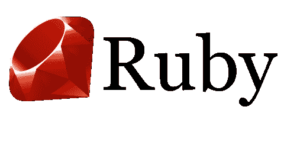

# 为什么要学 Ruby？

> 原文：<https://dev.to/devtox/why-learn-ruby-53jb>

为什么要学习 Ruby 编程？

Ruby 编程语言既有趣又简单，并且有一个庞大的社区。世界上许多初创公司都在使用它。

Rails 框架通常与 Ruby 一起使用，用于制作 web 应用程序。Rails 使得创建 web 应用程序变得很容易。

因为 Ruby 有一个简单的语法，它有助于提高代码质量。

阅读更多信息:

*   [https://ruby-lang.co/why-learn-ruby-programming-language/](https://ruby-lang.co/why-learn-ruby-programming-language/)