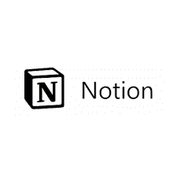
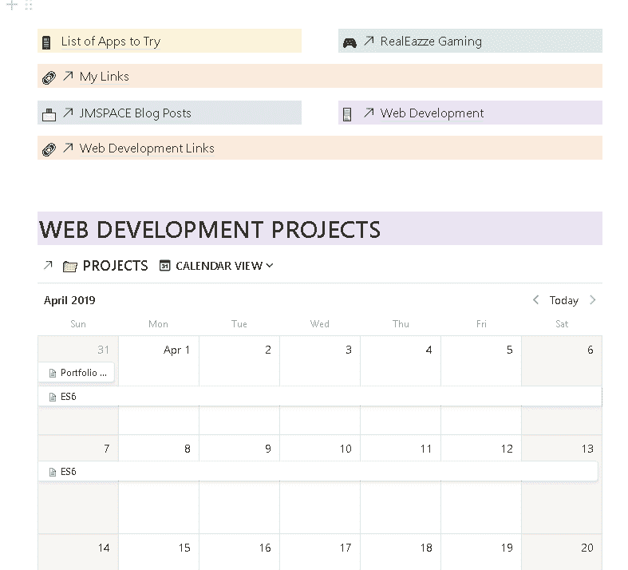
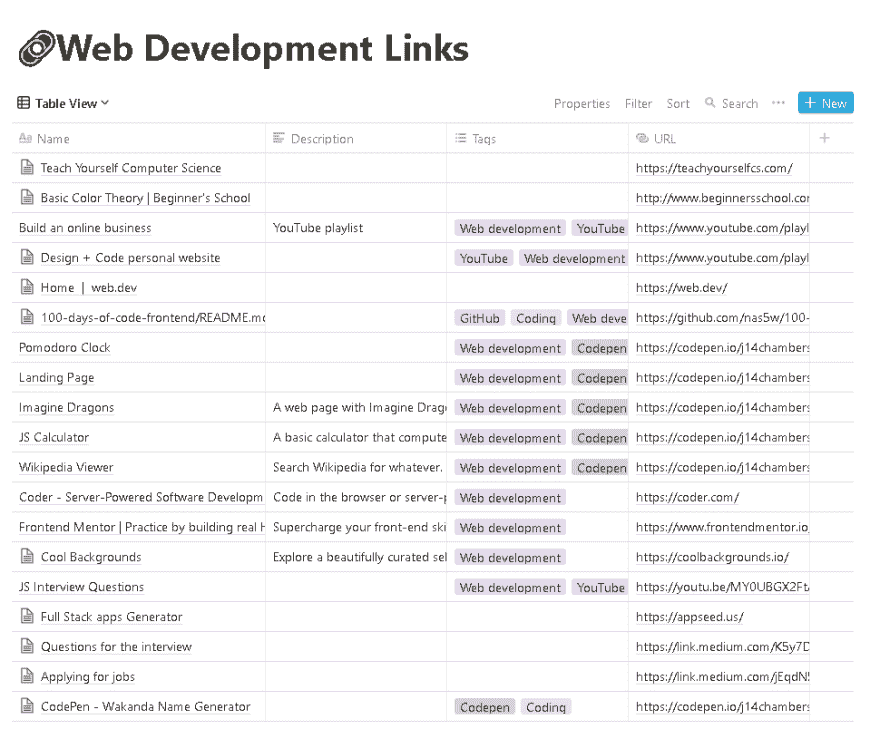

# 为什么是观念，为什么不是呢？

> 原文：<https://dev.to/jmspace/why-notion-but-why-not-35ia>

#### 观念是我见过的最好的生产力工具。它是所有事物的结合。观念可以是你让它成为的样子。如果你想跟踪你的项目，你可以这样做。如果你想列清单，它可以做到。如果你想保留一个数据库，为什么不呢，那就这么做吧。

观念已经把你想做的每件事和你需要做的每件事都放进了一个顺畅的工作系统中。

### 我用观念做什么？

*   跟踪任务和项目
*   写下想法/头脑风暴

我有想法设置为我的项目经理。我列出未来的每一个项目，并把它放在一块板上。这创建了大多数项目管理工具都有的工作流。我可以设置开始日期和截止日期，并将它们显示在日历、列表或表格上。

我的项目包括博客帖子、YouTube 上传、网页设计项目和日常任务。我有不同的工作空间来分隔每个区域。我甚至花时间做了一个数字子弹日志。虽然我不喜欢我的物理子弹日志，但我肯定可以将两者联系在一起，以方便思考。

### 关于观念的最好部分

#### 无尽的兔子洞

你可以开始一个页面，设置好，然后想，我需要更深入地了解这个，但是我不想开始一个全新的页面。有一件事仍然适用于这一切。最好的办法就是把这一行变成一页。

概念中的一页只是将想法联系在一起的另一种方式。它可以链接到更多关于这个主题的观点和想法。

下一个最好的事情是有捷径。曾经有一个想法与另一个想法相关，但其中一个想法是一个完整的书面概念？

concept 允许你做的另一件很酷的事情是创建现有页面的链接。

### 更多的说法

概念允许嵌入网页或文档。有一个选项显示内容或只是一个链接。如果它是一个谷歌文档，你可以把它嵌入到页面中，或者只留下一个链接。如果是指向网页的链接，它可以显示为书签。这将网页的详细框显示为一个可点击的链接。

### 与别人比较

**体式**

在完全转向意念之前，我一直在使用体式。观念比体式更开放。最大的比较是它的观点。Asana 只能有一个项目的视图，除非你创建另一个项目作为列表或板。有了概念，如果你创建了一个列表，在这个列表中你可以创建一个公告板，一个日历或者一个表格。这更好，因为这一切都发生在列表本身。您不必创建一个新项目，然后将列出的所有任务添加到新项目中。观念会帮你做到。

特雷罗

Trello 只是一个板或 Kaban 风格的应用程序。观念是这样的，甚至更多。我不能在特雷罗上说什么。用了一段时间后，我换成了 Asana。阿萨纳有更多，所以如果你需要的不仅仅是特雷罗，而是观念，那就去威尔·阿萨纳。

**点击**

ClickUp 可以击败 Asana 和 Trello，但很多人说这很复杂。我也觉得很复杂。我先和 ClickUp 在一起。ClickUp 还处于早期阶段。这款应用的网络功能还没有跟上。所以对我来说，它是缺乏的。然后我去了阿萨纳。现在，我又回到了 ClickUp。

刚开始时，点击可以像概念一样复杂。使它如此独特的制度也可能是它垮台的原因。但我坚持了这个想法，回到 ClickUp。我认为，一旦你看到你的管理系统是简单的，并在一个最小的视图中使用它，那么只有你才能进来，并添加所有的概念或 ClickUp 必须提供的“复杂的东西”。

### 替换 Word 文档的概念

虽然 concept 很棒，但我不认为它可以取代 Word 文档。我更喜欢在 Word 或 Dropbox Papers 之类的应用程序中输入文档(我目前正在为本文这样做)。我不知道 Dropbox 文件的存在。观念的阻碍是造成这种情况的原因。每当你按下回车键，它就变成一个新的块。所以分隔段落就成了一件麻烦事。当需要将所有输入的文本转移到一篇博客文章中时，这变得很乏味。一种方法是降低页面的价格，这样就可以通过疯狂的来回复制和粘贴来导出页面。

有一次，我试图写一篇博客，我输入的所有东西都开始消失了。这是他们早期的一个 bug。这不再是个问题了。我就是无法进入输入的概念，特别是如果我需要选择一定数量的文本并复制到其他地方。

我不会使用概念来键入整个文档或文章，但对于头脑风暴来说，我最喜欢使用概念。在 idea 中输入整个文档是可能的，但我不愿意这样做(这会影响我的配额)。

**数据库和 Excel**

如果您不喜欢复杂的数据库或 Excel 表格，那么 concept 可能适合您。

我有一个链接，我想保存的数据库。很简单。转到网页，共享并选择工作空间和数据库，然后保存。它甚至可以处理比这更复杂的想法。

你可以保留一份联系人或客户的名单。在这里储存他们所有的非敏感数据。你可以创建一个数据库，记录谁做了什么，什么时候到期，什么时候需要做，在哪里做等等。

### 概念下一个需要的特性

**与谷歌日历或 iCal 集成。**

为了能够在日历应用程序中查看事件和截止日期，只需将其提升到一个新的水平。这实际上消除了对体式或叩击的需要。在意识到体式缺少了我需要的东西后，我最近转向了 ClickUp。只有在这之后，我才意识到观念可以做到这一点。给出任务和事件的开始日期和到期日期。有一天，它会像 ClickUp 一样被整合到日历中，我可能会完全离开 ClickUp。我只使用 ClickUp，因为它集成了日历、公告板和列表显示。没有深入的项目规划。我只输入项目或任务的名称，以及它们的开始和结束日期。

试试这个想法。不要被它吓倒。一开始可能会很多，但是一旦你搞清楚了你的系统。你准备好了。也是免费的。

idea 在 Windows、Mac、iOS 和 Android 上可用。所以你可以在任何地方使用它。

概念——为你的笔记、任务、维基和数据库提供一体化的工作空间。

* * *