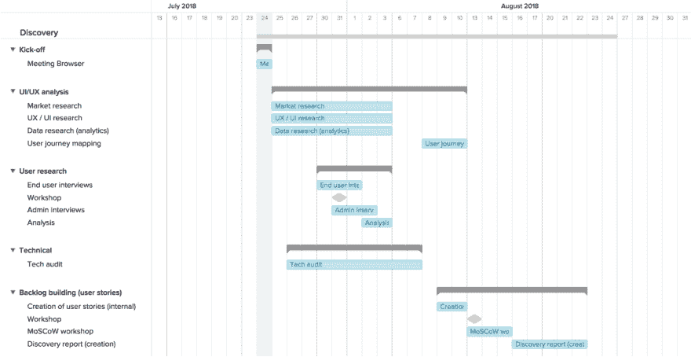

# 为什么小团队是强大的

> 原文：<https://dev.to/browserlondon/why-small-teams-are-mighty-16oj>

专注的小团队能生产出伟大的产品，并且是最有趣的工作方式……或者至少，这是我根据自己的职业生涯得出的结论。

我曾在一系列技术团队中工作过，我发现最令人愉快和兴奋的是那些能够产生动态“创业心态”的小团队。在一个人们有自己的专业领域，但也积极鼓励在其他领域做出贡献和合作的环境中运营——超越任何严格的职权范围或工作描述——是非常有益的。

这种方法创造了一种创造性的合作环境，在这种环境中，创新和对规范的质疑受到鼓励，而不是根深蒂固的惯例或模式，在我看来，这种惯例或模式可能会令人窒息或停滞不前。一个创造性的环境也能吸引那些能够适应不同任务或项目以及不同方法的人才。我认为这是软件开发世界中一个至关重要的品质。

当我在 Browser 的第四周，整个团队都去参加伦敦的 JAM 活动时，这些想法在我的脑海中得到了加强，在这个活动中，许多公司谈论了他们在小团队中培养创新的努力。就在这次访问的背后，[浏览器堵塞](https://www.browserlondon.com/blog/2018/12/13/winter-2018-jams-hackathon-roundup/)诞生了！

## 我们的小团队

当然，在一个更大的团队或公司中创造创业氛围并不是不可能的，但随着团队的扩大，这的确会变得异常困难。我认为我们的小团队是一个很好的案例，可以说明保持敏捷的好处。

我现在已经在[浏览器](https://www.browserlondon.com/)上了，它给我留下了深刻的印象，当一个问题出现时，我们可以多么快地跳到它上面。我们可能已经几个月没有在一个特定的站点或应用程序上工作了，但是团队能够很快地解释请求，拾起任务，并在很短的时间内，有时在几个小时内，将一些(好的)东西投入生产。我们总是有办法提高效率，但是在一个拥有额外级别的变更控制和签准的大型企业中以这种速度运行将是一项艰巨的任务。

同样，接新项目的方式也很刺激。在你知道之前，我们已经开始并完成了一个[发现阶段](https://www.browserlondon.com/blog/2017/03/01/building-an-app-what-to-expect-from-the-discovery-phase/)，并且正在计划我们的待办事项和冲刺。它变得更像是一种突破和目标驱动，而不是打勾，以我的经验来看，这是大公司容易陷入的一个陷阱。

## 更容易得到你需要的工具

具体到我的工作(项目经理)，我有机会开始使用一些很棒的工具来促进我的角色( [Google G Suite](https://gsuite.google.com) 、Google Meet、 [Harvest Forecasting](https://www.getharvest.com/forecast) 、 [Slack](https://slack.com/) 、 [TeamGantt](https://www.teamgantt.com/) 以及对[吉拉](https://www.atlassian.com/software/jira)和 Harvest 的额外权限)。

这些工具提供了一些功能，如安全的异地访问和实时协作，这些功能在较小的团队或企业中是理所当然的，尤其是在 2019 年。

然而，在大型组织中，这些类型的应用程序经常被阻止或限制，因为[开发团队只是大型企业](https://www.browserlondon.com/blog/2017/09/18/building-house-dev-team-hard/)的一部分。事实上，许多大公司要求在工具可以使用之前进行大规模和昂贵的“推广”操作，或者只是以“我们现在已经足够好了”的态度来迎接新技术的请求，这更糟糕。

当你们中较少的人不那么反对改变，并且真正渴望把事情做好的时候，情况就不一样了。同样重要的是，在一个小团队中，与负责新系统或服务决策的人直接对话通常更容易，因为他们可能更接近您试图解决的问题，所以向他们解释也更容易。

作为一名新的项目经理，我能够非常迅速地投入其中，这正是我所希望的(而不是被派去旁观)。在一个专注、积极的团队中工作是很棒的，每个人都热衷于探索不同的工作和沟通方式，客户也乐于接受这一点。

说到技术活，我肯定觉得小团队很厉害。如果你想成为我们小团队的一员，你可以[点击此处查看我们有哪些职位](https://www.browserlondon.com/jobs/)。

* * *

帖子[为什么小团队强大](https://www.browserlondon.com/blog/2019/01/08/small-teams/)首先出现在[浏览器伦敦](https://www.browserlondon.com)上。