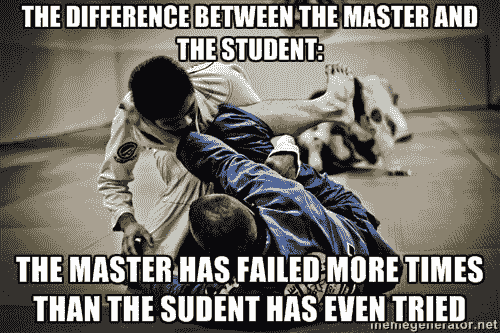
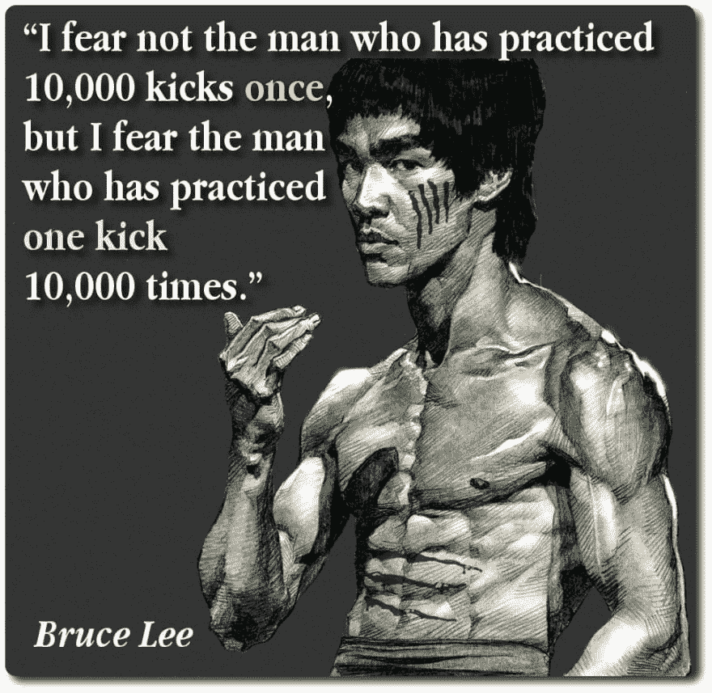
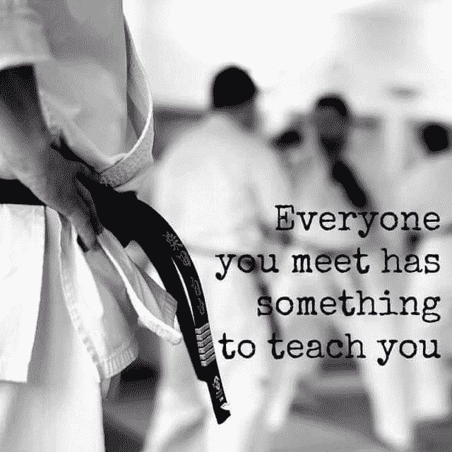
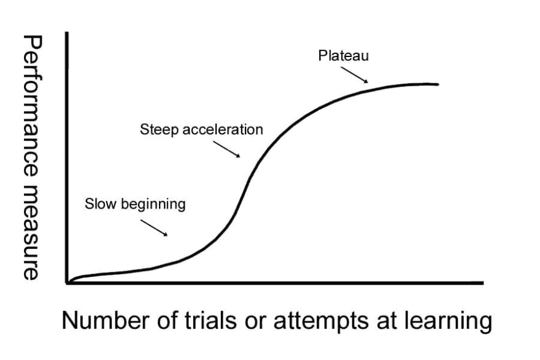

# 为什么软件开发像武术一样

> 原文：<https://dev.to/rachelsoderberg/why-software-development-is-like-martial-arts-3ebh>

我有写这篇文章的灵感已经有一段时间了，但是我担心它可能“太傻了”然后可爱的海伦写了一个类似主题的帖子，我知道必须这样做:

 [## 为什么数据库就像舞蹈课

### 海伦·安德森

#data #database #sql #beginners](/helenanders26/why-a-database-is-like-a-dance-class-1dmi)

虽然我现在只练习了大约三年，武术已经成为我生活中重要的一部分，在这段时间里，我看到了武术和软件开发之间的许多相似之处。

也许这不是常识，但在武术界，人们普遍认为一个人会在余生中不断练习和磨练自己的技艺。即使是达到了宗师、私服、克鲁、唤醒等级别的人。继续完成他们的练习，并让学生达到更高的精通水平。

我认为特级大师的水平类似于高级架构师、成功的语言创造者或在开发社区中受到高度尊重的人。例如，我认为比雅尼·斯特劳斯特鲁普是 C++的一代宗师。软件开发老师可能会承担起帮助初级开发人员的责任，在世界各地进行演讲，甚至在 C#设计委员会这样的小组中找到自己的位置。

作为软件开发人员，技术在不断发展和变化，我们必须不断磨练自己的技能，以在我们的职业生涯和就业市场中保持相关性，并跟上最新和最棒的语言补充。值得庆幸的是，程序员通常对持续学习有着永不满足的渴望，所以我们会愉快地大步前进。

我们旅程的一部分将是永无止境的练习。当然，基础回来“就像骑自行车一样”，但你必须定期练习技能以保持锋利(就像你会磨刀以保持其锋利)。就像李小龙说的，他更害怕那个表演了一万次同样踢腿的人。

武术训练的一个重要部分是重复练习，尤其是泰拳和传统拳击。你只有这么多的肢体，因此你可以执行的打击次数是有限的。在掌握了基本动作后，鼓励与同伴或沉重的袋子一起练习单个动作，以建立肌肉记忆并最终掌握。身体通过做它被训练要做的事情来做出反应，武术家通过演练数百次来重新编程这些反应。泰国人更进了一步，通过在练习中踢倒香蕉树，发展出岩石般坚硬的胫骨和激烈的精神调节。

也许我们不需要坚硬的手指来写出最好的代码，但是我们可以看到在编写代码时训练我们自己的反应会有一些好处。软件开发人员可以留出时间在像 [HackerRank](https://www.hackerrank.com/) 这样的网站上解决算法问题，或者参加当地的黑客马拉松，或者他们可以阅读关于他们选择的语言的最新消息——例如微软 C#开发人员通讯: [MSDN 通讯](https://msdn.microsoft.com/en-us/aa940986.aspx)。

我们对自己做的每件事都有独特的看法；我们也都有独特的特长。不仅仅是在武术或软件开发领域，分享这种独特性并给予回报的最佳方式之一是，教某个在某个领域或技能方面经验比你少的人。你不仅可以通过提升新成员来为你的社区服务，你还可以通过以一种独特的新方式与你头脑中的那些联系互动来完善你自己的技能。

互联网上到处都是教别人如何做曾经被别人教过的事情的人(什么？).在 StackOverflow 或 Dev.to 上快速搜索，会发现许多人都有软件问题的答案。还有许多视频分解了一些概念，比如链表、冒泡排序和大 O 符号。有同样多的视频，博客和书籍可以找到教任何一个人想学的武术。

任何初学者都非常清楚，当他们刚开始学习一项新技能时，会有一个令人沮丧的缓慢曲线，随着他们开始掌握基础知识，这个曲线会显著提高。随着时间的推移，这种技能的快速增长逐渐减弱到一个平台，从业者不再看到他们曾经看到的主要能力增长。泰拳的这种现象在这篇文章中描述得非常详细:[泰拳学习曲线](http://muaythaipros.com/the-muay-thai-learning-curve-the-3-stages-of-development/#)。

无论是体育、智力还是艺术，这条学习曲线都是相似的。除非特别有天赋，否则一个人在开始时会犯很多错误，进入长时间的学习和成长，最终达到精通。

有大量的武术可供选择——就像我们有大量的编程语言一样——在这两种情况下，都有适合特定情况的特定语言(或武术)。

在武术中，我们有几种独特的战斗方式。我们可以决定是空手作战，用一件武器，还是两件武器。还有很多武器组合，包括刀、剑、棍、棒、锤、弓和箭、枪等等。我们也可以考虑我们的战斗方式是完全站立，完全在地面上，两者结合，还是在户外远距离。人们将根据他们选择的武器，战斗的风格/环境，以及比赛中的任何规则，为每种情况选择最佳的武术。

几个例子:

*   近距离的空手格斗对中国功夫和咏春拳以及传统拳击来说是一种很好的情况。泰拳也做得很好，因为膝盖和肘部是毁灭性的，但如果要充分发挥回旋踢的潜力，需要更多的空间。
*   菲律宾卡利，埃斯克里马，或阿尼斯，也更普遍地被称为菲律宾武术(FMA)，最适合在接近中等距离的一个或两个武器战斗。武器可以组合使用，如空手&刀，棒&刀，博杖，双刀，或双棒。
*   长距离格斗适合射程更远的武器，如连枷、狼牙棒、长剑、双截棍和锁链。其中一些武器出现在 FMA，在中世纪的欧洲历史上也有很多例子。
*   非常远的射程需要远程武器。在这里你会看到弓、投掷武器如刀或“忍者之星”、枪，甚至是弹弓或大炮的使用。如果战斗在近距离进行，这些武器很难操作，因此许多武器专门用于战场式战斗或狩猎。

软件开发同样有无限多的选择和场景，这为一种语言或框架提供了更多的优点。像武术一样，武器和它们最适合做什么有一些重叠(有些人喜欢彻底地争论这一点)。事实上，大多数语言(和武器)可以解决大多数问题，但它可能不是您希望的最佳解决方案。

一些语言及其强项的例子:

*   低级软件开发(比如驱动程序和微控制器)需要对系统本身进行最大限度的控制。一个人必须能够管理内存分配，垃圾收集，以及最可靠的起搏器或最新的 NVidia 驱动程序更新之间的一切。为系统提供必要控制级别的语言包括 C 和 C++，如果你真的需要深入研究的话，还有机器语言/机器代码。
*   游戏开发具有与上述相似的效率和低延迟需求，并且毫不奇怪地也非常适合 C++开发。虚幻引擎是一个使用 C++的流行游戏开发引擎，但是 C#也和 Unity 一起出现，Unity 是另一个常用的游戏开发引擎。
*   当需要任何类型的数据库管理时，SQL 是关系数据库开发中最常见和最著名的选择，但也有可能以 MongoDB 或 Hadoop 的形式出现的 NoSQL。
*   我不确定如果没有 Javascript，web 开发会是今天的样子——我们仍然被迫用 HTML 写所有的东西，没有什么是动态的！

