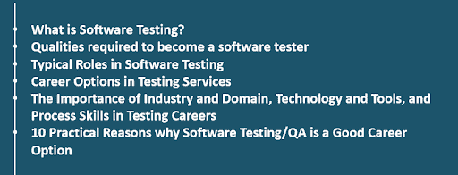
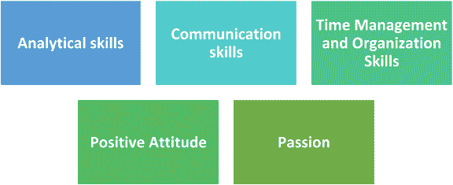
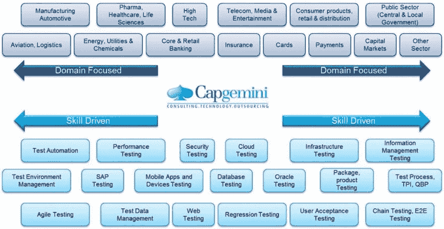

# 为什么软件测试是一个好的职业选择？

> 原文：<https://dev.to/vikastwittes/why-software-testing-is-a-good-career-option--32jn>

软件测试不再是你在准备软件时做的最后一件事。低效的测试已经被证明会导致人类历史上一些最大的灾难。这就是为什么公司正在为其产品和软件雇佣高效的测试人员。今天我们将看到软件测试如何成为你的一个极好的职业选择，为此我们将这篇文章分成以下几个部分

* *什么是软件测试？**

软件测试是确认一个 PC 框架/程序是否满足预先定义的需求并产生预期结果的过程。因此，您可以识别软件编程中的错误。软件测试必须提供没有错误或问题的高质量项目。

**成为软件测试人员所需的素质**

非技术技能:以下是成为一名成功的软件测试人员的基本技能。

一个好的软件测试人员应该有敏锐的逻辑能力。分析技能将使他能够分解复杂的软件代码，以获得更好的理解并创建测试用例。

沟通技巧:一个好的软件测试人员必须具备良好的口头和书面沟通技巧。测试工件(例如测试用例/计划、测试策略、错误报告等。)必须易于阅读和掌握。管理开发人员(在出现 bug 或其他问题的情况下)需要一定程度的谨慎和判断力。

时间管理和组织技巧:很多时候，测试会成为一项要求很高的工作，尤其是在程序代码发布期间。一个软件测试人员应该有效地管理负担，具有高生产率，展示最佳的时间管理和组织技能。

积极的态度:要成为一名成功的软件测试人员，你应该有一个积极的心态。对“突破测试”的态度，细节导向，渴望学习和提出流程改进。在软件行业中，技术飞速发展，一个好的软件测试人员必须随着技术的发展而提升他们的技能。

激情:要想在任何职业中脱颖而出，一个人必须对它有相当程度的热情。一个软件测试人员必须充满激情，并拥有很高的耐心。

**技术技能**

**数据库/SQL 基础:**软件系统后台数据庞大。这些数据存储在后台的各种数据库中，如 Oracle、MySQL 等。有些情况下，这些数据需要验证。如果您熟悉简单/复杂的 SQL 查询，您可以轻松地检查存储在后端数据库中的数据。

**Linux 基础:**目前，一些软件应用程序，如 Web 服务、数据库、应用服务器都是在 Linux 机器上开发的。因此，您必须适当接触 Linux 命令。

**对测试管理工具的体验和理解:**测试管理是软件测试的关键部分。没有适当的测试管理技术，你的软件测试过程最终会失败。简单地说，测试管理就是关于你如何管理你的测试相关的工件。

**任何缺陷跟踪工具的经验和理解:**缺陷跟踪和缺陷生命周期是软件测试的关键部分。合法地管理缺陷并以有效的方式跟踪它们是非常重要的。缺陷跟踪是必需的，因为整个团队都应该了解缺陷/bug，包括经理、开发人员和软件测试人员。有几个工具可用于缺陷跟踪，如 QC、Bugzilla、吉拉等。

**对自动化工具的体验和理解:**由于市场竞争激烈，每个组织都希望变得高效，这可以借助自动化来实现。因此，对那些有自动化工具实践经验的人有巨大的需求。如果你的目标是在从事手工测试两三年后成为一名“自动化测试员”，那么你必须学习一种自动化工具。如果你正在寻找自动化方面的职业，任何脚本语言的知识，比如 Visual Basic Script、JavaScript、C++、Shell/Perl，都会派上用场。

**软件测试中的典型角色**

下面是一个软件测试人员现在或将来可以从事的典型角色:

**测试服务行业的职业选择**

软件质量保证测试专家可以通过不同的职业方式——专家、绘图员、顾问、风险委员会——来推进他们的职业。当今的 SMAC(社交媒体、移动性、分析和云)世界使得 QA 变得越来越重要。在先进的现实中失望的代价是异常高的，尤其是当一个人把名誉伤害包括在内时，这从根本上形成了强大的 QA 形式。

轻盈的脚步和 DevOps 的世界并没有扼杀测试的需求；相反，这样的测试是在运行中完成的，扩展的破折号推动了对更多测试和机械化的需求。测试呼叫一直在不断调整，以适应动态业务的快速变化的需求和所使用的不同推进过程。考试管理专业人员可以通过以下方式提升自己的职业水平:

*   在各种测试安排、形式、设备、策略、设计和教学中培养学习
*   应用行业技能和空间外显学习。
*   通过获得中心容量的广度和深度来导航四个顶点中的任何一个
*   加强承诺接触，进行准备和辅导，以提升到行政级别。

**行业和领域的重要性，[ab/测试](https://en.wikipedia.org/wiki/Software_testing#A/B_testing)，技术和工具，以及测试职业中的过程技能**

测试职业可以使用区域和逻辑能力、过程、专业学习、创新和工具能力、通信和微妙的能力。最重要的是，风度、适应性和可学性可能是测试专家最想要的资质。下图显示了大量的行业、空间和创新能力，人们可以浏览这些信息，以便在凯捷等供应商的测试职业道路上获得一些专业知识。

**软件测试/QA 是一个好职业选择的 10 个实际原因**

1.  需要软件测试
2.  测试员收入丰厚
3.  相对容易通过软件测试进入其中
4.  从开发转换到测试很容易
5.  测试工具很容易学习
6.  朝九晚六的工作
7.  良好的现场机会
8.  可以做自由职业者
9.  职业空缺后相对容易回来
10.  从测试到文学学士的职业转变很容易

**结论**

如果你从事测试，你的职业道路无疑不是不可改变的现实，也不是只有一种方法可以发展。一些人会比其他人更快地经历这些阶段。为了推动，一个人应该坚持不懈地提高自己的能力，作为一个个体发展，并调查自己的潜力。