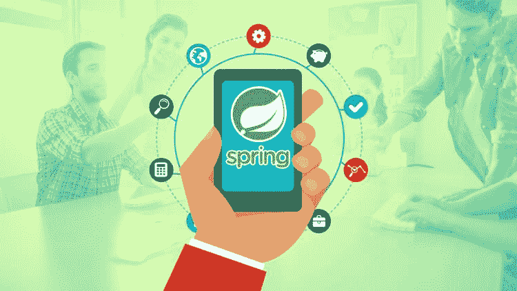
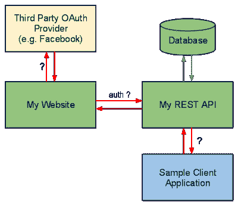
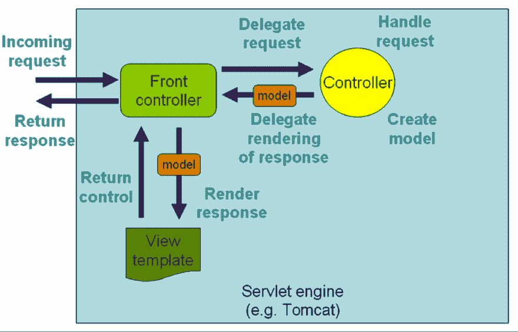

# 为什么 Spring MVC 最适合用 Java 创建 RESTful Web 服务？

> 原文：<https://dev.to/javinpaul/why-spring-mvc-is-best-for-creating-restful-web-services-in-java-358p>

*披露:这篇文章包括附属链接；如果您从本文提供的不同链接购买产品或服务，我可能会收到报酬。*

你们中的许多人都同意 REST 现在已经成为开发 web 服务的标准方法(有些人可能会争论 GraphQL)，当谈到 Java 时，有许多可用的框架和库，如 [JAX-RS](https://github.com/jax-rs) 、 [Restlet](http://javarevisited.blogspot.sg/2016/10/restlet-helloworld-example-in-java-and-Eclipse.html) 、 [Jersey](http://javarevisited.blogspot.sg/2017/06/jersey-web-service-hello-world-example.html) 、 [RESTEasy](http://javarevisited.blogspot.sg/2017/02/difference-between-jax-rs-restlet-jersey-apache-cfx-RESTEasy.html) 、Apache CXF 等。，但是我鼓励 Java 开发者使用 Spring MVC 来开发 RESTful web 服务。

有些人可能会问，*为什么要用 Spring MVC 框架用 Java 开发 RESTful web 服务？*有什么优势，为什么它比其他可用的[框架](https://dev.to/javinpaul/10-frameworks-java-and-web-developers-can-learn-in-2019-17ke)和[库](https://javarevisited.blogspot.com/2018/01/top-20-libraries-and-apis-for-java-programmers.html)更好？

嗯，我认为，使用 Spring 开发 RESTful web 服务的最重要的原因是，您可以使用您的 [Spring MVC](http://javarevisited.blogspot.sg/2017/06/how-spring-mvc-framework-works-web-flow.html) 经验来开发 RESTful web 服务，并且您不需要学习新的框架或库，这意味着您可以快速推出 REST API。

这是最大的优势之一，我的意思是，利用您多年的 Spring MVC 经验，将您的应用程序公开为 REST APIs。

另一个原因是 *Spring 对开发 RESTful web 服务*有很好的支持。

在最近的几个版本中，从 Spring 3.0 版本开始，它对 Spring MVC 进行了很多增强，以提供一流的 REST 支持。它提供了专门的注释，如 [**@RestController**](http://javarevisited.blogspot.sg/2017/08/difference-between-restcontroller-and-controller-annotations-spring-mvc-rest.html) 和 [**@ResponseStatus**](http://javarevisited.blogspot.sg/2011/09/spring-interview-questions-answers-j2ee.html#axzz55mVSPFfH) 以使 Spring 4.0 中 RESTful 资源的开发更加容易。

它不仅帮助你创建 RESTful web 服务，还提供了使用 REST 资源的类，就像你可以使用 REST 模板 类来使用 RESTful 资源一样。

还有许多实用程序类和注释使得在 Spring 中开发 RESTful web 服务更加容易和无缝，我将在本文中分享其中的几个来证明我的观点，即使用 Spring 开发 RESTful Web 服务是正确的决定。

### 使用 Spring MVC 在 Java 中创建 RESTful Web 服务的 7 个理由

正如我在第一段中告诉你的，我们可以使用 [Spring MVC](https://javarevisited.blogspot.com/2020/08/top-5-courses-to-learn-spring-mvc-for.html) 来创建和消费 RESTful web 服务。

现在，让我们更详细地看看这些支持，这样您就可以充分利用它们，快速开发您一直想要的 RESTful 服务。

**1。在 Spring MVC 中，控制器可以处理所有 HTTP 方法的请求，这是 RESTful web 服务的主干。例如，您可以处理一个 GET 方法来执行读操作， [POST](http://javarevisited.blogspot.sg/2016/10/difference-between-put-and-post-in-restful-web-service.html) 方法来创建资源， [PUT](http://www.java67.com/2016/09/when-to-use-put-or-post-in-restful-web-services.html) 方法来更新资源，DELETE 方法从服务器上删除资源。**

从 Spring 3.2 开始，您还可以处理补丁请求。顺便说一句，如果你不熟悉 Spring MVC 框架，那么你应该先看看那个； [Spring MVC 对于初学者来说](https://click.linksynergy.com/fs-bin/click?id=JVFxdTr9V80&subid=0&offerid=562016.1&type=10&tmpid=14538&RD_PARM1=https%3A%2F%2Fwww.udemy.com%2Fspring-mvc-tutorial-for-beginners-step-by-step%2F)是一个很好的起点。

[
T3】](https://click.linksynergy.com/fs-bin/click?id=JVFxdTr9V80&subid=0&offerid=562016.1&type=10&tmpid=14538&RD_PARM1=https%3A%2F%2Fwww.udemy.com%2Fspring-mvc-tutorial-for-beginners-step-by-step%2F)

**2。**在 REST 的情况下，数据的表示非常重要，这就是为什么 Spring MVC 允许你通过使用`@ResponseBody`注释和各种`HttpMessgeConverter`实现来完全绕过基于视图的呈现。

通过使用它，您可以直接向客户端发送响应，例如，客户端想要的资源以及他们想要的格式。点击[这里](http://courses.baeldung.com/p/rest-with-spring-the-certification-class?affcode=22136_bkwjs9xa)了解更多关于`HttpMessageConvert`和`@ResponseBody`注释的信息。

**3。**Spring 4.0 版本增加了一个专用注释`@RestController`，使得 RESTful web 服务的开发更加容易。

如果您使用`@RestController`而不是 [@Controller](http://javarevisited.blogspot.sg/2017/08/difference-between-restcontroller-and-controller-annotations-spring-mvc-rest.html) 来注释控制器类，那么 Spring 会将消息会话应用到控制器中的所有处理程序方法。

这意味着您不需要用`@ResponseBody`注释来注释每个方法。这也使你的代码更加整洁。如果你不了解`@ResponseBody and` @RequestBody annotation，建议你去看看 [Spring Framework 5:初学者到大师](https://click.linksynergy.com/fs-bin/click?id=JVFxdTr9V80&subid=0&offerid=323058.1&type=10&tmpid=14538&RD_PARM1=https%3A%2F%2Fwww.udemy.com%2Fspring-framework-5-beginner-to-guru%2F)课程，由最好的 Spring Framework 导师之一约翰·汤姆森教授。

**4。**REST web 服务和普通 web 应用程序的主要区别之一是 REST pass 资源在 URI 中标识数据，如`/messages/101`，而 web 应用程序通常使用查询参数，如`/messages?Id=101`。

如果您还记得，我们使用 [@RequestParam](http://javarevisited.blogspot.sg/2017/10/differences-between-requestparam-and-pathvariable-annotations-spring-mvc.html) 来获取这些查询参数的值，但是不用担心，Spring MVC 还提供了一个 [@PathVariable](http://javarevisited.blogspot.sg/2017/10/differences-between-requestparam-and-pathvariable-annotations-spring-mvc.html) 注释，可以从 URL 中提取数据。它允许控制器处理参数化 URL 的请求。

**5。RESTful web 服务的另一个关键方面是表示，这意味着相同的资源可以用不同的格式表示，例如 JSON、XML、HTML 等。幸运的是，Spring 提供了几个视图实现和视图解析器来将数据呈现为 [JSON](http://www.java67.com/2016/10/3-ways-to-convert-string-to-json-object-in-java.html#.WkOmLRqktTU.linkedin) 、 [XML](http://javarevisited.blogspot.sg/2015/07/how-to-read-xml-file-as-string-in-java-example.html#axzz55mVSPFfH) 和 [HTML](http://javarevisited.blogspot.sg/2014/09/how-to-parse-html-file-in-java-jsoup-example.html) 。**

例如，`ContentNegotiatingViewResolver`可以查看请求或接受头的文件扩展名，为客户机找出资源的正确表示。

**6。**类似于`@ResponseBody`注释，它用于将响应转换成客户机想要的格式(通过使用`HttpMessageConverts` ), [Spring MVC](https://medium.com/javarevisited/21-spring-mvc-rest-interview-questions-answers-for-beginners-and-experienced-developers-21ad3d4c9b82) 也提供了`@RequestBody`注释，它使用`HttpMethodConverter`实现将入站 HTTP 数据转换成传递给控制器的 handler 方法的 Java 对象。

如果你对 handler 方法和 Spring MVC 总体不熟悉，那么你也可以查看一下 [3 种学习 Spring MVC 的方法](http://javarevisited.blogspot.sg/2018/01/how-to-learn-spring-core-spring-mvc-boot-security-framework.html)。

**7。【TheSpring 框架还提供了一个模板类`RestTemplate`，类似于`JdbcTemplate`，`JmsTemplate`，可以消耗 REST 资源。您可以使用这个类来测试 RESTful web 服务或者开发 REST 客户端。**

这些是 Spring MVC 框架的一些**重要特性，它们有助于开发 [RESTful web 服务](https://medium.com/javarevisited/top-5-books-and-courses-to-learn-restful-web-services-in-java-using-spring-mvc-and-spring-boot-79ec4b351d12)。正如我前面所说，我选择 Spring 或 Spring Boot 开发 RESTful 资源的最重要原因是，我可以使用我现有的框架知识，这意味着没有陡峭的学习曲线。**

如果从高层次来看，开发 RESTful 服务与开发 web 应用程序没有太大区别。

最根本的区别是，对于前者，我们主要处理人类用户，而对于 REST，您必须处理非人类用户，主要是富 JavaScript 客户端和移动应用程序。

这种关键的差异会导致其他的差异，比如用 JSON 或 XML 而不是 HTML 来表示数据，后者适合人类用户，但不适合非人类系统。如果您想在开始使用 Spring 开发生产级 RESTful web 服务之前了解更多，那么 [**REST with Spring**](http://courses.baeldung.com/p/rest-with-spring-the-certification-class?affcode=22136_bkwjs9xa) 课程是一个不错的起点。

其他 **Spring** 和 **REST 资源**你可能喜欢的
[如何用 Spring Cloud 搭建微服务？](https://click.linksynergy.com/fs-bin/click?id=JVFxdTr9V80&subid=0&offerid=323058.1&type=10&tmpid=14538&RD_PARM1=https%3A%2F%2Fwww.udemy.com%2Fmicroservices-with-spring-cloud%2F)
[带 Spring Boot 和春云的微服务](https://click.linksynergy.com/fs-bin/click?id=JVFxdTr9V80&subid=0&offerid=323058.1&type=10&tmpid=14538&RD_PARM1=https%3A%2F%2Fwww.udemy.com%2Fexploring-spring-boot-and-spring-cloud-microservices%2F)\
[Java 中 Restlet、Jersey、RESTEasy 的区别？](http://javarevisited.blogspot.sg/2017/02/difference-between-jax-rs-restlet-jersey-apache-cfx-RESTEasy.html)
[DispatcherServlet 在 Spring MVC 中有什么用？](http://www.java67.com/2017/06/what-is-use-of-dispatcherservlet-in-spring-mvc.html)
[2021 年学习 Spring Boot 的前 5 门课程](https://hackernoon.com/top-5-online-courses-to-learn-spring-boot-in-2019-c2fd7a0282c2)
[如何在 Java web 应用中启用 Spring 安全？](http://javarevisited.blogspot.sg/2017/05/how-to-enable-spring-security-in-java-web-application.html)
[弹簧在行动中受克雷格壁](https://www.amazon.com/Spring-Action-Craig-Walls/dp/1617294942?tag=javamysqlanta-20)
[弹簧框架 5:初学者到宗师](https://click.linksynergy.com/fs-bin/click?id=JVFxdTr9V80&subid=0&offerid=323058.1&type=10&tmpid=14538&RD_PARM1=https%3A%2F%2Fwww.udemy.com%2Fspring-framework-5-beginner-to-guru%2F)

感谢您阅读本文，如果您喜欢这些使用 Spring 开发 RESTful web 服务的理由，那么请与您的朋友和同事分享。如果您有任何问题或反馈，请留言