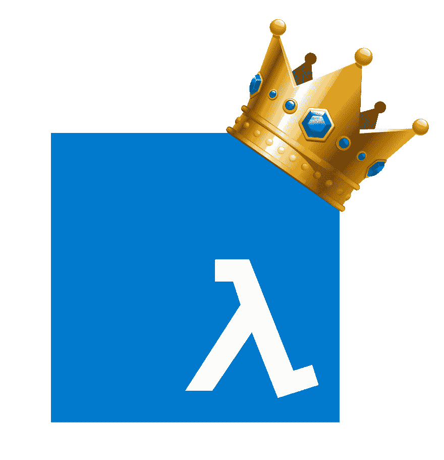
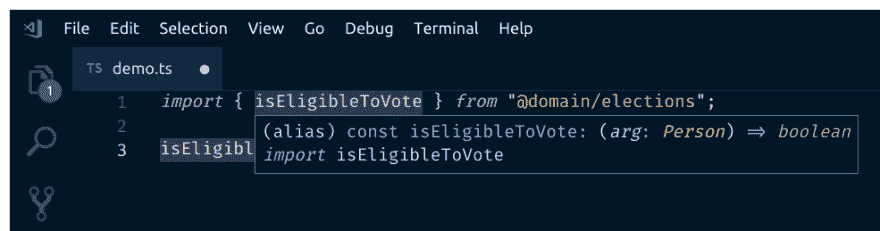
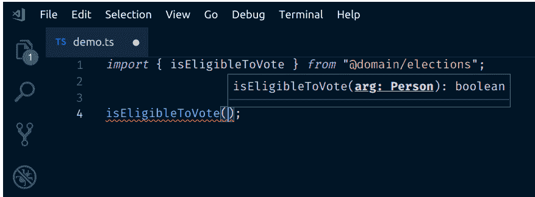
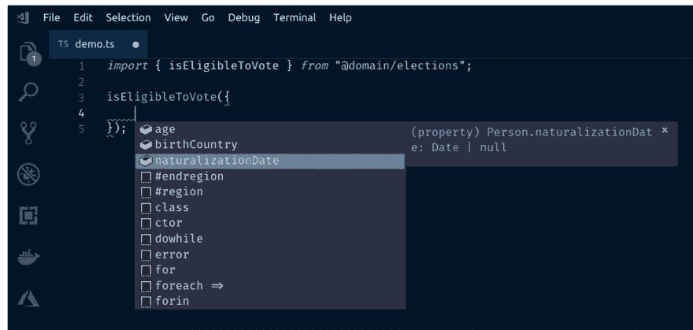
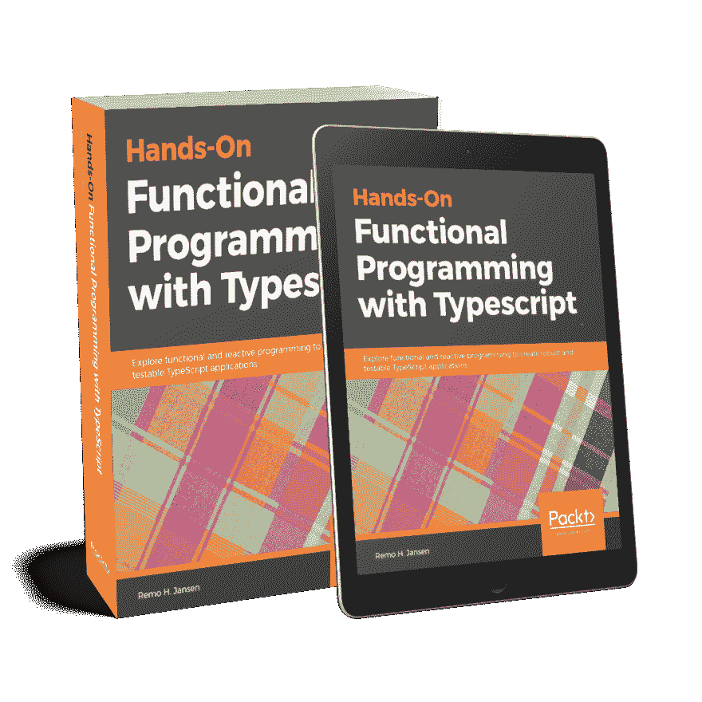

# 为什么在函数式编程中，TypeScript 是比 JavaScript 更好的选择？

> 原文：<https://dev.to/wolksoftware/why-typescript-is-a-better-option-than-javascript-when-it-comes-to-functional-programming-3mp0>

在这篇文章中，我想讨论静态类型在函数式编程语言中的重要性，以及为什么在函数式编程中，由于 JavaScript 中缺少静态类型系统，TypeScript 是比 JavaScript 更好的选择。

[](https://res.cloudinary.com/practicaldev/image/fetch/s--68tmMUx9--/c_limit%2Cf_auto%2Cfl_progressive%2Cq_auto%2Cw_880/https://thepracticaldev.s3.amazonaws.com/i/gmmmx4nebcdw15qvsghb.png)

## 生活中没有类型的函数式编程代码库

请试着把你的思想放在一个假设的情况下，这样我们就可以展示静态类型的价值。让我们假设您正在为一个与选举相关的应用程序编写一些代码。你刚入队，应用挺大的。您需要编写一个新的功能，其中一个要求是确保应用程序的用户有资格在选举中投票。团队中的一位老成员向我们指出，我们需要的一些代码已经在一个名为`@domain/elections`的模块中实现了，我们可以按如下方式导入它:

```
import { isEligibleToVote } from "@domain/elections"; 
```

Enter fullscreen mode Exit fullscreen mode

导入是一个很好的起点，我们非常感谢或同事提供的帮助。是时候做些工作了。然而，我们有一个问题。我们不知道如何使用`isEligibleToVote`。如果我们试图通过名字猜测`isEligibleToVote`的类型，我们可以假设它很可能是一个函数，但是我们不知道应该给它提供什么参数:

```
isEligibleToVote(????); 
```

Enter fullscreen mode Exit fullscreen mode

我们不害怕阅读别人的代码。当我们打开`@domain/elections`模块的源代码时，我们会遇到以下情况:

```
const either = (f, g) => arg => f(arg) || g(arg);
const both = (f, g) => arg => f(arg) && g(arg);
const OUR_COUNTRY = "Ireland";
const wasBornInCountry = person => person.birthCountry === OUR_COUNTRY;
const wasNaturalized = person => Boolean(person.naturalizationDate);
const isOver18 = person => person.age >= 18;
const isCitizen = either(wasBornInCountry, wasNaturalized);
export const isEligibleToVote = both(isOver18, isCitizen); 
```

Enter fullscreen mode Exit fullscreen mode

前面的代码片段使用了函数式编程风格。`isEligibleToVote`执行一系列检查:

*   这个人必须超过 10 岁
*   此人必须是公民
*   要成为公民，该人必须出生在该国或已入籍

我们需要开始在我们的大脑中做一些逆向工程，以便能够解码前面的代码。我几乎可以肯定`isEligibleToVote`是一个函数，但现在我有些怀疑，因为我没有看到`function`关键字或箭头函数(`=>`)在其声明:

```
const isEligibleToVote = both(isOver18, isCitizen); 
```

Enter fullscreen mode Exit fullscreen mode

为了能够知道它是什么，我们需要检查`both`函数在做什么。我可以看到两者都有两个参数`f`和`g`，而且我可以看到它们是函数，因为它们被调用了`f(arg)`和`g(arg)`。`both`函数返回一个函数`arg => f(arg) && g(arg)`,该函数带有一个名为`args`的参数，此时它的形状对我们来说是完全未知的:

```
const both = (f, g) => arg => f(arg) && g(arg); 
```

Enter fullscreen mode Exit fullscreen mode

现在我们可以返回到`isEligibleToVote`函数，再次尝试检查，看看我们是否能找到新的东西。我们现在知道`isEligibleToVote`是由`both`函数`arg => f(arg) && g(arg)`返回的函数，我们还知道`f`是`isOver18`而`g`是`isCitizen`，所以`isEligibleToVote`正在做类似于下面的事情:

```
const isEligibleToVote = arg => isOver18(arg) && isCitizen(arg); 
```

Enter fullscreen mode Exit fullscreen mode

我们仍然需要找出论点是什么。我们可以检查`isOver18`和`isCitizen`函数来找到一些细节。

```
const isOver18 = person => person.age >= 18; 
```

Enter fullscreen mode Exit fullscreen mode

这条信息很有用。现在我们知道`isOver18`期望一个名为`person`的参数，并且它是一个具有名为`age`的属性的对象，我们也可以通过比较`person.age >= 18`来猜测`age`是一个数字。

让我们看看`isCitizen`函数:

```
const isCitizen = either(wasBornInCountry, wasNaturalized); 
```

Enter fullscreen mode Exit fullscreen mode

我们在这里运气不好，我们需要检查`either`、`wasBornInCountry`和`wasNaturalized`函数:

```
const either = (f, g) => arg => f(arg) || g(arg);
const OUR_COUNTRY = "Ireland";
const wasBornInCountry = person => person.birthCountry === OUR_COUNTRY;
const wasNaturalized = person => Boolean(person.naturalizationDate); 
```

Enter fullscreen mode Exit fullscreen mode

`wasBornInCountry`和`wasNaturalized`都期待一个名为`person`的自变量，现在我们发现了新的性质:

*   `birthCountry`属性似乎是一个字符串
*   `naturalizationDate`属性似乎是日期或空

`either`函数向`wasBornInCountry`和`wasNaturalized`传递一个参数，这意味着`arg`必须是一个人。这需要很大的认知努力，我们感觉很累，但现在我们知道我们可以使用`isElegibleToVote`功能，如下所示:

```
isEligibleToVote({
    age: 27,
    birthCountry: "Ireland",
    naturalizationDate: null
}); 
```

Enter fullscreen mode Exit fullscreen mode

我们可以使用像 JSDoc 这样的文档来解决这些问题。然而，这意味着更多的工作和文档会很快过时。

> TypeScript 可以帮助验证我们的 JSDoc 注释是否与我们的代码库保持同步。然而，如果我们要这样做，为什么不首先采用 TypeScript 呢？

## 生活用函数式编程代码库中的类型

现在我们知道了在没有类型的函数式编程代码库中工作有多困难，我们将看看在有静态类型的函数式编程代码库中工作是什么感觉。我们将回到同一个起点，我们加入了一家公司，我们的一位同事为我们指出了`@domain/elections`模块。然而，这次我们是在一个平行宇宙中，代码库是静态类型的。

```
import { isEligibleToVote } from "@domain/elections"; 
```

Enter fullscreen mode Exit fullscreen mode

我们不知道`isEligibleToVote`是不是函数。然而，这次我们能做的远不止猜测。我们可以使用 IDE 将鼠标悬停在`isEligibleToVote`变量上，以确认它是一个函数:

[](https://res.cloudinary.com/practicaldev/image/fetch/s--oR1ihWM6--/c_limit%2Cf_auto%2Cfl_progressive%2Cq_auto%2Cw_880/https://thepracticaldev.s3.amazonaws.com/i/8sjf3foelt23tofqsnym.png)

然后我们可以尝试调用`isEligibleToVote`函数，我们的 IDE 会告诉我们需要传递一个类型为`Person`的对象作为参数:

[](https://res.cloudinary.com/practicaldev/image/fetch/s--IA0rVM2p--/c_limit%2Cf_auto%2Cfl_progressive%2Cq_auto%2Cw_880/https://thepracticaldev.s3.amazonaws.com/i/uil57b9gpav1a0dl1ozj.png)

如果我们试图传递一个对象文字，我们的 IDE 将显示所有属性和`Person`类型以及它们的类型:

[](https://res.cloudinary.com/practicaldev/image/fetch/s--ld2lLRoH--/c_limit%2Cf_auto%2Cfl_progressive%2Cq_auto%2Cw_880/https://thepracticaldev.s3.amazonaws.com/i/tm2p82yf1aalx7pjdne5.png)

就是这样！不需要思考或文档！这都要归功于 TypeScript 类型系统。

下面的代码片段包含了`@domain/elections`模块的类型安全版本:

```
interface Person {
    birthCountry: string;
    naturalizationDate: Date | null;
    age: number;
}

const either = <T1>(
   f: (a: T1) => boolean,
   g: (a: T1) => boolean
) => (arg: T1) => f(arg) || g(arg);

const both = <T1>(
   f: (a: T1) => boolean,
   g: (a: T1) => boolean
) => (arg: T1) => f(arg) && g(arg);

const OUR_COUNTRY = "Ireland";
const wasBornInCountry = (person: Person) => person.birthCountry === OUR_COUNTRY;
const wasNaturalized = (person: Person) => Boolean(person.naturalizationDate);
const isOver18 = (person: Person) => person.age >= 18;
const isCitizen = either(wasBornInCountry, wasNaturalized);
export const isEligibleToVote = both(isOver18, isCitizen); 
```

Enter fullscreen mode Exit fullscreen mode

添加类型注释会占用一点额外的类型，但好处无疑是值得的。我们的代码将更不容易出错，它将是自文档化的，并且我们的团队成员将更有生产力，因为他们将花费更少的时间来试图理解预先存在的代码。

普适的 UX 法则 [*不要让我认为*](https://amzn.to/2Ti3uhW) 也能给我们的代码带来巨大的改进。记住，在一天结束的时候，我们花在阅读上的时间比写代码多得多。

## 关于函数式编程语言中的类型

函数式编程语言不必是静态类型的。然而，函数式编程语言往往是静态类型的。根据维基百科，这种趋势从 20 世纪 70 年代就开始了:

> 自从 20 世纪 70 年代 Hindley-Milner 类型推理的发展以来，函数式编程语言倾向于使用类型化的 lambda 演算，在编译时拒绝所有无效程序，并冒着假阳性错误的风险，这与 Lisp 及其变体(如 Scheme)中使用的非类型化的 lambda 演算相反，后者在编译时接受所有有效程序，并冒着假阴性错误的风险，尽管它们在运行时拒绝所有无效程序，但当信息足以不拒绝有效程序时。代数数据类型的使用使得复杂数据结构的操作变得方便；强大的编译时类型检查使程序在缺乏其他可靠性技术(如测试驱动开发)的情况下更加可靠,而类型推理使程序员在大多数情况下无需向编译器手动声明类型。

让我们考虑一个没有类型的`isEligibleToVote`特性的面向对象实现:

```
const OUR_COUNTRY = "Ireland";

export class Person {
    constructor(birthCountry, age, naturalizationDate) {
        this._birthCountry = birthCountry;
        this._age = age;
        this._naturalizationDate = naturalizationDate;
    }
    _wasBornInCountry() {
        return this._birthCountry === OUR_COUNTRY;
    }
    _wasNaturalized() {
        return Boolean(this._naturalizationDate);
    }
    _isOver18() {
        return this._age >= 18;
    }
    _isCitizen() {
        return this._wasBornInCountry() || this._wasNaturalized();
    }
    isEligibleToVote() {
        return this._isOver18() && this._isCitizen();
    }
} 
```

Enter fullscreen mode Exit fullscreen mode

弄清楚如何调用前面的代码并不是一件简单的事情:

```
import { Person } from "@domain/elections";

new Person("Ireland", 27, null).isEligibleToVote(); 
```

Enter fullscreen mode Exit fullscreen mode

再一次，没有类型，我们被迫看一下实现细节。

```
constructor(birthCountry, age, naturalizationDate) {
    this._birthCountry = birthCountry;
    this._age = age;
    this._naturalizationDate = naturalizationDate;
} 
```

Enter fullscreen mode Exit fullscreen mode

当我们使用静态类型时，事情变得更容易:

```
const OUR_COUNTRY = "Ireland";

class Person {

    private readonly _birthCountry: string;
    private readonly _naturalizationDate: Date | null;
    private readonly _age: number;

    public constructor(
        birthCountry: string,
        age: number,
        naturalizationDate: Date | null
    ) {
        this._birthCountry = birthCountry;
        this._age = age;
        this._naturalizationDate = naturalizationDate;
    }

    private _wasBornInCountry() {
        return this._birthCountry === OUR_COUNTRY;
    }

    private _wasNaturalized() {
        return Boolean(this._naturalizationDate);
    }

    private _isOver18() {
        return this._age >= 18;
    }

    private _isCitizen() {
        return this._wasBornInCountry() || this._wasNaturalized();
    }

    public isEligibleToVote() {
        return this._isOver18() && this._isCitizen();
    }

} 
```

Enter fullscreen mode Exit fullscreen mode

构造函数告诉我们需要多少个参数以及每个参数的预期类型:

```
public constructor(
    birthCountry: string,
    age: number,
    naturalizationDate: Date | null
) {
    this._birthCountry = birthCountry;
    this._age = age;
    this._naturalizationDate = naturalizationDate;
} 
```

Enter fullscreen mode Exit fullscreen mode

我个人认为函数式编程通常比面向对象编程更难逆向工程。也许这是由于我的面向对象的背景。然而，不管是什么原因，我确信一件事:类型确实让我的生活变得更容易，当我在处理函数式编程代码库时，它们的好处甚至更加明显。

## 总结

静态类型是有价值的信息来源。由于我们花在读代码上的时间比写代码多得多，我们应该优化我们的工作流程，这样我们就可以更高效地读代码，而不是更高效地写代码。类型可以帮助我们去除大量的认知工作，这样我们就可以专注于我们试图解决的业务问题。

虽然所有这些在面向对象编程代码库中都是正确的，但在函数式编程代码库中好处甚至更明显，这也正是我为什么喜欢认为在函数式编程中，TypeScript 是比 JavaScript 更好的选择。你怎么想呢?

如果你喜欢这篇文章，并且对函数式编程或打字稿感兴趣，请看看我即将出版的书 [***带打字稿的函数式编程***](http://www.functionaltypescript.com/)

[](https://res.cloudinary.com/practicaldev/image/fetch/s--b6t79U_g--/c_limit%2Cf_auto%2Cfl_progressive%2Cq_auto%2Cw_880/https://thepracticaldev.s3.amazonaws.com/i/91ajqn8adctk9i0tua1u.png)