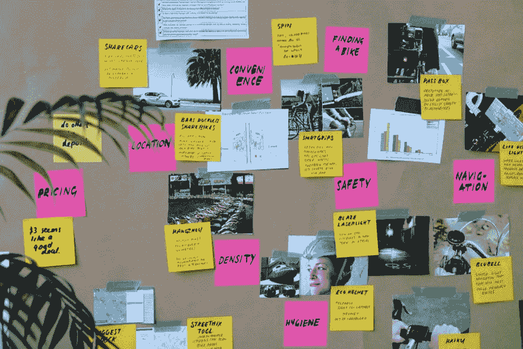

# 为什么要用 Figma 来打造 MVP

> 原文：<https://dev.to/steelwolf180/why-use-figma-to-build-a-mvp-383o>

# 简介

[Figma](https://www.figma.com) 一直是我的 goto 设计工具，我会用它来完成从原型设计、线框到 Linkedin 横幅的设计任务。

当我读到 AJ T2 Smart 因 Figma 的实时协作特性而推荐它时，我变得更感兴趣了。

他们也是 uda city Design Sprint nango gree 课程讲师的一部分。

# 共享设计原型中的问题

我讨厌每当你把设计发给用户寻求反馈的时候。它假设用户在他们的机器上有设计工具来查看它。

为了解决这个问题，您将设计导出为 PDF，但是您失去了原型的**交互性**部分，该部分允许用户使用它来为您的设计提供反馈。

Figma 提供了一个链接，你可以把它分享给你的用户，也可以直接在 Figma 中提供反馈。

# 为您的 MVP 存储设计文档

Figma 允许您一站式存储您的设计文档。

无论何时你在构建你的 MVP，你都应该有这**三个**文件的关键部分，即:

*   用户角色(User Persona)——对使用你的软件的理想用户类型的虚构描述
*   [用户之旅](https://theuxreview.co.uk/user-journeys-beginners-guide/)——从头到尾你的用户将如何与你的软件交互的数据流。
*   风格指南(Style Guide)-一个模板，从配色方案、排版和图标等方面展示你的创业品牌。

这样，将你的想法传达给你的团队，从 UX 的设计者到开发者建立一个 MVP，有助于减少设计和开发时间的损失。

# 适用于所有平台

除了 Windows 和 Mac 中的原生应用。

Figma 提供了一个网络应用程序，允许任何有互联网连接和网络浏览器的人设计和编辑他们的设计。

这很重要，因为我的开发环境是 Linux 机器。

# 允许导入草图资产

这是我发现的非常有用的东西，因为你不需要从头开始设计一切。

你可以导入大量设计精美的预建草图文件。据我所知，这个草图被认为是 UI/UX 设计师用来为网站、移动应用和其他软件构建 UI 的一个非常流行的工具。

# 实时协作

这是我作为一个人在构建设计或原型时从未想过或使用过的东西。

对于有不止一个设计师在设计原型的团队来说，这可能是一个有用的特性。

通过在单个文件上进行协作的同时进行即时更改，该文件为设计师提供了单一的真实信息来源。

# 开发商移交

我喜欢 Figma 的一个简洁的特性是开发人员可以轻松地复制整个设计。

只需悬停并点击组件的一部分，就可以在 CSS 的**代码**标签下直接获得该组件的颜色、大小和样式。

这为开发者在网站、iOS 或 Andriod 上查找你的 MVP 的特定组件的大小、颜色和位置节省了大量时间。

# 结论

最后，我真的很喜欢 Figma 是需要的学习曲线。

我不是一个专业的设计师，我真的很欣赏这种思维过程，以及在没有花费大量精力去学习如何使用它的情况下，快速创建一个原型或设计所花费的时间。

我希望你可以考虑在你的下一个项目中使用 Figma 或者构建你自己的 MVP。

对于那些正在使用 Figma 的人，我很想知道你们的想法和使用体验。

如果你喜欢我的文章，请**注册**Max[冒险家简讯](http://eepurl.com/dOUoUb)获取我每周在 **Python** 、**创业**和 **Web 开发**偶然发现的牛逼内容。

你也可以**关注**我来获取我在 **Dev** 上的文章的**最新**更新

这篇文章最初发表在 Max 的博客[上，为什么创业要用 Python？](https://www.maxongzb.com/why-use-python-for-startups/)和[照片由 Jo Szczepanska 在 Unsplash 上拍摄](https://unsplash.com/photos/bjemWZcNF34)

# 参考文献

*   [图](https://www.figma.com/)
*   [设计冲刺](https://www.gv.com/sprint/)
*   [Udacity 设计冲刺纳米度](https://www.udacity.com/course/design-sprint-foundations-nanodegree--nd201)
*   [Figma 新手教程- AJ &聪明](https://youtu.be/tdy1bo5eAgA)
*   [用户旅程–初学者指南](https://theuxreview.co.uk/user-journeys-beginners-guide/)
*   [如何创建品牌风格指南](https://99designs.com.sg/blog/logo-branding/how-to-create-a-brand-style-guide/)
*   [用户角色](https://www.interaction-design.org/literature/topics/user-personas)