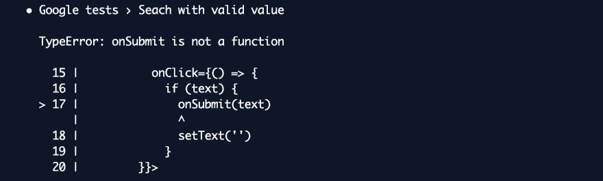

# 为什么渲染后要清理

> 原文：<https://dev.to/nicolasamabile/why-you-should-cleanup-after-render-4aff>

今天我花了一些时间用 [react-testing-library](https://github.com/testing-library/react-testing-library) 调试了一个简单的 [jest](https://github.com/facebook/jest) 测试。我遇到了一些问题，我不容易弄清楚发生了什么。

## 问题

我有一个非常简单的组件:

*   快照测试
*   一些基本的交互测试只有在我单独运行它们时才能正常工作**😒**

 **我创建了这个例子来说明这个想法:

```
const Google = ({ onSubmit }) => {
  const [text, setText] = useState('')
  return (
    <Fragment>
      <input
        data-testid='textbox'
        type='text'
        value={text}
        onChange={({ target: { value }}) => setText(value)} />

        <button
          data-testid='btn'
          onClick={() => {
            if (text) {
              onSubmit(text)
              setText('')
            }
        }}>
          Search
        </button>
    </Fragment>
  )
} 
```

测试是:

```
import { render, fireEvent } from 'react-testing-library'

describe('Google tests', () => {
  test('It renders corectly', () => {
    const { container } = render(<Google />)
    expect(container.firstChild).toMatchSnapshot()
  })

  test('Search with empty value', () => {
    const onSubmit = jest.fn()
    const { container, getByTestId } = render(<Google onSubmit={onSubmit}/>)
    const button = getByTestId('btn')
    fireEvent.click(button)
    expect(onSubmit).not.toBeCalled()
  })

  test('Seach with valid value', () => {
    const onSubmit = jest.fn()
    const text = 'Example'
    const { container, getByTestId } = render(<Google onSubmit={onSubmit}/>)
    const textbox = getByTestId('textbox')
    fireEvent.change(textbox, { target: { value: text }})
    const button = getByTestId('btn')
    fireEvent.click(button)
    expect(onSubmit).toBeCalledWith(text)
  })
}) 
```

如果我运行这个，我得到这个错误:
[](https://res.cloudinary.com/practicaldev/image/fetch/s--Lgp76bE1--/c_limit%2Cf_auto%2Cfl_progressive%2Cq_auto%2Cw_880/https://thepracticaldev.s3.amazonaws.com/i/44mamkl2udv46hc7rolk.png)

很明显，我为那个特定的测试发送了一个函数(“用有效值搜索”)。可能是打字错误？🤔
我的第一反应是在测试中加入`.only`并专注于那个特定的问题。你猜怎么着，成功了😒

我花了一些时间调试它，直到我意识到失败的测试使用了我为第一个快照测试创建的组件实例(没有点击处理程序的那个)🤯这到底是怎么回事？

来自[官方文档](https://testing-library.com/docs/react-testing-library/api#cleanup) :
*“在调用 render 时未调用 cleanup 可能会导致内存泄漏和非“等幂”测试(这会导致测试中难以调试的错误)。”*

## 解

这就像使用来自`'react-testing-library'`的`cleanup`一样简单。

```
import { render, fireEvent, cleanup } from 'react-testing-library'

describe('Google tests', () => {
  beforeEach(cleanup)
  ...
}) 
```

这里有一个例子。

希望这将为您节省一些调试时间👍

照片由[卡拉塔拉](https://www.pexels.com/@karatara-278139)从[派克斯](https://www.pexels.com/photo/male-statue-decor-931317/)拍摄**