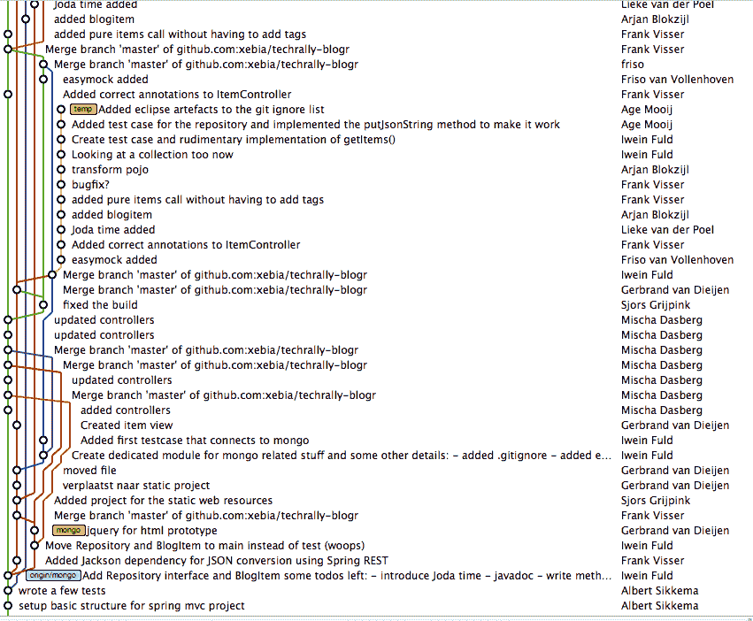

# 为什么您应该考虑单一回购和单一构建？银弹

> 原文：<https://dev.to/bilalarxd/why-you-should-consider-mono-repo-and-single-build-the-silver-bullet-case-study-31j0>

如果你只是通过阅读标题来到这个博客，并对一些事情有一些奇怪的想法

具体的，我先澄清一下，不是！我不会分享杀死狼的 100 种方法，甚至连击倒一只狼的提示都不会。事实上，我的标题是受我毕业时读到的小佛瑞德·P·布鲁克斯的论文《没有银弹》的启发。

> 无论是技术还是管理技术，都没有哪一项发展本身能保证在十年内生产率、可靠性和简单性有一个数量级的提高。 [-小佛瑞德·P·布鲁克斯的《没有银子弹》](http://faculty.salisbury.edu/~xswang/Research/Papers/SERelated/no-silver-bullet.pdf)

在这篇博客中，我将解释我们如何开始第一个项目的现有工作流程，我们遇到了什么样的问题，我们如何解决它们，以及我们现在正在为第二个项目做些什么。

## 随波逐流

我们在 PolarBears 的第一个项目上已经工作了八个月，我们的目标是将第一个项目作为 web 应用、android 应用和 iOS 应用来交付。为了支持这些平台，我们决定开发一个 API，为两个客户端共享实现。因此，我们最终为移动、网络和服务器创建了三个存储库。为了维护这些存储库，我们根据每个平台的可用技能和知识将我们的团队分成了更小的团队。是时候决定我们的开发工作流程了，我们将如何处理分支、构建、部署和环境。

我们是一个新成立的团队，大多数成员以前没有一起工作过，我们的第一个挑战是带领团队进入塔克曼在他的团队发展阶段中描述的表演阶段。第二个挑战是按时交付项目，通过研究最佳方法或研究行业如何解决这些问题，我们可能会错过最后期限。因此，考虑到这两点，我们决定为我们的项目采用现有的工作流模型，我的组织中的大多数项目都使用这个模型。

让我解释一下该模型，有四种环境开发、质量、试运行和生产，我将它们称为 D、Q、S 和 p。为了支持这些环境，您有四个长期(始终开放)分支默认、质量、稳定和生产。每个分支都配置有 Bamboo 构建计划，然后为每个环境触发 Bamboo 部署计划。d 代表日常开发，Q 代表 QA 测试，S 代表 PO 测试，然后 P 代表客户。

## 合并地狱

让我们深入了解这个工作流的一个已知用例。如果您想将 D 环境升级到 Q 环境，您只需将 D 分支合并到 Q 环境中，通过这种方式，bamboo 将在合并提交时触发构建，如果构建成功，它将部署到 Q 环境。升级 Q 到 S 和 S 到 P 的流程相同。因此，通过这种模式，如果您需要在 P 环境中发布新功能 X。你必须在 D 上开发它，然后通过 Q 和 S 提升到 P。从 D 到 P 的旅程并不像我描述的那么简单，有许多注意事项。可能会有特定于环境的问题，您会注意到这些问题在任何其他环境中都不存在。(例如，客户将报告一个在 D、Q 和 S 上工作正常的问题)。我相信大多数读者都能讲述发生在他们身上的同样的故事。所以，问题是为什么会这样？让我尽我所知来回答这个问题，记住，我们用竹构建配置了分支，每当您提交代码或合并分支时，它都会触发竹构建。因此，如果您将 D 合并到 Q，Q 合并到 S，或者 S 合并到 P，Bamboo 将为每个环境构建一个新的二进制文件。这意味着每次您合并时，看起来您在 D 和 Q 上有相同的代码，但实际上，两个构建是不同的，并导致不同的二进制文件和可部署的资产。这就是每个开发人员一生中说过的这些神奇的话背后的原因。

> 但是，它在我的机器上工作。[其中我的机器= [D，Q，S]//在我们的例子中]

假设我们在其他环境中发现了问题，并需要修复它。所以问题是我们应该如何修复它？你可能会认为在 D 上修复它，然后提升到 Q、S 和 p。是的，这是一个选项，但修复一个 bug 会花费太多时间吗？是的，会花太多时间。为什么我们不把它固定在 P 上，合并回 S，Q 和 D 呢？是的，我们通常使用这个选项来热修复 P 上的问题/错误，有时在 S 上，之后，我们的分支看起来像下面的图片，也被称为 merge-hell。

## 问题的关键

如果我们分析所选的工作流模型并计算数量，我们就会知道其中的问题。因此，我们有三个存储库移动、web 和服务器，每个存储库有 4 个分支、4 个构建、4 个部署和 4 个环境。总的来说，仅仅是一个项目，我们就需要处理 48 件事情。我们做了八个月，这不仅仅是维护，还有与此相关的时间、精力和成本。

除了这个成本之外，想象一下，如果你必须发布一个跨越所有平台的新特性，那么这个工作流肯定会导致更长的开发到生产时间。使用这种模型，开发人员很难跨多个平台工作，这是不应该发生的。我们不仅让日常任务变得痛苦，还让整个模型变得不那么透明。为了知道某个特性在另一个平台上的状态，你每次都必须做额外的工作。久而久之:有可能你会接受额外工作方面的培训，这不成问题，但更大的可能是你会因为一遍又一遍地做同样的事情而变得不那么好奇和烦恼。

因此，通过设计，我们引入了罗伯特·c·马丁在他的书中所说的“环境的粘性”,

> 粘性有两种形式:软件的粘性和环境的粘性。当面对变化时，开发人员通常会找到不止一种方法来实现变化。一些方法保留了设计；其他人没有(即，他们是黑客)。当保留设计的方法比 hacks 更难使用时，设计的粘性就很高。做错事容易，做对事难。我们希望设计我们的软件，以便保留设计的更改很容易进行。当开发环境缓慢且低效时，环境的粘性就产生了。例如，如果编译时间很长，开发人员会倾向于进行不强制大量重新编译的更改，即使这些更改不会保留设计。如果源代码控制系统需要几个小时才能签入几个文件，那么开发人员将会倾向于做出尽可能少签入的更改，而不管设计是否被保留。在这两种情况下，粘性项目都是软件设计难以保存的项目。我们希望创建系统和项目环境，使其易于保存和改进设计。Robert C. Martin 和 Micah Martin 的《C#中的敏捷原则、模式和实践》

另一个需要考虑的问题是保持板的更新，这是包括我在内的很多开发者都面临的问题。那么，为什么没有人一劳永逸地解决这个问题呢？为什么我们不能把 Bitbucket 和吉拉集成在一起，让它们在某些特定的场合互相交流，比如创建一个分支，提交你的代码，创建一个 pull 请求，合并一个 pull 请求，这样它们就能保持电路板的更新？所有这些问题的答案都是肯定的，我们能够做到，我们也做到了。这个我会在以后的博客里详细讲。

当北极熊队成立时，我们的第一次会议是定义我们的价值体系，“保持进化(没有什么是不变的，变化是好的，直到它是积极的)”是我们的第一个价值。这几个月来，我们的核心一直在演进，但是，我们无法改变第一个项目的存储库、分支、构建、环境和工作流，因为我们非常接近 1.0 版本，我们知道如果我们改变任何东西，我们可能会错过最后期限。

## 新的方向

三周前，我们得知第二个项目准备由北极熊承担，我们非常兴奋地面对新的挑战，等待等待等待！！！新的挑战？用同样的技术，同样的工作流程开发一个 app？同一个分支模型？同一个数据库？相同的建造计划？同样的部署？这不会是一个挑战，这只是一个“同样的咖啡在新的包装”。那么，什么是挑战呢？挑战在于解决新项目中的所有上述问题，或者至少尝试一下。这是我们的问题

#### 单一回购

大多数顶级公司，如谷歌、微软和脸书，都在他们的项目中使用 mono 库。Mono-Repo 是指一个用于所有内容的单一存储库，由多个项目和模块的文件夹和子文件夹划分，它们每天处理用户和机器人的数百万次提交，以及数十亿次文件更改。现在的问题是他们如何做到这一点？工具(比如我们日常使用的 git 和 mercurial)能处理这么多的提交和数据吗？显然不是，这三家公司已经扩展了现有的工具或创建了自己的系统来处理如此大量的数据。但这并不意味着我们也必须创建自己的，我们的代码库与这些大公司相比什么都不是，这些简单的工具能够处理我们的提交和文件更改。因此，如果我们只是将这些工具用于单一回购，我们将获得默认支持。你可以在这里和这里阅读更多关于这些[和](https://trunkbaseddevelopment.com/)[的内容。
因此，这意味着我们可以拥有一个包含三个文件夹的单一存储库，用于三个平台，我们将通过日常使用的工具获得开箱即用的支持。太棒了，不是吗？](https://github.com/cgbystrom/awesome-trunk-based-dev)

#### 一枝

现在的问题是，我们是不是将所有 48 件事情合并到一个存储库中，而这个存储库以前被分成三个不同的存储库，我们将在一个存储库中维护 12 个分支，这将是比以前的模型更糟糕的。是的，如果我们不使用 mono-repo 更新我们的工作流程，情况会更糟。mono-repo 广泛使用的一种流行方法是基于主干的开发，它

> 在源代码控制分支模型中，开发人员在一个称为“主干”的分支中就代码进行协作，通过采用文档化的技术来抵制任何创建其他长期开发分支的压力。因此，他们避免了合并地狱，没有破坏建设，从此幸福地生活在一起。 [-基于主干的开发](https://trunkbaseddevelopment.com/)

因此，如果我们采用基于主干开发的单一回购，我们可以将分支数量减少到 1。

#### 一人一造

为了理解构建、部署和环境，我们需要了解它们的职责和功能。构建克隆代码，在其上运行转换，安装依赖项，构建代码，创建和发布工件。部署从构建中获取已发布的工件，并将它们部署到 IP。环境运行在 IP 上，为二进制文件提供操作系统和托管服务器。

每次我们提交新代码或合并一个分支时，我们都会触发构建，成功的构建会触发部署。下面是由生成和部署执行的操作。步骤可能因项目而异，但你会明白我在说什么。

(**共享**:D、Q、S、P 相同| **单独**:D、Q、S、P 唯一)

##### 打造

1.  克隆代码(共享)
2.  运行转换(单独)
3.  选择配置(单独)
4.  安装依赖项(共享)
5.  干净构建(共享)
6.  构建(共享)
7.  创建工件(共享)
8.  发布工件(共享)

如果我们仔细观察，只有对每个环境都独特的操作才是拥有多个构建的原因。如果我们能够删除或修复那些独特的行为，我们就可以实现一个构建。转换是我们在给定环境中需要的较小的代码变化，比如根据环境改变变量值。如果我们优化代码，对这些较小的代码更改使用配置设置，我们就可以很容易地摆脱它们。现在剩下的是针对每个环境的不同配置。如果我们只是从构建中删除这一步骤，并将其分配给部署，以在部署工件之前首先选择配置，我们将不再需要多个构建，并且我们的构建可以减少到 1 个。

4 部署和环境
更改构建操作后，我们将有以下构建和部署操作。

##### 打造

1.  克隆代码(共享)
2.  安装依赖项(共享)
3.  干净构建(共享)
4.  构建(共享)
5.  创建工件(共享)
6.  发布工件(共享)

##### 部署

1.  获取已发布的工件(共享)
2.  选择配置(单独)
3.  将工件部署到 IP(单独)

通常，部署与环境紧密相关，如果我们需要减少部署数量，我们就必须减少环境数量，或者进行一次部署并改变我们的配置工作方式。要更改配置，我们可以使用 AWS、Firebase 和其他流行平台支持的远程配置。我们必须实现一种在不同环境之间切换的方法，如果你的团队每天都在使用不同的环境，那么这将是一个问题。让我们保持 web 和服务器实现的部署，并专注于移动应用程序。移动应用程序使用服务器提供的 API，或者有时独立工作。因此，如果我们的应用程序正在使用 API，并基于 API 响应提供视图和数据。我们只是在部署中替换了 API 基本 URL，并为 D、Q、S 和 P 创建了单独的部署。对于移动设备，我们可以将部署配置为默认为 P 构建，并嵌入一个隐藏机制来启用 D、Q 和 S。为此，我们可以使用任何自定义机制，如点击应用徽标 10 次等。一旦我们启用了开发者设置或菜单，我们就可以提供一个下拉菜单或单选按钮来选择环境。为了获得更多的控制权，我们可以为他们提供功能标志和远程配置。已经有建造的系统( [featureflags](//featureflags.io) 、[发射黑暗](https://launchdarkly.com/use-cases/)和[子弹头列车](https://bullet-train.io))服务于这个目的。要了解更多关于特征标志的信息，你可以在这里阅读。

因此，我们已经将我们的移动部署和环境缩减为一个，其余的都是一样的。如果有关于服务器或 web 部署和环境的更新，我将更新这一部分。

## 行动时间

因此，对于第二个项目，我们正在试验这种新的工作流，通过 mono-repo，一个构建来管理所有环境，减少部署和环境，这将帮助我们减少开发到生产的时间。我们将使用子弹头列车的功能标志和远程配置，每月 20，000 次请求是免费的，将像魅力一样服务于目的。

我将尝试用概念证明和技术细节来写另一部分，这样您就可以看到所有的操作。总之，我们将存储库从 3 个减少到 1 个，构建从 12 个减少到 3 个，部署从 12 个减少到 9 个，环境从 12 个减少到 9 个。这不是一个大的飞跃，但这是你从这个博客中得到的收获。

没听懂狼笑话的请先看完[这个](https://en.wikipedia.org/wiki/Silver_bullet)，如果还是没听懂。[这里的](https://www.instructables.com/id/how-to-kill-a-werewolf-1/)是三步杀法。

请在评论中喊出你的想法。非常感谢您的建议、批评和改进。

感谢
巴