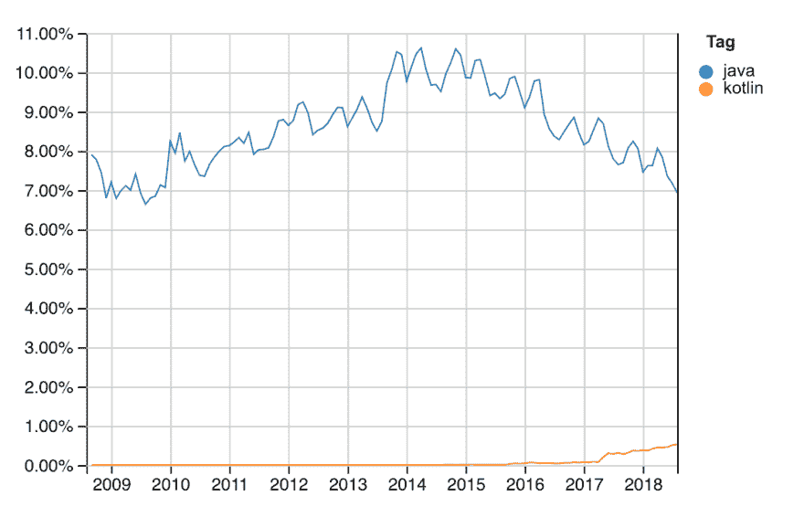

# Java 会走向默默无闻吗？

> 原文：<https://dev.to/ben/will-java-trend-towards-obscurity-kke>

我在岔开另一个话题:

 [ Trevor Montgomery ](/thefitdevproject) • [<time datetime="2018-12-12T16:41:11Z" class="date-short-year"> Dec 12 '18 </time>](https://dev.to/thefitdevproject/comment/7g1n) 

Word，这可能是一个副题，但是你见过有什么东西取代 java 吗？

 [ Ben Halpern ](/ben) • [<time datetime="2018-12-12T16:55:22Z" class="date-short-year"> Dec 12 '18 </time>](https://dev.to/ben/comment/7g25) 

是啊，很多。

Kotlin 和 Scala 出现在脑海中的原因显而易见。Swift，Elixir，Go，Rust，很多更新的东西可以在 Java 流行的很多环境中取代它的位置。

还有很长的路要走，但我认为 Java 会逐渐走下坡路，会有很多不同的语言取而代之。它将不断发展，永远占有一席之地。我没有密切关注，但甲骨文诉谷歌不可能帮助 Java 在世界上的地位。

 
[通过堆栈溢出](https://insights.stackoverflow.com/trends?tags=java%2Ckotlin)

似乎 JavaScript 是目前唯一一种真正受欢迎的语言，因为它运行在浏览器中。这将随着 WebAssembly 而消失。

我认为“替换”这个词有点太二进制了，但是如果图中的线条继续向下，Java 很容易失去它作为一种非常流行的编程语言的地位。