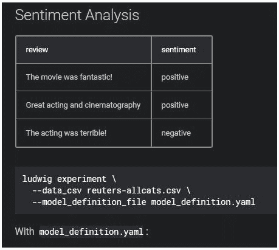

# 优步的 Ludwig 真的能帮助任何人在没有代码的情况下使用深度学习吗？

> 原文：<https://dev.to/belanigaurav/will-uber-s-ludwig-actually-help-anybody-use-deep-learning-without-code-4oio>

你真的能在繁忙的纽约街道上通过打开手机上的应用程序叫到出租车吗？

你真的可以用 Shopify 创建并推出一个电子商务商店，并在一天内卖出去吗？

你真的能使用 WebFlow 开发出一个漂亮且响应迅速的基于 CMS 的网站吗？

所有这些问题的答案都是响亮的“是”，这也是我们对“优步·路德维希真的会帮助任何人在没有代码的情况下使用深度学习吗？”当然会。它被设计成这样，现在它已经被开源，越来越多的支持只会流入，帮助建立一个大的社区。

所以让我们退一步来谈谈这里的基础知识。

### **什么是优步·路德维希？**

Ludwig 是一个建立在 TensorFlow 之上的工具箱，它允许任何人训练和测试深度学习模型，而不需要编写任何代码。它提供了一种基于数据类型的方法来开发适用于广泛应用的预测性深度学习模型。本质上，它将允许非专家在其网站或应用程序中开发和集成深度学习模型，以获得深度学习系统的全部好处，这将帮助他们加快业务发展或改善生活。这些非专家，甚至是专家，可以利用这种强大的新技术来大幅减少花在训练和测试深度学习模型上的时间，而不是“专注于开发深度学习架构，而不是数据争论”，引用优步研究人员在他们的[博客文章](https://eng.uber.com/introducing-ludwig/)中的话

### **这是怎么做到的？**

深度学习应该很难，只有熟练的数学头脑才擅长，对吗？嗯，是的。直到几年前，你甚至需要一个博士学位才能理解算法、编码器和机器学习的含义。但是互联网的爆炸式发展使技术成为了一个真正民主的实体。今天，有了 Ludwig 这样的平台，[任何人都可以学习利用深度学习](https://www.manipalprolearn.com/data-science/post-graduate-certificate-program-artificial-intelligence-deep-learning-certification-training)来解决业务问题并加速增长。

无论您是想对评论进行情感分析，还是想构建一个自动图像标题生成器，甚至是构建一个直观的聊天机器人，使用自然语言处理来为随机的客户查询提供极其人性化的响应， [Ludwig 会全力支持您](https://uber.github.io/ludwig/examples/)。优步的研究人员声称，Ludwig 的极度简化配置可以减少训练深度学习模型所花费的时间。

您只需上传一个 CSV 数据集，其中包含您使用的任何在线工具中的所有数据，以及一个指定输入和输出列表的模型定义 YAML 配置文件。只需指定 CSV 中作为模型输入和输出的列，告诉 Ludwig 您的目标变量，就可以了。Ludwig 会自动为你创建一个深度学习模型，并训练它来预测你的结果。

Ludwig 对数据进行随机分割，创建测试和验证集，预处理数据，为所有不同的输入构建编码器，构建组合器，然后为输出目标构建解码器。使用这些，它训练模型，直到达到期望的精度。

Ludwig 使用专门创建的编码器将原始数据映射到张量，将其合并，然后使用解码器将张量映射到原始数据。通过指定用于数据集中某些特定要素的编码器和解码器，您可以选择更具体地使用 Ludwig。您甚至可以为每个编码器和解码器设置架构和训练参数。

非专家可以简单地上传数据集，让“黑匣子”做它的事情，而更技术的人可以选择单独设置每个参数，以获得尽可能多的个性化配置。这种灵活性是 Ludwig 的核心产品之一。它还提供了一个编程 API，允许用户使用一个简单的 Python API 来加载现有的模型，并训练它在新的数据集上提取预测。

目前，他们有许多数据类型的编码器，如二进制、数字、序列等。不过，在未来，他们打算扩展编码器对数据类型的支持，如针对文本的 Transformer、ELMo 和 BERT，以及针对图像的 DenseNet 和 FractalNet。Ludwig 提供了许多可视化选项，然后观察模型从数据中提取洞察力。

### **路德维希的无代码 AI 真的会接管开发者的工作吗？**

即使是那些精通编码、人工智能和机器学习的人，也无法抵制诱惑，放弃重复而平凡的工作，转而使用无代码平台。这种平台培养创造力，帮助建立一个创客社区。因此，有了 Ludwig 这样的平台，开发人员不会失业。

相反，他们将有机会为现实世界的问题开发更具创造性的解决方案，而不是编写大量冗长的代码。像 Ludwig 这样的开源社区依靠贡献者成长和繁荣。可以说，称职的开发人员不会很快被无代码所取代。然而，它将允许任何人开发和训练深度学习模型。

图片来源:[https://uber.github.io/ludwig/examples/](https://uber.github.io/ludwig/examples/)