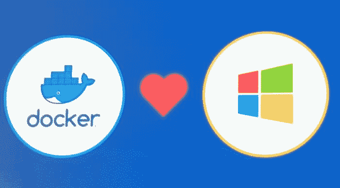

# Windows 容器(个人)备忘单

> 原文：<https://dev.to/sebagomez/windows-containers-personal-cheat-sheet-o1>

我一直在努力在 Windows 容器中获得一个带有一些 ReST 服务的 web 应用程序(ASP.NET 4)。它实际上是三个不同的应用程序，其中两个是 web 应用程序，另一个只是一个必须通过 MSBuild 调用的大型批处理进程。

这不仅仅是一张小抄，它只是给我未来的自己的一张便条…也许它会帮助一路上的某个人。

<figure>

<figcaption>Image source https://blog.newrelic.com/culture/dockercon-sf/</figcaption>

</figure>

这是我的文档，我会仔细检查下面的每一行👇